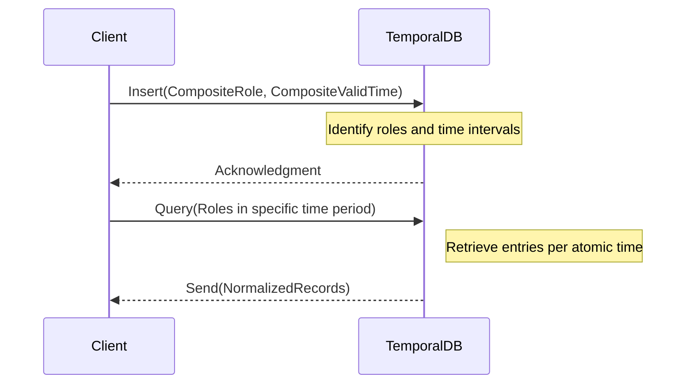

## Temporal First Normal Form (1NFt)

### Introduction
Temporal First Normal Form (1NFt) is a database design pattern that adapts the traditional First Normal Form (1NF) to handle temporal data. In standard database normalization, 1NF is achieved by ensuring that all attributes contain atomic, indivisible values. Temporal 1NF extends this by ensuring that each temporal attribute also encapsulates atomic, indivisible time intervals, thereby solidifying data integrity over time.

### Detailed Explanation

#### Conceptual Overview
In traditional databases, ensuring 1NF means representing each piece of information in a separate column/row, avoiding repeating groups or arrays. When extending this to temporal data, the goal is to ensure each data entry is isolated to one specific time period—decomposing temporal attributes into discrete entries, each associated with a distinct valid time interval.

#### Why Temporal 1NF?
The main reasons for adopting 1NFt include:
1. **Data Consistency**: Maintains data consistency over varying time dimensions by ensuring each record corresponds to a precise period.
2. **Streamlined Queries**: Simplifies query operations since each record represents a singular state.
3. **Enhanced Interpretability**: Augments human and system interpretability of data by maintaining discrete time slices.

### Example Implementation

Consider a table storing employee roles over time:

#### Non-normalized Temporal Attributes
| EmployeeID | Role                  | ValidTime         |
|------------|-----------------------|-------------------|
| 101        | Engineer, Manager     | 2023-01-01 to 2023-06-30, 2023-07-01 to 2023-12-31 |

In this non-normalized table, the `Role` and `ValidTime` columns hold composite values.

#### Normalized using 1NFt
| EmployeeID | Role     | ValidTimeStart | ValidTimeEnd   |
|------------|----------|----------------|---------------|
| 101        | Engineer | 2023-01-01     | 2023-06-30    |
| 101        | Manager  | 2023-07-01     | 2023-12-31    |

By splitting each temporal attribute into separate tuples with atomic time intervals, the table adheres to Temporal 1NF.

### Mermaid Diagram

Here's a sequence of how the normalization process can occur:

### Related Patterns

- **Temporal Second Normal Form (2NFt)**: Further decomposes temporal dependencies by ensuring non-temporal attributes are functionally dependent solely on the temporal keys.
- **Temporal Valid-Time**: Manages the valid times, ensuring all temporal entries align with their intended real-world effectiveness period.

### Additional Resources

- [Temporal Data and the Relational Model](https://www.springer.com/gp/book/9781125345648) by C.J. Date
- [Temporal Data in SQL: A Methodological Approach](https://www.oreilly.com/library/view/temporal-data-in/9781466581725/) by Richard T. Snodgrass

### Final Summary
Temporal First Normal Form (1NFt) effectively handles temporal data modeling by guaranteeing attribute atomicity both in data values and their associated time intervals. By implementing 1NFt, databases can significantly improve the integrity and accessibility of temporal data, enabling more reliable versioning and historical analysis.
