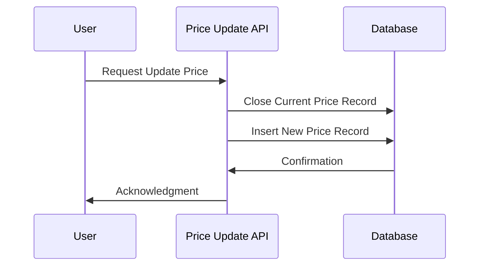

---

linkTitle: "Avoiding Temporal Redundancy"
title: "Avoiding Temporal Redundancy"
category: "Temporal Normalization"
series: "Data Modeling Design Patterns"
description: "Ensuring that temporal information is stored only once to prevent update anomalies in data modeling and reflect accurate historical information."
categories:
- temporal-normalization
- data-modeling
- database-design
tags:
- data-integrity
- normalization
- temporal-data
- database-patterns
- update-anomalies
date: 2024-07-07
type: docs

canonical: "https://softwarepatternslexicon.com/103/10/10"
license: "© 2024 Tokenizer Inc. CC BY-NC-SA 4.0"
---


## Introduction

In the domain of data modeling, especially for time-sensitive data, maintaining the integrity and accuracy of temporal information is crucial. Storing the same temporal data in multiple locations can lead to inconsistencies and update anomalies, making it challenging to derive an accurate historical picture of data changes over time. The pattern of "Avoiding Temporal Redundancy" is a strategic approach to ensure that each piece of temporal information is stored only once, thus optimizing data models for integrity and efficiency.

## Design Pattern Explanation

### Intent

The intent of the Avoiding Temporal Redundancy pattern is to maintain a single source of truth for any piece of time-sensitive data, where temporal attributes, such as timestamps or historical records, are managed in a consolidated manner. This prevents duplication and inconsistencies when data changes.

### Motivation

Consider a database for an e-commerce platform where product pricing changes based on promotions or market competition. If price changes are duplicated across different tables or datasets, ensuring consistency becomes burdensome and error-prone. When temporal data is scattered, not only is storage wasted, but risks of anomalies and outdated information increase.

By consolidating temporal data, maintenance becomes straightforward. When a price update is necessary, a single update operation reflects across all interested concerns without redundancy.

### Applicability

Use this pattern when:

- Managing historical data, such as product price histories, employment periods, or software versioning.
- You need to perform frequent updates on temporal data, and maintaining consistency across duplicated data results in complexity.
- The cost of maintaining duplicate temporal information is high, both in terms of resources and potential data inaccuracy.

## Architectural Approaches

### Centralized Temporal Table

- **Approach**: Introduce a dedicated temporal table that stores all relevant temporal changes for specific entities. For instance, have a `ProductPriceHistory` table for all price changes.
  
  ```sql
  CREATE TABLE ProductPriceHistory (
      ProductID INT,
      Price DECIMAL(10, 2),
      StartDate TIMESTAMP,
      EndDate TIMESTAMP,
      PRIMARY KEY (ProductID, StartDate)
  );
  ```

### Temporal Consistency Rules

- **Approach**: Define database triggers or application-level rules to ensure that all temporal data mutations pass through a centralized logic. For example, forbid price updates on product records directly, enforcing updates only via the `ProductPriceHistory`.

## Example Code

```scala
// Assuming a functional approach using Scala
case class Product(id: Int, name: String)
case class ProductPriceHistory(productId: Int, price: BigDecimal, startDate: Timestamp, endDate: Option[Timestamp])

// A method to add or update the price, where end dates of past records are closed
def updatePrice(productId: Int, newPrice: BigDecimal, effectiveDate: Timestamp): Unit = {
  val now = Timestamp.from(Instant.now())
  // Query current price record and close it if applicable
  closeCurrentPriceRecord(productId, now)

  // Insert new price record
  insertNewPriceRecord(ProductPriceHistory(productId, newPrice, now, None))
}
```

## Diagrams



## Related Patterns

- **Temporal Validity Pattern**: Focuses on storing time ranges for which data is valid, complementing avoidance of redundancy by overlapping functionalities.

- **Event Sourcing**: Stores every change as an event record, enabling complete temporal traceability without overwriting historical data.

## Additional Resources

- *Temporal Data & the Relational Model* by C.J. Date, Hugh Darwen, and Nikos Lorentzos - A comprehensive guide on temporal database management.
- Explore self-guided content on relational databases and their normalization techniques through online courses or educational platforms like Coursera or edX.

## Summary

Avoiding Temporal Redundancy is an essential pattern in designing databases that handle time-sensitive data efficiently. By ensuring data is stored in a consolidated manner, update anomalies are reduced, historical data integrity is maintained, and systems are made robust against malpractices of data management. This pattern paves the way for a cleaner, manageable, and efficient system deservation when dealing with temporal attributes in data models.

---
