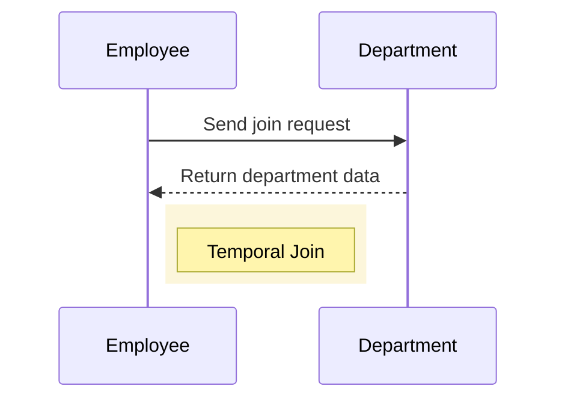

## Introduction

Temporal Join Dependencies address the challenge of maintaining data integrity and avoiding redundancy when performing joins in temporal databases. This design pattern is essential for ensuring the consistent and accurate representation of data over time when different temporal objects are combined.

## Context

Temporal databases store and manage data related to time. They handle time-varying data in a way that allows queries to be made to return results based on different temporal dimensions, such as valid time or transaction time. When joining tables in a temporal database, redundant records can be introduced, potentially leading to inaccurate representations and analysis.

## Problem

There arises the need to join different datasets that have their own temporal dimensions. Directly joining such datasets often results in the duplication of records or inconsistent relationships over time. For example, joining an employee table with a department table, both having their own time dimensions, can lead to redundant records if not handled properly.

## Solution

The Temporal Join Dependencies pattern proposes structuring temporal data in such a way that when join operations are performed, redundancy is minimized or eliminated. It leverages the concept of temporal normalization, splitting data into separate entities if they exhibit distinct temporal behaviors.

### Key Principles

1. **Temporal Segmentation**: Divide tables into segments with unique temporal traits. Each segment represents distinct temporal intervals aligned with its time-related fields.
   
2. **Temporal Keys**: Use start and end time keys while joining. Ensure keys reflect actual temporal overlaps relevant to both datasets being joined.

3. **Normalization Aspects**: Normalize data by separating concerns into their distinct temporal tables before joining. This limits redundancy and confusion.

4. **Bidirectional Constraints**: Enforce constraints that govern the effective timelines for relationships, maintaining consistent history representation post-join.

### Example Code

Here’s an example SQL query demonstrating the temporal join:

```sql
SELECT e.employee_id, e.name, d.department_name, e.start_time, e.end_time, d.start_time, d.end_time
FROM employee e
JOIN department d
ON e.department_id = d.department_id
AND (e.start_time < d.end_time AND d.start_time < e.end_time);
```

This query ensures temporal overlap by checking that the employee tenure and department validity intervals intersect.

### Diagram



## Related Patterns

- **Temporal Data Pattern**: Managing time-specific data in databases.
- **SCD (Slowly Changing Dimension)**: Handling changes in reporting dimensions over time.

## Additional Resources

- "Temporal Data & the Relational Model" by C. J. Date, H. Darwen, and Nikos Lorentzos
- "SQL Design Patterns" by Vadim Tropashko

## Summary

Temporal Join Dependencies design pattern helps manage and maintain data integrity by addressing the redundancy caused by joining tables with independent temporal data. By emphasizing temporal segmentation and optimized normalization, it ensures that data retrieved from the temporal join reflects accurate historical records, free from duplicates or inaccuracies due to unnecessary redundancy.
