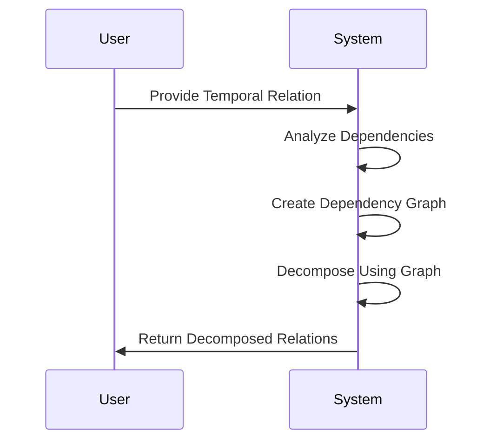

---

linkTitle: "Temporal Normalization Algorithms"
title: "Temporal Normalization Algorithms"
category: "Temporal Normalization"
series: "Data Modeling Design Patterns"
description: "Applying algorithms designed for temporal data normalization to ensure consistency and integrity of temporal databases by using temporal dependency graphs and decomposition strategies."
categories:
- data-modeling
- temporal-data
- databases
tags:
- data-normalization
- temporal-dependency
- algorithms
- temporal-databases
- consistency
date: 2024-07-07
type: docs

canonical: "https://softwarepatternslexicon.com/103/10/13"
license: "© 2024 Tokenizer Inc. CC BY-NC-SA 4.0"
---

## Overview

Temporal normalization involves structuring temporal databases in a way that minimizes redundancy and dependency, ensuring data integrity and consistency over time. Temporal databases store time-variant data, allowing queries on past, present, and possible future states.

Temporal normalization builds upon traditional normalization principles to accommodate time-related aspects. This involves using algorithms that address temporal dependencies that arise when information transitions over time.

## Design Pattern Explanation

### Key Concepts

- **Temporal Relations**: Tables or data structures representing entities and associated time dimensions (e.g., effective date range).
- **Temporal Dependency Graph**: A representation that captures the temporal dependencies among data attributes, aiding in determining how to decompose the database schema.
- **Normalization Goals**: To eliminate redundancy while preserving meaningful data retrieval operations.

### Architectural Approach

1. **Identify Temporal Dependencies**:
   - Analyze the temporal aspects of data attributes.
   - Create a dependency graph to understand how data elements relate to each other over time.

2. **Decompose Temporal Relations**:
   - Use the temporal dependency graph to systematically decompose temporal relations.
   - Ensure each relation satisfies temporal normal forms akin to traditional normal forms but tailored for temporal aspects.

3. **Algorithm Application**:
   - Apply algorithms to retain only relevant temporal dependencies.
   - Iteratively resolve dependencies through decomposition sans redundancy.
   - Prioritize queries requiring historical versus current data views and structure relations accordingly.

### Example Code

Assume a temporal relation `"Employee_Temporal"` with attributes `EmployeeID`, `Name`, StartDate`, and `EndDate`.

In pseudo-code:

```scala
case class TemporalDependencyGraph(node: String, dependsOn: List[String])

def decomposeTemporalRelation(relation: List[TemporalRelation], dependencyGraph: List[TemporalDependencyGraph]): List[TemporalRelation] = {
  dependencyGraph.flatMap { graph =>
    if (graph.dependsOn.isEmpty) {
      List(relation.find(_.node == graph.node).get)
    } else {
      relation.filter(r => graph.dependsOn.contains(r.node))
    }
  }
}

// example usage
val relation = List(
  TemporalRelation("EmployeeID", List("Name")),
  TemporalRelation("Name", List("StartDate", "EndDate"))
)

val dependencyGraph = List(
  TemporalDependencyGraph("EmployeeID", List("Name")),
  TemporalDependencyGraph("Name", List("StartDate", "EndDate"))
)

val decomposedRelations = decomposeTemporalRelation(relation, dependencyGraph)
```

### Diagram

Below is a conceptual UML sequence diagram to illustrate decomposing temporal relations:



## Related Patterns

- **Snapshot Isolation Patterns**: Ensuring that operations reflect consistent states.
- **Bitemporal Data Modeling**: Handling valid versus transaction time aspects.
- **Data Versioning**: Tracking changes over temporal dimensions without redundancy.

## Additional Resources

- [Temporal Data & Temporal Databases](https://example-temporal-documentation.com)
- [Effective Temporal Data Management](https://effective-temporal-mgmt.org)
- [Fundamentals of Temporal Dependency](https://temporal-dependency-fundamentals.edu)

## Summary

Temporal normalization algorithms extend traditional data normalization by focusing on time-based attributes in a database. By leveraging temporal dependency graphs, these algorithms facilitate the decomposition of temporal relations—balancing data consistency, integrity, and efficient retrieval.

Aligning data storage with temporal normalization practices can significantly boost performance and accuracy for time-variant queries, ultimately aiding in better decision-making and historical analysis.
