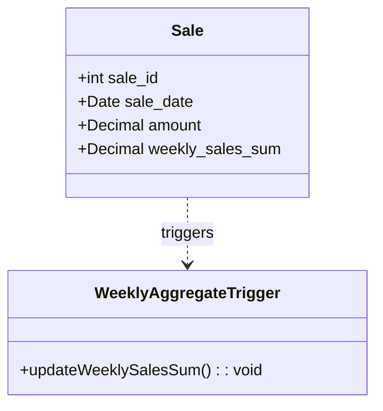

## Overview

Temporal Denormalization is a data modeling design pattern wherein redundancy is strategically introduced into temporal models to enhance performance. This approach is particularly useful in contexts where frequent querying of historical data is needed, and the cost of computation can be amortized through pre-computed values. However, introducing redundancy requires managing the trade-offs between data consistency and system performance.

## Detailed Explanation

### What is Temporal Denormalization?

In traditional normalization, a database schema is designed to minimize data redundancy by splitting data into multiple tables and establishing relationships between them. In temporal modeling, this principle ensures that changes over time can be tracked efficiently. Temporal Denormalization, on the other hand, deliberately introduces redundancy into the data model. By keeping duplicate or pre-computed data, the system can deliver faster query performance and reduced computational needs for common queries, especially when accessing recent or frequently used historical data.

### Architectural Approaches

1. **Redundant Aggregates**  
   Store aggregate values alongside the raw data. These aggregates can be updated at specified intervals, such as daily or weekly, to ensure queries are efficient.

2. **Soft State and Eventual Consistency**  
   Apply the soft state pattern where temporal data is eventually updated in a denormalized form, allowing for more relaxed consistency models.

3. **Snapshot Tables**  
   Use snapshot tables to capture the state of a database at various intervals. These snapshots are denormalized but provide a quick view of the data at specific points in time.

### Best Practices

- **Balance Redundancy with Consistency**: Implement mechanisms to manage data updates consistently. This might involve using change-data-capture (CDC) mechanisms or triggers to update denormalized data when the source data changes.

- **Regular Audits and Cleanup**: Define a schedule to audit the denormalized data for consistency and remove stale data to prevent bloating and data spillover.

- **Query Optimization**: Focus on queries and access patterns that benefit the most from denormalization. Identify the critical paths and ensure they are covered by redundancies.

### Example Code

Here is a simple example in SQL that illustrates how a denormalized column might be added to a table to store aggregate results:

```sql
CREATE TABLE sales (
    sale_id INT PRIMARY KEY,
    sale_date DATE,
    amount DECIMAL(10, 2)
);

ALTER TABLE sales ADD COLUMN weekly_sales_sum DECIMAL(10, 2);

-- Example trigger to update the denormalized column
CREATE FUNCTION update_weekly_sales_sum() RETURNS TRIGGER AS 
BEGIN
    UPDATE sales
    SET weekly_sales_sum = (
        SELECT SUM(amount)
        FROM sales
        WHERE sale_date >= current_date - interval '7 day'
    )
    WHERE NEW.sale_id = sale_id;

    RETURN NEW;
END;
 LANGUAGE plpgsql;

CREATE TRIGGER update_weekly_sales_sum_trigger
    AFTER INSERT OR UPDATE ON sales
    FOR EACH ROW EXECUTE PROCEDURE update_weekly_sales_sum();
```

### Diagrams



### Related Patterns

1. **CQRS (Command Query Responsibility Segregation)**  
   Separate read and write operations to optimize for performance and scalability. Temporal Denormalization often plays a role in the query side of CQRS.

2. **Event Sourcing**  
   Store state changes as a sequence of events which can be replayed to derive the current state. Temporal denormalization can be an optimization on top of this pattern.

3. **Materialized Views**  
   Pre-computed views that represent the denormalized state of the database at a certain point, similar to snapshot tables.

### Additional Resources

- [The Data Model Resource Book](https://www.oreilly.com/library/view/the-data-model/9781118448053/)
- [Introducing Temporal Tables in SQL Server](https://docs.microsoft.com/en-us/sql/relational-databases/tables/temporal-tables)
- [SQL Performance Tuning Book](https://www.oreilly.com/library/view/sql-performance-tuning/9780596005733/)

## Summary

Temporal Denormalization strategically enhances performance in temporal data models by introducing redundancy. While it offers significant efficiency benefits for high-frequency data access patterns, especially with temporal aggregations, it requires careful management to balance the trade-offs between performance and data consistency. This pattern is particularly beneficial in read-heavy systems where querying speed is paramount, and it can be seamlessly integrated with other advanced data modeling patterns to maintain a robust and scalable architecture.
