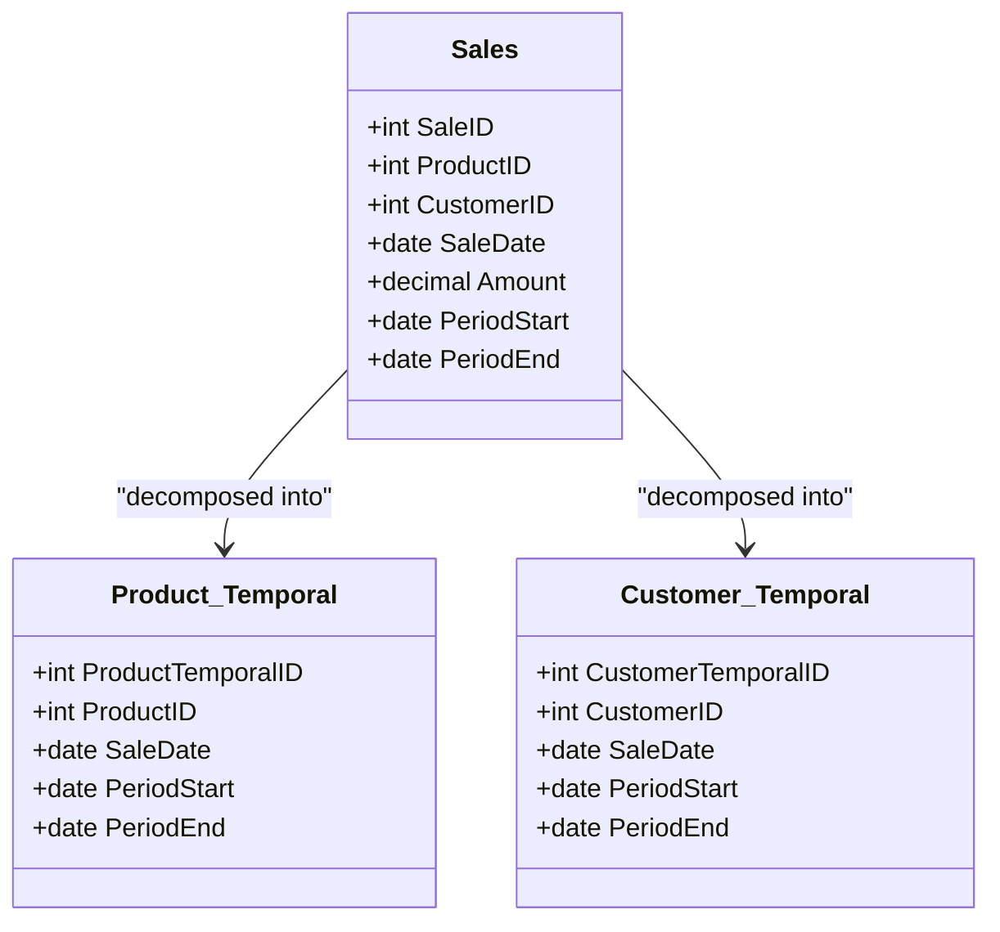

## Temporal Lossless Decomposition

### Description

Temporal Lossless Decomposition is a design pattern in database systems, particularly within temporal databases, that enables the splitting of large temporal relations into smaller, more manageable parts without losing any temporal information. This approach ensures that the temporal characteristics and data integrity across various time dimensions are preserved, even in distributed or replicated database systems.

### Architectural Approaches

- **Dimension Splitting**: By analyzing comprehensive temporal datasets, temporal components such as valid time, transaction time, or bi-temporal data can be separated into distinct, yet related, tables. This aids in the performance and manageability of complex joins and queries.
  
- **Surrogate Keys**: Introduce surrogate keys to maintain relationships between the decomposed tables. This ensures efficient linking and historical tracking across the temporal dataset.

- **Temporal Join Operations**: Utilize specialized temporal join operations, such as temporal equi-joins, to reconstruct the holistic view from the decomposed tables.

- **Temporal Integrity Constraints**: Implement and enforce integrity constraints across decomposed tables to retain the sequence and consistency of historical data.

### Best Practices

- **Preserve Temporal Granularity**: Ensure that each decomposed part retains the original temporal granularity, whether it be time-based granularity (e.g., daily, weekly) or event-based granularity.

- **Efficient Query Strategies**: Develop efficient query strategies to reconstruct and analyze temporal relationships. This may include stored procedures or materialized views.

- **Audit Trails**: Maintain audit trails to monitor changes and relationships throughout the decomposition process, aiding in reverting or understanding modifications over time.
  
### Example Code

Here is an illustrative example of how to decompose a sample 'Sales' table into 'Product_Temporal' and 'Customer_Temporal' tables:

```sql
-- Original Sales table
CREATE TABLE Sales (
    SaleID INT,
    ProductID INT,
    CustomerID INT,
    SaleDate DATE,
    Amount DECIMAL(10, 2),
    PeriodStart DATE,
    PeriodEnd DATE
);

-- Decomposed Product Temporal table
CREATE TABLE Product_Temporal (
    ProductTemporalID INT PRIMARY KEY,
    ProductID INT,
    SaleDate DATE,
    PeriodStart DATE,
    PeriodEnd DATE
);

-- Decomposed Customer Temporal table
CREATE TABLE Customer_Temporal (
    CustomerTemporalID INT PRIMARY KEY,
    CustomerID INT,
    SaleDate DATE,
    PeriodStart DATE,
    PeriodEnd DATE
);
```

### Diagrams

#### Mermaid UML Class Diagram



### Related Patterns

- **Temporal Tables**: Used to manage versions of rows with their associated timestamps.
  
- **Bi-Temporal Data**: Addressing data requirements for both valid time and transaction time within temporal datasets.

- **Dimensional Modeling**: Structures complex datasets across temporal views for analytical purposes.

### Additional Resources

- [Temporal Databases: A Comprehensive Survey](https://example.com/temporal-databases-survey)
- [Handling Temporal Data in SQL](https://example.com/handling-temporal-data-sql)
- [Designing a Temporal Data Warehouse with Dimensional Modeling](https://example.com/temporal-data-warehouse)

### Summary

Temporal Lossless Decomposition is crucial in managing extensive temporal datasets, as it enhances performance and extendibility without compromising data integrity. By employing careful splitting, efficient querying, and maintaining constraints, this pattern achieves seamless data handling across multiple temporal dimensions. Adopting this pattern can significantly improve the manageability and scalability of temporal database systems while preserving vital historical data insights.
