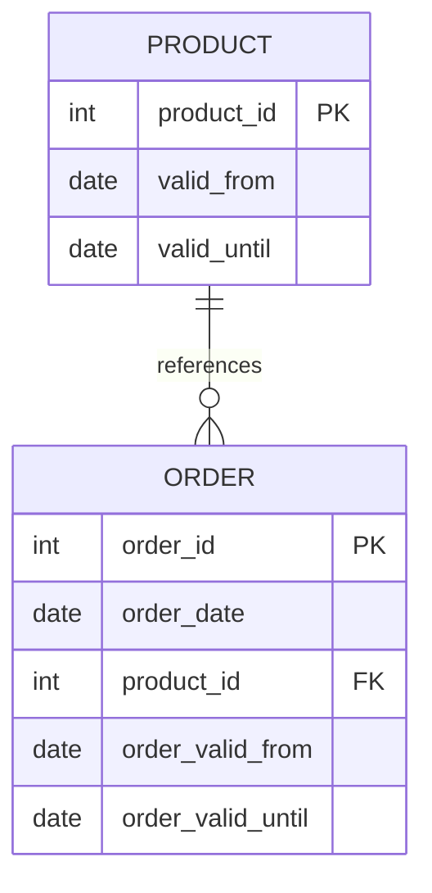

## Introduction

Temporal Inclusion Dependencies are crucial in database systems where temporal elements, specifically time-bound data, must reference valid states or records. This pattern ensures that a temporal foreign key within a table consistently and correctly references a temporal primary key in another table. This design pattern is essential in maintaining the integrity of time-dependent relationships.

## Explanation

In essence, Temporal Inclusion Dependencies (TID) extend the classical foreign key constraints to cover temporal dimensions. While traditional foreign keys link columns between tables to ensure referential integrity, temporal foreign keys additionally incorporate time intervals or periods to assure temporal correctness.

### Key Features:
1. **Temporal Foreign Key**: Combines a standard foreign key with time period validation.
2. **Temporal Primary Key**: Represents a record with time-bound validity.
3. **Time Intervals**: Consideration of valid time periods during referential checks.

### Example

Suppose we have an order system. An `Orders` table includes references to the `Products` table, with each product only valid for specific time periods. 

#### Tables:
- `Products` table:
  - `product_id` (Primary Key)
  - `valid_from` (Start date of validity)
  - `valid_until` (End date of validity)
  
- `Orders` table:
  - `order_id`
  - `order_date`
  - `product_id`
  - `order_valid_from`
  - `order_valid_until`

#### Temporal Inclusion Dependency:

```sql
ALTER TABLE Orders
ADD CONSTRAINT FK_TemporalProduct
FOREIGN KEY (product_id, order_valid_from, order_valid_until)
REFERENCES Products(product_id, valid_from, valid_until)
ON DELETE CASCADE;
```

This constraint ensures that the product being referenced by any order was valid during the order's recognized period.

## Architectural Approaches

1. **Temporal Table Design**: Use of temporal tables that store versions of records with associated time validity attributes.
2. **Time-Bound Validation Layer**: Implement logic in the application or database that checks the temporal integrity between records before any transaction or query execution.
3. **Event Sourcing**: Capture every change as an event with a timestamp, ensuring historical consistency and providing mechanisms to evaluate temporal keys dynamically.

## Best Practices

- **Granular Time Periods**: Use precise time granularity that aligns with the application needs (e.g., daily, hourly).
- **Consistent Time Zones**: Handle time zones across datasets to avoid discrepancies.
- **Periodic Verification**: Establish processes to review and correct temporal data integrity regularly.

## Example Code

Here is how you might use SQL to set up temporal tables and enforce inclusion dependencies in a more advanced context, ensuring proper time-bound references:

```sql
CREATE TABLE Products (
    product_id INT PRIMARY KEY,
    valid_from DATE NOT NULL,
    valid_until DATE NOT NULL,
    CHECK (valid_from <= valid_until)
);

CREATE TABLE Orders (
    order_id INT PRIMARY KEY,
    order_date DATE NOT NULL,
    product_id INT NOT NULL,
    order_valid_from DATE NOT NULL,
    order_valid_until DATE NOT NULL,
    CHECK (order_valid_from <= order_valid_until),
    FOREIGN KEY (product_id, order_valid_from, order_valid_until)
    REFERENCES Products(product_id, valid_from, valid_until)
);
```

## Diagrams

Visualizing Temporal Inclusion Dependencies involves highlighting relationships within tables, enforcing constraints over time entities.



## Related Patterns

- **Temporal Table Pattern**: Deals with the efficient management of time-series or timespan-based data in databases.
- **Versioning**: Involves creating new records or augmenting existing ones to represent changes over time without losing past data.

## Additional Resources

- "Temporal Data & the Relational Model" by C.J. Date, Hugh Darwen, and Nikos A. Lorentzos.
- IEEE Data Engineering Bulletin on Temporal Databases.
- Temporal Persistence in SQL by Richard T. Snodgrass.

## Summary

Temporal Inclusion Dependencies offer a robust mechanism for enforcing referential integrity over temporal datasets. By ensuring that foreign keys respect the time dimensions of primary keys, databases not only guarantee current data consistency but also historical accuracy, offering a complete view through time-aware data relations. Leveraging TID can significantly enhance the fidelity and reliability of complex data modeling and time-stamped databases.
