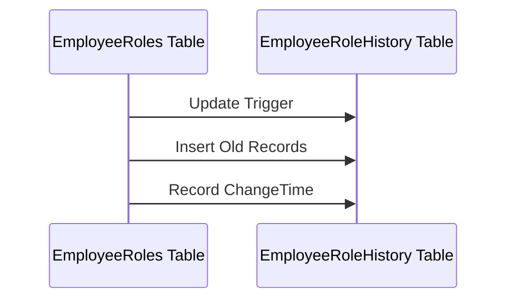

## Introduction

In data modeling and database design, it's crucial to ensure that relationships and dependencies between entities are well-defined and efficiently organized. One important aspect of this is handling temporal transitive dependencies effectively. Temporal transitive dependencies involve situations where one entity or attribute is temporally dependent on another, forming a transitive relationship that requires accurate modeling to maintain data integrity and consistency over time.

## Design Pattern Explanation

### Definition

A temporal transitive dependency occurs in a database schema when an attribute A depends on another attribute B, which in turn depends on a time component T. This creates a chain of dependencies that needs careful consideration, especially when dealing with historical, time-sensitive, or versioned data. Proper handling ensures that changes in time-related attributes are accurately reflected across all dependent data points.

### Example Scenario

Consider a scenario where a company maintains records of employee roles and their corresponding department allocations. An employee's specific role may change over time, along with the department's organizational structure. Let's break down the dependencies:

- **Employee Role (A)** is dependent on the **Department (B)**.
- **Department (B)** is dependent on the **Time Period (T)**.

Properly modeling these dependencies is essential for tracking changes over time, ensuring analytical accuracy, and dynamics within the organizational structure.

### Architectural Approach

- **Normalization**: Begin by normalizing the database schema to ensure that each entity has a minimal dependency on time. Separate tables can be created to manage historical records.
  
- **Versioning**: Implement version control for entities that have temporal dependencies. This allows for maintaining a log of changes, providing an accurate historical view.

- **Caching**: Use caching mechanisms to store temporal states for frequently accessed data, reducing the computational load on the database.

- **Partitioning**: Apply data partitioning based on temporal attributes, which aids in optimizing query performance and maintenance tasks.

## Best Practices

1. **Temporal Tables**: Utilize dedicated temporal tables to store historical states and changes. This separation allows for efficient querying of time-related data without affecting normal data operations.

2. **ETL Processes**: Design ETL (Extract, Transform, Load) processes with time awareness, ensuring that temporal dependencies are respected when transferring data between systems.

3. **Indexing**: Implement time-based indexing to speed up queries on temporal data, making retrieval and reporting faster and more efficient.

4. **Data Integrity Rules**: Set up constraints and triggers to maintain the integrity of temporal dependencies, ensuring that changes in one part of the data reflect correctly in related areas.

## Example Code

Here's a simplified SQL example to demonstrate temporal normalization using temporal tables:

```sql
-- Main table holding current records
CREATE TABLE EmployeeRoles (
    EmployeeID INT PRIMARY KEY,
    RoleID INT,
    DepartmentID INT,
    StartTime DATETIME,
    EndTime DATETIME
);

-- Temporal table to track changes
CREATE TABLE EmployeeRoleHistory (
    EmployeeID INT,
    RoleID INT,
    DepartmentID INT,
    ChangeTime DATETIME,
    PRIMARY KEY (EmployeeID, ChangeTime)
);

-- Trigger to update history table on role change
CREATE TRIGGER UpdateEmployeeRoleHistory 
AFTER UPDATE ON EmployeeRoles
FOR EACH ROW
BEGIN
    INSERT INTO EmployeeRoleHistory (EmployeeID, RoleID, DepartmentID, ChangeTime)
    VALUES (OLD.EmployeeID, OLD.RoleID, OLD.DepartmentID, NOW());
END;
```

## Diagrams

Let's visualize using a Mermaid UML sequence diagram to illustrate temporal dependency handling:



## Related Patterns

- **Temporal Versioning**: Closely related to temporal transitive dependencies, this pattern involves maintaining different versions of data over time, essential for systems requiring history tracking.
  
- **Event Sourcing**: Captures changes to the application state as a sequence of events, enabling the reconstruction of current state by replaying the recorded changes.

- **Time-based Sharding**: Distributes data across different shards or partitions using temporal attributes, improving scalability and performance for large datasets.

## Additional Resources

- **Book**: *The Art of Temporal Data Models: Discover, Understand, Forget* by Robert Peck for in-depth exploration of temporal modeling techniques.
  
- **Article**: [Temporal Data Management in Modern Systems](https://example.com/temporal-data-management) — A comprehensive guide to implementing temporal data handling practices.

- **Blog**: [Mastering Temporal Dependencies in SQL Databases](https://example.com/blog/temporal-sql) — Practical tips and strategies.

## Summary

Handling temporal transitive dependencies effectively is pivotal in maintaining the integrity and usability of data models that encounter time-dependent relationships. By employing proper normalization techniques, partitioning strategies, and versioning approaches, architectural robustness is achieved. This pattern empowers systems to efficiently manage historical, time-sensitive data while ensuring accuracy and consistency.
