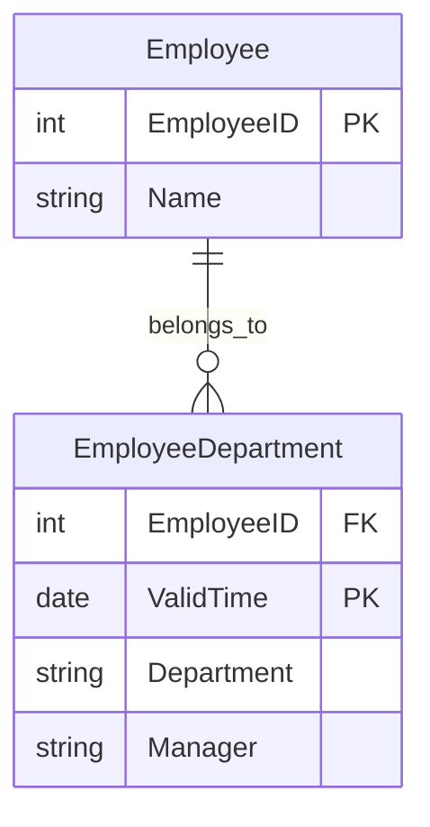

---

linkTitle: "Temporal Second Normal Form (2NFt)"
title: "Temporal Second Normal Form (2NFt)"
category: "Temporal Normalization"
series: "Data Modeling Design Patterns"
description: "The Temporal Second Normal Form (2NFt) removes partial dependencies on temporal keys, ensuring that all non-temporal attributes depend on the entire temporal primary key."
categories:
- temporal
- normalization
- data-modeling
tags:
- temporal
- second-normal-form
- data-modeling
- database-design
- temporal-data
date: 2024-07-07
type: docs

canonical: "https://softwarepatternslexicon.com/103/10/2"
license: "© 2024 Tokenizer Inc. CC BY-NC-SA 4.0"
---


## Introduction

Temporal Second Normal Form (2NFt) is an extension of the classical Second Normal Form (2NF) found in traditional relational database design, tailored particularly for temporal databases. It aims to address partial dependencies of non-temporal attributes on subsets of a composite primary key that includes temporal aspects, ensuring consistent temporal data representation.

## Concept Overview

In a temporal context, tables often have composite keys combining non-temporal and temporal dimensions, such as an identifier plus a time period (ValidTime). Temporal Second Normal Form eliminates partial dependencies on non-temporal attributes by ensuring they depend on the entire composite key.

## Architectural Approach

* **Identify Composite Keys**: Recognize keys formed by a non-temporal component, typically an ID, and a temporal component like ValidTime.
  
* **Analyze Dependencies**: Evaluate the dependencies between non-temporal attributes and the components of the composite key. 

* **Eliminate Partial Dependencies**: Reorganize data to ensure all non-temporal attributes fully functionally depend on the entire composite key, thus removing any chance of redundancy or update anomalies.

## Example Code

Below is an example that illustrates the concept in a SQL setup:

```sql
-- Consider a table before applying 2NFt
CREATE TABLE EmployeeHistory (
  EmployeeID INT,
  ValidTime DATE,
  Name VARCHAR(100),
  Department VARCHAR(100),
  Manager VARCHAR(100),
  PRIMARY KEY (EmployeeID, ValidTime)
);

-- Applying 2NFt by separating tables
CREATE TABLE Employee (
  EmployeeID INT PRIMARY KEY,
  Name VARCHAR(100)
);

CREATE TABLE EmployeeDepartment (
  EmployeeID INT,
  ValidTime DATE,
  Department VARCHAR(100),
  Manager VARCHAR(100),
  PRIMARY KEY (EmployeeID, ValidTime)
);
```

In the initial table, the attributes like `Name` have a partial dependency, depending solely on `EmployeeID` rather than both elements of the composite key. After applying 2NFt, `Name` is separated into its own table for correct representation of dependency.

## Diagram



## Related Patterns

- **Temporal First Normal Form (1NFt)**: Ensures atomic data and helps establish a foundation for temporal consistency.

- **Temporal Third Normal Form (3NFt)**: Focuses on eliminating transitive dependencies within temporal tables.

## Best Practices

- **Regular Audits**: Continuously audit temporal data designs to ensure conformity with modeled dependencies and evolving business rules.

- **Use of Surrogate Keys**: Consider surrogate keys for better performance when complex natural keys lead to cumbersome joins.

## Additional Resources

- [Temporal Databases: Design Considerations](https://examplelink1.com)
- [Normalization in Temporal Databases](https://examplelink2.com)
- [The Theory and Practice of Temporal Data Modelling](https://examplelink3.com)

## Summary

Temporal Second Normal Form (2NFt) lays down an architectural guideline to ensure non-temporal attributes of a table with a temporal element in its primary key are fully dependent on that entire temporal composite key. By doing so, 2NFt helps maintain the integrity and accuracy of temporal databases, reducing redundancy and potential anomalies during data updates or retrieval.


