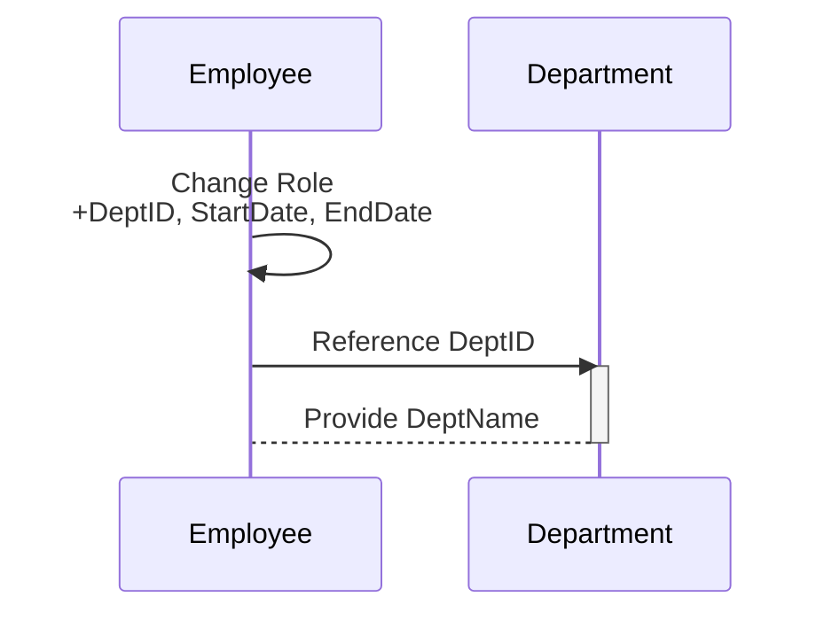

## Introduction

In the realm of temporal databases and data modeling, the Temporal Dependency Preservation pattern is pivotal for maintaining the integrity of historical data. This design pattern ensures that when decomposing temporal relations, all time-dependent dependencies are preserved. This facilitates accurate queries and analyses over temporal data, reflective of historical truths.

## Problem Statement

When decomposing temporal data, a challenge arises in preserving the inherent time-based dependencies between different data entities. For example, in an enterprise setting, employee roles and department affiliations might change over time. When these temporal relations are decomposed, it is crucial to retain their chronological dependencies to maintain accurate historical records.

## Solution Description

The Temporal Dependency Preservation pattern addresses this by offering a structured approach to maintain these temporal dependencies during the normalization process. It involves:

1. **Identification of Temporal Dependencies**: Recognize the temporal dependencies within the database schema that need preservation.
  
2. **Decomposition Strategy**: Plan the decomposition of tables such that temporal dependencies remain intact across new schemas.
  
3. **Schema Design**: Modify the schema to include time dimensions (e.g., start and end dates) that capture changes over time without data loss.

4. **Use of Surrogate Keys**: Implement surrogate keys to uniquely identify temporal instances where natural keys become dependent on time.

## Example Code

```sql
CREATE TABLE Employees (
    EmployeeID INT,
    Role VARCHAR(50),
    DeptID INT,
    StartDate DATE,
    EndDate DATE,
    PRIMARY KEY (EmployeeID, Role, StartDate)
);

CREATE TABLE Departments (
    DeptID INT,
    DeptName VARCHAR(100),
    PRIMARY KEY (DeptID)
);

-- Query to fetch an employee's role over time
SELECT e.EmployeeID, e.Role, d.DeptName, e.StartDate, e.EndDate
FROM Employees e
JOIN Departments d ON e.DeptID = d.DeptID
WHERE e.EmployeeID = 123;
```

## Diagram

Below is a Mermaid sequence diagram showcasing the preservation of temporal dependencies between roles and departments over time:



## Related Patterns

- **Temporal Pattern**: Focuses on modeling temporal states of data, enhancing historical query capabilities.

- **Slowly Changing Dimensions (SCD)**: Handles changes in dimension tables within data warehouse environments, often aligned with temporal dependency aspects.

- **Event Sourcing**: Builds on capturing all changes as a sequence of events over time, crucial for preserving temporal states.

## Additional Resources

- "Temporal Data & the Relational Model" by C.J. Date
- Resources on SQL for handling historical data and temporal tables
- Blog posts about best practices in temporal schema design

## Summary

Temporal Dependency Preservation is a vital pattern for data architects working with databases requiring historical accuracy and temporal relationships. By ensuring that temporal dependencies are retained during schema normalization, organizations can maintain integrity and reliability of time-based data analytics. This pattern empowers data-driven decisions based on a truthful reflection of historical data within an enterprise system.
