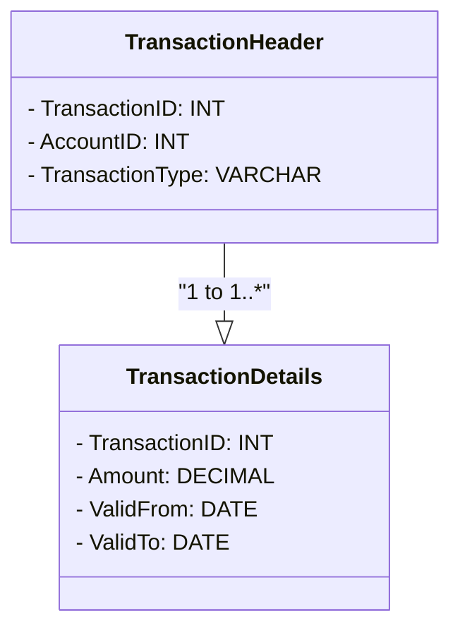

## Introduction

The **Temporal Relation Decomposition** pattern plays a crucial role in enhancing the clarity and efficiency of managing time-variant data within a relational database. This design pattern involves decomposing complex temporal relations into smaller, more manageable tables that maintain data integrity and support efficient query operations. By refining how temporal information is structured, organizations can significantly improve both the scalability and robustness of their database systems.

## Design Pattern Explanation

### Problem Statement

Organizations often need to manage large temporal datasets containing historical information, such as financial transactions, inventory tracking, and personnel records. Over time, these datasets can become unwieldy, resulting in challenges related to:

- Data redundancy and inconsistency.
- Complicated query structures that are hard to optimize.
- Increased storage requirements and slower query performance.

### Solution Approach

Temporal Relation Decomposition provides a structured approach to organizing temporal data by:

1. **Identifying Temporal Entities**: Recognize key entities in your dataset that require temporal tracking.

2. **Decomposition**: Break down larger temporal tables into smaller, meaningful subsets based on criteria such as transaction types or distinct time intervals.

3. **Normalization**: Ensure that decomposition adheres to database normalization principles to minimize redundancy and dependency anomalies.

4. **Time Dimensions Separation**: Clearly separate temporal attributes (e.g., valid time, transaction time) from the primary data attributes. This can involve:

   - Creating distinct tables for different temporal aspects.
   - Utilizing surrogate keys linked with time dimensions to manage versioning.

### Example Code

Let's consider a temporal table holding transaction data:

```sql
CREATE TABLE Transactions (
    TransactionID INT PRIMARY KEY,
    AccountID INT,
    Amount DECIMAL(10, 2),
    TransactionType VARCHAR(50),
    ValidFrom DATE,
    ValidTo DATE
);
```

Applying Temporal Relation Decomposition, you can split it into:

```sql
CREATE TABLE TransactionHeader (
    TransactionID INT PRIMARY KEY,
    AccountID INT,
    TransactionType VARCHAR(50)
);

CREATE TABLE TransactionDetails (
    TransactionID INT,
    Amount DECIMAL(10, 2),
    ValidFrom DATE,
    ValidTo DATE,
    FOREIGN KEY (TransactionID) REFERENCES TransactionHeader(TransactionID)
);
```

This decomposition allows for more targeted and optimized queries while preserving all necessary temporal data.

## UML Diagram

Below is a simple class diagram illustrating Temporal Relation Decomposition:



## Related Patterns

- **Temporal Data Patterns**: Explore different ways to model temporal aspects of data, such as Slowly Changing Dimensions or Temporal Table Patterns.

- **Data Vault Modeling**: A pattern focusing on storing historical data while supporting scalability and flexibility.

## Best Practices

- **Regularly Audit for Redundancy**: Over time, your decomposition should be reviewed to prevent redundant or obsolete structures.
  
- **Consistency Checks**: Utilize automated tools to ensure data integrity across decomposed tables.

- **Indexing Strategies**: Implement appropriate indexing to support common queries across temporal dimensions.

## Additional Resources

- Blankenagel, A., & Pickles, R. (2019). *Advanced SQL for The Traditional and Cloud-Based DBA*.
  
- W3C. (2018). *Best Practices for Data Sustainability*.
  
- ISO/IEC. (2019). *Temporal Database Standards*.

## Summary

Temporal Relation Decomposition is an essential design pattern for managing complex temporal datasets effectively. By decomposing large, intricate temporal tables into well-structured components, organizations can ensure data integrity, optimize storage costs, and maintain efficient query performance. This pattern, grounded in principles of normalization and structured decomposition, is integral to sustaining robust database architectures.
