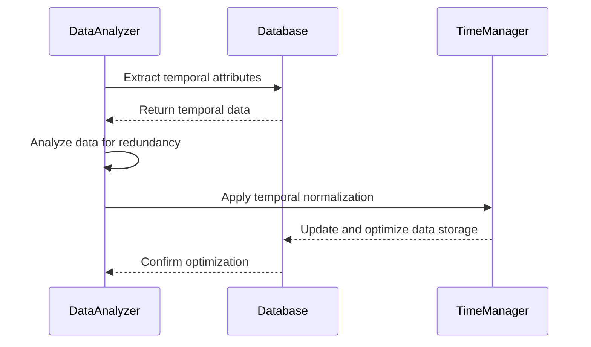

## Overview

Temporal Data Redundancy Analysis focuses on examining temporal data—data associated with time—to identify and eliminate unnecessary redundancy. This is crucial for improving data integrity and optimizing database performance.

### Importance of Temporal Data Redundancy Analysis

Temporal data often exhibits variations over time and can lead to redundancy where the same data is stored multiple times, unnecessarily bloating storage and complicating data integrity. By analyzing and normalizing this data, systems can enhance efficiency and uphold a high standard of consistency.

## Detailed Explanation

Temporal normalization is the process of structuring data which incorporates time elements to minimize redundancy and improve consistency.

### Key Concepts

- **Temporal Attributes**: Includes timestamps, dates, or any other time-specific details that are associated with the data entries.
- **Redundancy**: Occurs when the same data is repeated unnecessarily. In temporal datasets, this may happen across different timeframes.
- **Normalization**: The process to eliminate redundancy and ensure that the data is stored efficiently without sacrificing the details captured over time.

### Best Practices

- **Use Versioning**: Implement time-based versioning to differentiate between different states of data without duplicating the entire data record.
- **Partitioning by Time**: Consider using time-range partitioning in databases to separate and efficiently manage data based on time periods.
- **Data Archiving**: Move historical data to separate storage or archive systems, maintaining accessibility while cleaning active databases.
- **Ensure Atomicity and Isolation in Updates**: Update operations must be atomic to ensure no intermediate states can cause redundancy errors.

## Example Code

Suppose we're dealing with a transactional financial database where each transaction had a timestamp. The redundancy elimination might look like this using SQL:

```sql
-- Imagine we have a table: transactions(transaction_id, amount, transaction_date, customer_id)
-- We want to remove redundant records that mistakenly got entered multiple times

WITH DeduplicatedTransactions AS (
    SELECT 
        transaction_id, 
        amount, 
        transaction_date, 
        customer_id,
        ROW_NUMBER() OVER (PARTITION BY transaction_id, amount, transaction_date, customer_id ORDER BY transaction_date) as rn
    FROM transactions
)
DELETE FROM transactions
WHERE transaction_id IN (
    SELECT transaction_id
    FROM DeduplicatedTransactions
    WHERE rn > 1
);
```

In the example above, we utilize the `ROW_NUMBER` window function to find duplicates and remove unnecessary redundancy from a transactions table.

## Diagrams

### Mermaid UML Sequence Diagram



## Related Patterns

- **Temporal Data Slicing**: Patterns that involve creating specific views or partitions of data based on time dimensions.
- **Data Archiving Strategies**: Patterns focusing on the systematic storage of historical data to optimize system performance.

## Additional Resources

- *Temporal Data & the Relational Model* by C.J. Date – A comprehensive resource on handling temporal data within relational databases.
- Online articles and papers on *Temporal Logic and Databases*.

## Summary

Temporal Data Redundancy Analysis is vital in systems handling data linked to time attributes. It prevents data bloat, enhances system performance, and maintains data integrity. Applying principles of normalization and effective strategies ensures holistic improvement in data management systems. By continually reviewing the temporal aspects of data, systems can adapt to both current and evolving information requirements efficiently.
