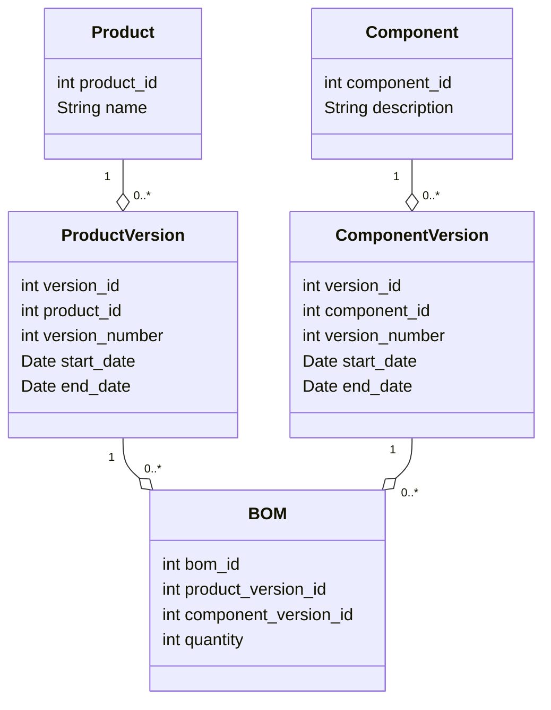

---

linkTitle: "Normalizing Temporal Hierarchies"
title: "Normalizing Temporal Hierarchies"
category: "Temporal Normalization"
series: "Data Modeling Design Patterns"
description: "Applying normalization techniques to temporal hierarchical data to achieve consistency and eliminate redundancy over time."
categories:
- data modeling
- temporal normalization
- database design
tags:
- normalization
- temporal data
- hierarchies
- database patterns
- data consistency
date: 2024-07-07
type: docs

canonical: "https://softwarepatternslexicon.com/103/10/24"
license: "© 2024 Tokenizer Inc. CC BY-NC-SA 4.0"
---

## Introduction

Temporal hierarchies in databases often require careful handling to maintain consistency and eliminate redundancy over time. As businesses evolve, the way temporal data is stored and accessed to reflect changes such as versioning, historical tracking, and lifecycle states needs proper normalization. The "Normalizing Temporal Hierarchies" design pattern addresses this by applying normalization techniques to ensure efficient data structure and integrity.

## Problem

In managing temporal data, especially hierarchical structures such as bills of materials or organizational charts, it can be challenging to represent changes over time without creating redundant data entries. Unnormalized temporal data can lead to inconsistencies, redundant storage, and queries that are complex and costly in terms of performance.

## Solution

The solution involves:

1. **Temporal Segmentation**: Dividing data into segments based on time intervals where each segment represents a valid state during that period.
2. **Decomposition**: Breaking down a hierarchy into its temporal components and storing changes separately to maintain the history.
3. **Normalization**: Using conventional normalization methods while accounting for temporal attributes to eliminate redundancy and improve data integrity.

### Example Code

Suppose we are managing a database for a manufacturing company that has a **Bill of Materials (BOM)** for product assembly. Here's how we can normalize temporal data:

```sql
CREATE TABLE Product (
    product_id SERIAL PRIMARY KEY,
    name VARCHAR(100)
);

CREATE TABLE Component (
    component_id SERIAL PRIMARY KEY,
    description VARCHAR(255)
);

CREATE TABLE ProductVersion (
    version_id SERIAL PRIMARY KEY,
    product_id INT,
    version_number INT,
    start_date DATE,
    end_date DATE,
    FOREIGN KEY (product_id) REFERENCES Product(product_id)
);

CREATE TABLE ComponentVersion (
    version_id SERIAL PRIMARY KEY,
    component_id INT,
    version_number INT,
    start_date DATE,
    end_date DATE,
    FOREIGN KEY (component_id) REFERENCES Component(component_id)
);

CREATE TABLE BOM (
    bom_id SERIAL PRIMARY KEY,
    product_version_id INT,
    component_version_id INT,
    quantity INT,
    FOREIGN KEY (product_version_id) REFERENCES ProductVersion(version_id),
    FOREIGN KEY (component_version_id) REFERENCES ComponentVersion(version_id)
);
```

In this schema:

- `ProductVersion` and `ComponentVersion` tables store temporal attributes (`start_date`, `end_date`) to capture the timespan during which a specific product or component version is valid.
- `BOM` table maintains the relationships between product versions and component versions, along with their quantities.

## Architectures and Paradigms

- **Event Sourcing**: Maintain a complete history of changes for temporal hierarchies by storing discrete state changes as events.
- **CQRS (Command Query Responsibility Segregation)**: Separating the read and write operations of temporal data can be optimized by maintaining immutable histories.

## Best Practices

- **Effective Use of Indexes**: Use indexes particularly on temporal keys like `start_date` and `end_date` to reduce query time.
- **Version Control**: Implement a robust versioning control mechanism to ensure each update is tracked accurately and is backward-traceable.
- **Data Retention Policies**: Establish clear data retention policies considering the storage and regulatory requirements.

## Diagrams

Here's a Mermaid UML Class Diagram exemplifying the normalized temporal hierarchy:



## Related Patterns

- **Temporal Patterns**: Similar patterns focusing on managing historical data efficiently.
- **Versioned Entity Pattern**: Utilizes versioning to manage and access different states of an entity over time.

## Additional Resources

- Martin Fowler’s Books on Enterprise Patterns
- Temporal databases theory and solutions
- Research papers on temporal data models

## Summary

The "Normalizing Temporal Hierarchies" pattern provides an essential framework for dealing with changes over time in hierarchical data structures. It ensures flexibility in how temporal data is managed, analyzed, and accessed, reducing redundancy, and providing consistent and reliable datasets for query processing. By leveraging normalization and embracing supporting architectural paradigms, this pattern aids in constructing robust and efficient temporal data management solutions.
