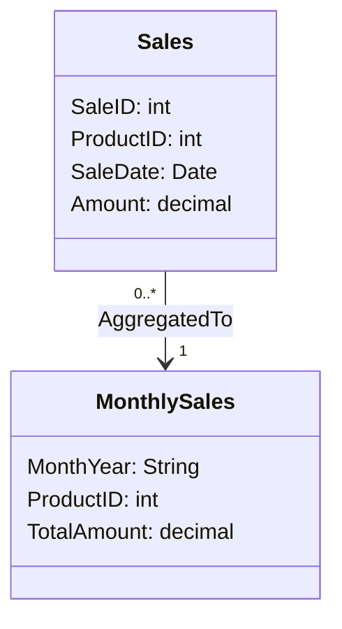

## Introduction

The Temporal Aggregation Normalization pattern focuses on normalizing aggregate temporal data to eliminate redundancy, improve data management, and optimize query performance. By structuring data into normalized temporal tables, we separate temporal data into more manageable and maintainable entities, which is crucial for reporting, analytics, and storage efficiency.

## Problem Statement

In many business scenarios, you have aggregate data that changes over time. Redundant storage of aggregates, such as total sales per month, can quickly lead to data management challenges. Certain use cases, such as time-series analysis or business analytics, require efficient retrieval and update of this data.

Without normalization, you might face:

- Duplication of aggregate data across different time periods.
- Increased complexity and storage requirements.
- Higher possibilities of errors during data updates.
- Difficulties in maintaining historical accuracy.

## Solution Overview

Temporal Aggregation Normalization provides a structured approach to storing aggregate temporal data, which prevents redundancy while simplifying querying and updates. By maintaining denormalized tables for raw transactional data and separate normalized tables for aggregates, consistent and accurate temporal analysis is facilitated.

## Architectural Approaches

1. **Normalize by Time Granularity**: Divide data into natural time periods, such as monthly or quarterly, to simplify aggregation operations.

2. **Temporal Tables**: Utilize temporal tables or time-based partitioning for organizing historical data. This also includes encapsulating these tables within a single database schema focused on temporal data.

3. **Indexing Strategies**: Focus on temporal indexing to enhance performance. Ensure efficient indexing on columns representing time periods.

## Best Practices

- **Time Dimension Table**: Maintain a time dimension table that includes details like year, quarter, month, day, and relevant fiscal periods to support efficient joins.

- **Batch Processing for Aggregation**: Use batch processing mechanisms for generating aggregates periodically instead of computing on-the-fly, especially when dealing with large datasets.

- **Utilize Database Features**: Leverage database-specific features like partitioning and indexing, ensuring that queries on temporal data remain efficient.

## Example Code

Here’s an example of temporal normalization using a Sales database:

```sql
CREATE TABLE Sales (
  SaleID INT PRIMARY KEY,
  ProductID INT,
  SaleDate DATE,
  Amount DECIMAL(10, 2)
);

CREATE TABLE MonthlySales (
  MonthYear VARCHAR(6),
  ProductID INT,
  TotalAmount DECIMAL(10, 2),
  PRIMARY KEY (MonthYear, ProductID)
);

INSERT INTO MonthlySales (MonthYear, ProductID, TotalAmount)
SELECT 
  DATE_FORMAT(SaleDate, '%Y%m') AS MonthYear,
  ProductID,
  SUM(Amount) AS TotalAmount
FROM Sales
GROUP BY MonthYear, ProductID;
```

## Diagrams

Here is a visual representation using Mermaid:



## Related Patterns

- **Event Sourcing**: Deals with storing each change to the application state as an event description, useful in rebuilding state over time.
- **Snapshot**: Comprises storing the state of an entity at a given point in time to expedite recovery times.

## Additional Resources

- [Temporal Data and The Relational Model by C. J. Date](https://books.google.com)
- [Using Time Series Databases for IoT Applications](https://timescaledb.com/)
- [Beginning Temporal Databases by Richard T. Snodgrass](https://www.amazon.com)

## Summary

In conclusion, Temporal Aggregation Normalization offers a strategic approach to manage temporal data efficiently while enhancing data clarity and ensuring robust performance. Application of this pattern aids in structuring temporal data in a manner conducive to easy updates and minimizes redundancy while leveraging the powerful features of modern databases. Whether developing new analytics solutions or optimizing legacy systems, this pattern proves invaluable in maintaining the integrity and efficiency of temporal datasets.
