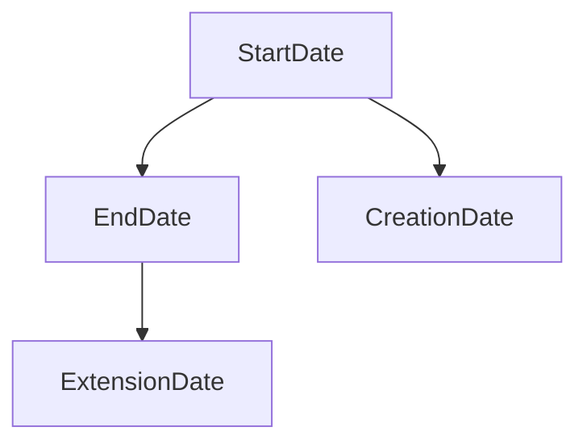

## Overview

Temporal Data Dependency Graphs are a modeling technique used to visualize and manage dependencies within temporal data to facilitate normalization. Temporal data, which includes time attributes like timestamps or periods, often inherently possesses complex relationships and dependencies. These relationships can be effectively represented as graphs where nodes represent temporal attributes, and edges encapsulate dependencies. This approach helps in understanding and normalizing temporal data models.

## Detailed Explanation

### Architecture and Components

The architecture of Temporal Data Dependency Graphs involves the following components:
- **Nodes**: Represent temporal attributes or sets of attributes.
- **Edges**: Encode dependencies indicating how one temporal attribute depends on another.

### Process of Normalization

1. **Identification**: Identify all relevant temporal attributes within datasets.
2. **Dependency Analysis**: Analyze these attributes to determine dependencies, using historical data evolution as guidance.
3. **Graph Construction**: Construct the graph, plotting nodes and drawing directional edges to denote dependencies.
4. **Graph Analysis**: Use graph traversal techniques to understand the paths and cycles, which may indicate complexities such as redundancy or anomalies.
5. **Normalization**: Based on the graph analysis, reorganize the data model to ensure each temporal attribute group is atomic concerning its dependencies, reducing redundancy and enhancing consistency.

### Example Code

```java
import java.util.*;

class TemporalNode {
    String attribute;

    public TemporalNode(String attribute) {
        this.attribute = attribute;
    }
}

class TemporalGraph {
    Map<TemporalNode, List<TemporalNode>> dependencyMap = new HashMap<>();

    public void addDependency(TemporalNode from, TemporalNode to) {
        dependencyMap.computeIfAbsent(from, k -> new ArrayList<>()).add(to);
    }

    public List<TemporalNode> getDependencies(TemporalNode node) {
        return dependencyMap.getOrDefault(node, new ArrayList<>());
    }
}

public class TemporalDataDependencyExample {
    public static void main(String[] args) {
        TemporalGraph graph = new TemporalGraph();
        
        TemporalNode startDate = new TemporalNode("StartDate");
        TemporalNode endDate = new TemporalNode("EndDate");
        
        graph.addDependency(startDate, endDate);
        
        System.out.println("Dependencies for " + startDate.attribute + ": ");
        for (TemporalNode dependentNode : graph.getDependencies(startDate)) {
            System.out.println("- " + dependentNode.attribute);
        }
    }
}
```

### Diagram

Here's an example of a simple Temporal Data Dependency Graph:



## Related Patterns

- **Temporal Record Versioning**: Managing temporal data changes over time using versioning systems.
- **Event Sourcing**: Capturing changes to an application state as a sequence of events, providing a reliable model for temporal data dependency modeling.

## Additional Resources

- *Temporal Data & The Relational Model* by C.J. Date, Hugh Darwen, and Nikos A. Lorentzos
- *Designing Data-Intensive Applications* by Martin Kleppmann

## Summary

Temporal Data Dependency Graphs offer a powerful means of visualizing and managing the dependencies in temporal datasets, assisting in the normalization process. By creating a graph representation, organizations can reduce data redundancy, enhance consistency, and lay a solid foundation for handling temporal data in a structured manner. This pattern is essential when dealing with complex temporal data flows, where understanding and controlling temporal dependencies is crucial.
