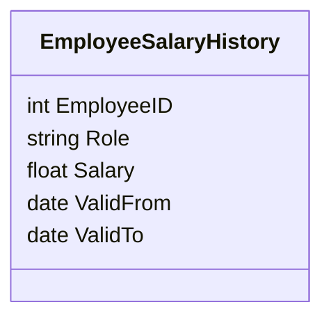

## Introduction

Temporal functional dependencies (TFDs) extend the concept of functional dependencies by incorporating the temporal aspect into data modeling, primarily in database systems. These are critical in scenarios where the attributes of entities depend not only on other attributes but also on time. This design pattern targets data normalization approaches that incorporate time as a fundamental dimension.

## The Importance of Temporal Functional Dependencies

In traditional database normalization, functional dependencies typically involve one attribute relying on another. However, in domains such as HR, finance, or any time-sensitive data system, temporal aspects come into play. For example, an employee's salary might depend on their position and the time period during which they held that position. Thus, handling TFDs is crucial for maintaining data accuracy and integrity over time.

## Key Concepts

- **Functional Dependency**: A relationship that defines how a column's value is determined by another column.
- **Temporal Element**: Inclusion of time validity into your database to record the period during which a fact is valid.
- **Temporal Normalization**: A schema design that explicitly accommodates time-dependent data-series and interactions.

## Architectural Approaches

### Adding Valid Time Columns

Incorporate additional columns to record the start and end times of the validity of a particular data point. This is fundamental for capturing TFDs. For instance:

```sql
CREATE TABLE EmployeeSalaryHistory (
  EmployeeID INT,
  Role VARCHAR(50),
  Salary DECIMAL(10, 2),
  ValidFrom DATE,
  ValidTo DATE,
  PRIMARY KEY (EmployeeID, Role, ValidFrom)
);
```

### Bi-temporal Data Management

Implement both system time (when the information is entered into the database) and valid time (the real-world time validity) to address TFDs adequately.

### Temporal Data Wrangling

Leverage techniques like snapshot-based and difference-based recording. Snapshot-based involves maintaining a full copy at each point in time, while difference-based stores only changes or deltas to the data.

## Example Code

### Querying Time-dependent Data

Here's an example of querying the salary history of an employee:

```sql
SELECT EmployeeID, Role, Salary, ValidFrom, ValidTo 
FROM EmployeeSalaryHistory 
WHERE EmployeeID = 123 
AND CURDATE() BETWEEN ValidFrom AND ValidTo;
```

This query retrieves the current salary details of an employee by checking if the current date falls within the validity period.

## Diagrams

Create a visual representation of the Employee Salary History data model using UML Class Diagrams in Mermaid:



## Related Patterns

- **Slowly Changing Dimensions (SCD)**: Techniques for managing and tracking changes in dimension tables.
- **State Transition Patterns**: Ideal for applications requiring archiving historical states and changes over time.

## Additional Resources

- "Temporal Data and the Relational Model" by C. J. Date, H. Darwen, and Nikos A. Lorentzos
- Industry case studies on temporal database design
- [Temporal Data in SQL Documentation](https://www.postgresql.org/docs/14/sql-intro-temporal.html)

## Summary

Handling temporal functional dependencies enhances database design by accounting for the validity of data over time. This design pattern is indispensable in maintaining consistency and accuracy in domains dealing with time-variant data. Leveraging temporal normalization and time-aware strategies ensures that historical information and evolutionary changes in data are tracked, analyzed, and stored effectively.
