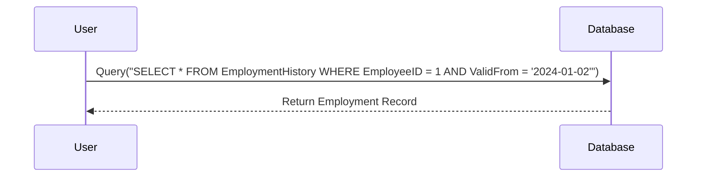

## Introduction

Temporal Candidate Key Identification is a critical pattern for designing databases that manage time-variant data. When handling historical or temporal data, traditional candidate keys may no longer suffice to uniquely identify records as data changes over time. Incorporating temporal attributes, such as valid-from or valid-to dates, into candidate keys ensures that these keys maintain their uniqueness, thereby preserving data integrity and supporting complex temporal queries.

## Problem Statement

In traditional databases, a candidate key is a minimal set of attributes that uniquely identify a record. However, when you introduce time as a factor, simply relying on non-temporal attributes may not prevent duplicates effectively as data changes over time. Examples such as recording the history of employment or membership where temporal data must be accurately captured necessitate identifying temporal candidate keys.

## Architectural Approach

### Understanding Temporal Attributes

1. **Temporal Data Types**: These attributes typically include valid-time and transaction-time, allowing you to query both current and historical data.
2. **Modeling Temporal Patterns**: Use temporal attributes to ensure that all historical transactions are recorded without ambiguities or overlap.

### Candidate Key Formation

- **Non-temporal Candidate Key (NT-CK)**: Includes attributes traditional to ensure uniqueness, excluding time-related dynamics.
- **Temporal Candidate Key (TCK)**: A superset of NT-CK that incorporates temporal attributes like ValidFrom, ValidTo, etc.

## Example

Consider a table meant to store historical employment data, where you track each employee's job history:

| EmployeeID | JobTitle  | Department | ValidFrom  | ValidTo    |
|------------|-----------|------------|------------|-------------|
| 1          | Analyst   | Marketing  | 2023-01-01 | 2024-01-01 |
| 1          | Lead      | Sales      | 2024-01-02 | 9999-12-31 |

In this example, the composite key `(EmployeeID, ValidFrom)` serves as a temporal candidate key, ensuring no two records will share the exact same identifiers, thus preserving the integrity of historical queries.

## Diagram

Below is a UML sequence diagram demonstrating how temporal candidate keys aid in fetching historical records based on temporal queries.

## Best Practices

- **Overlapping Periods**: Ensure periods do not overlap by enforcing business rules that adjust the `ValidTo` field appropriately when a new entry is inserted.
- **Query Optimization**: Index temporal attributes to optimize query performance on historical data.
- **Consistent Naming**: Standardize temporal attribute names across datasets for consistency and ease of understanding.

## Related Patterns

- **Temporal Data Management**: Strategies for comprehensive handling of temporal aspects across systems.
- **Slowly Changing Dimensions**: Techniques applied in data warehousing and feature management for evolving data over time.

## Additional Resources

- [Temporal Database Design](https://en.wikipedia.org/wiki/Temporal_database)
- [The Art of Temporal Data Management](https://books.google.com/)
- [Designing Temporal Databases: The Adamant Approach](https://books.google.com/)

## Summary

Identifying Temporal Candidate Keys is paramount when developing databases that aim to maintain data integrity through temporal dimensions. By designating these keys, systems can accurately record and query both present and past states of data. This design pattern not only helps in maintaining a robust database schema but also empowers complex analytical queries that depend on historical perspectives.
