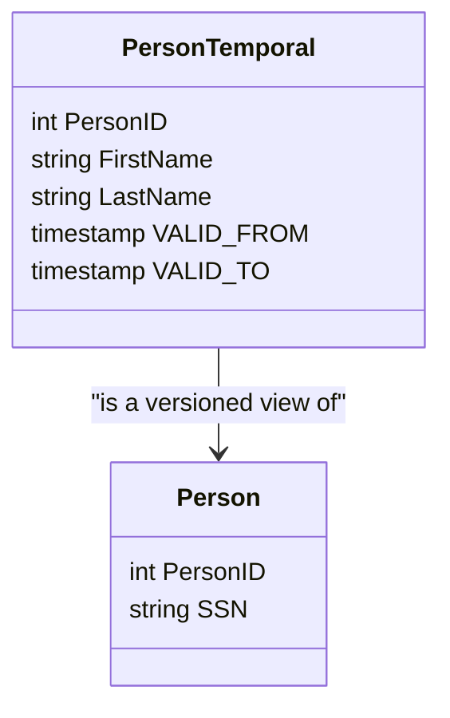

## Temporal Normalization of Non-Temporal Attributes

### Description

Temporal normalization in data modeling involves organizing and structuring data to ensure the accuracy and integrity of non-temporal attributes in temporal databases. This design pattern focuses on efficiently separating static information, like a Social Security Number (SSN), from attributes that are subject to change over time in temporal tables. The primary goal is to maintain data integrity and optimize queries by preventing unnecessary data duplication.

### Architectural Approach

1. **Separate Concerns**:
   * Maintain non-temporal attributes in a distinct table.
   * Use foreign keys to link the non-temporal data with temporal data.

2. **Effective Temporal Design**:
   * Implement system-versioned temporal tables to store histories of changes with `VALID FROM` and `VALID TO` attributes.
   * Apply bitemporal modeling when necessary to track both system time and valid time.

3. **Normalization**:
   * Utilize standard normalization principles, primarily focusing on 3NF (Third Normal Form) to achieve temporal normalization.

### Example Code

Here’s an example illustrating how you might structure database tables to achieve this pattern:

```sql
CREATE TABLE Person (
    PersonID int PRIMARY KEY,
    SSN varchar(11) NOT NULL
    -- Non-temporal attributes
);

CREATE TABLE PersonTemporal (
    PersonID int,
    FirstName varchar(255),
    LastName varchar(255),
    VALID_FROM TIMESTAMP,
    VALID_TO TIMESTAMP,
    PERIOD FOR SYSTEM_TIME (VALID_FROM, VALID_TO),
    FOREIGN KEY (PersonID) REFERENCES Person(PersonID),
    PRIMARY KEY (PersonID, VALID_FROM)
    -- Temporal attributes
);

ALTER TABLE PersonTemporal
ADD SYSTEM VERSIONING;
```

### Diagrams

#### UML Class Diagram



### Related Patterns

- **State Pattern**: Managing object state changes, relevant when constructing histories of temporal data.
- **Versioned Tables**: Structures that help create historical versions of data, essential in multi-temporal databases.

### Additional Resources

1. [Temporal Data & the Relational Model](https://www.example.com/resource1) - A comprehensive book on implementing temporal databases.
2. [Understanding Time in Databases](https://www.example.com/resource2) - An article addressing various temporal models.

### Summary

Temporal Normalization of Non-Temporal Attributes focuses on correctly situating immutable information within temporal table structures. This ensures data integrity, efficient querying, and optimal storage solutions in databases where historical accuracy is necessary. By properly applying design patterns and bifurcating temporal and non-temporal data, organizations can achieve more precise and reliable data insights.
