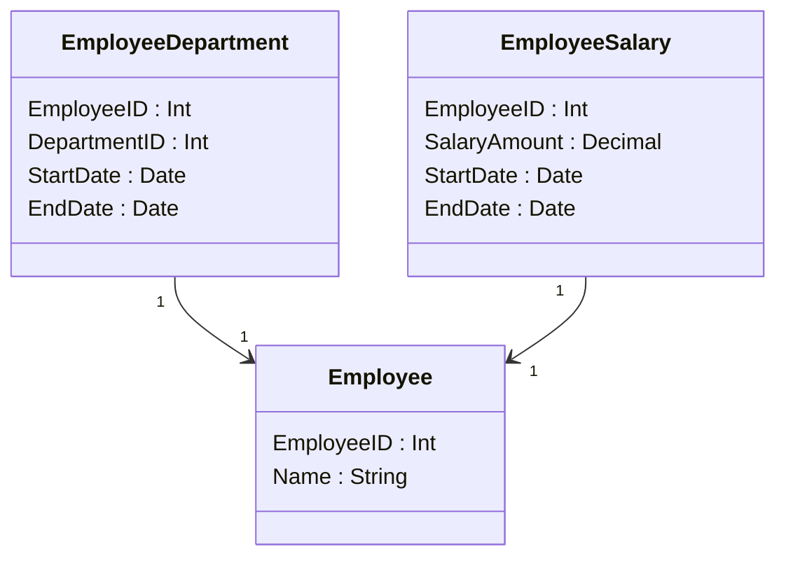

## Temporal Dependency Removal

Temporal Dependency Removal is a data modeling design pattern aimed at addressing the challenge of temporal dependencies in data, which often lead to anomalies and inconsistencies over time. This pattern is particularly relevant in domains where data evolves with time, and dependencies can introduce unnecessary complexity, affecting data integrity and performance. By removing these temporal dependencies, databases can attain higher normal forms, ensuring consistency and efficiency.

### Description

Temporal dependencies occur when temporal aspects of data, such as time-varying attributes, are inappropriately determining other attributes. This can lead to data anomalies when there are updates or changes over time. Temporal Dependency Removal focuses on restructuring the data model to eliminate these undesirable dependencies, thereby achieving a higher level of normalization specifically tailored for temporal data.

For example, consider a scenario where an employee's department assignment is influencing their salary over time. In this case, the department-to-salary dependency could result in incorrect salary data when either the department or salary information changes independently over time. Resolving this requires decoupling these dependencies and establishing a more stable and normalized model.

### Architectural Approach

**Key Steps:**

1. **Analyze Temporal Dependencies**:
   - Identify attributes with potential temporal dependencies.
   - Analyze the relationships and determine which attributes are unduly influencing others over time.

2. **Establish Temporal Tables**:
   - Use temporal tables to capture time-based changes.
   - Separate stable attributes from those likely to change over time.

3. **Normalize the Data Model**:
   - Apply normalization techniques specifically for temporal information, ensuring that each attribute is independent of others with respect to time.
   - Use concepts of temporal normalization akin to traditional database normalization but applied to temporal dimensions.

4. **Implement Historical Tracking**:
   - Integrate mechanisms for maintaining historical records without introducing temporal dependencies into unrelated attributes.
   - Consider implementing a slowly changing dimension (SCD) architecture if applicable.

### Best Practices

- **Independence of Time**: Ensure that changes in temporal data do not affect unrelated attributes.
- **Temporal Versioning**: Implement versioning to manage historical data effectively without introducing anomalies.
- **Data Consistency**: Maintain data consistency by ensuring that each time-varying attribute has its timeline independent of other attributes.

### Example Code

```sql
-- Example SQL to demonstrate temporal dependency removal
CREATE TABLE Employee (
    EmployeeID INT PRIMARY KEY,
    Name VARCHAR(100),
    -- Separate salary into its own historical table to remove dependency
);

CREATE TABLE EmployeeDepartment (
    EmployeeID INT,
    DepartmentID INT,
    StartDate DATE,
    EndDate DATE,
    PRIMARY KEY (EmployeeID, StartDate),
    FOREIGN KEY (EmployeeID) REFERENCES Employee(EmployeeID)
);

CREATE TABLE EmployeeSalary (
    EmployeeID INT,
    SalaryAmount DECIMAL(10, 2),
    StartDate DATE,
    EndDate DATE,
    PRIMARY KEY (EmployeeID, StartDate),
    FOREIGN KEY (EmployeeID) REFERENCES Employee(EmployeeID)
);
```

### Diagram

Below is a simple Mermaid UML diagram demonstrating this concept.



### Related Patterns

- **Slowly Changing Dimension (SCD)**: Understand different approaches for managing and storing historical data changes.
- **Data Versioning**: Techniques for versioning data to maintain historical integrity.
- **Temporal Data Management**: Broader category encompassing various strategies for effectively managing time-related information in databases.

### Additional Resources

- *"Temporal Data & the Relational Model"* by C. J. Date et al., for deeper insights into temporal relational theory.
- Explore database vendor documentation on temporal tables (e.g., SQL Server, Oracle).

### Summary

Temporal Dependency Removal is a vital pattern in managing temporal data models by removing unsuitable dependencies that could result in data anomalies. This pattern helps achieve a higher normal form specifically tailored for temporal databases, ensuring data integrity, consistency, and simplifying updates over time. By decoupling temporal dependencies, organizations can maintain cleaner, more efficient, and more reliable data models.
