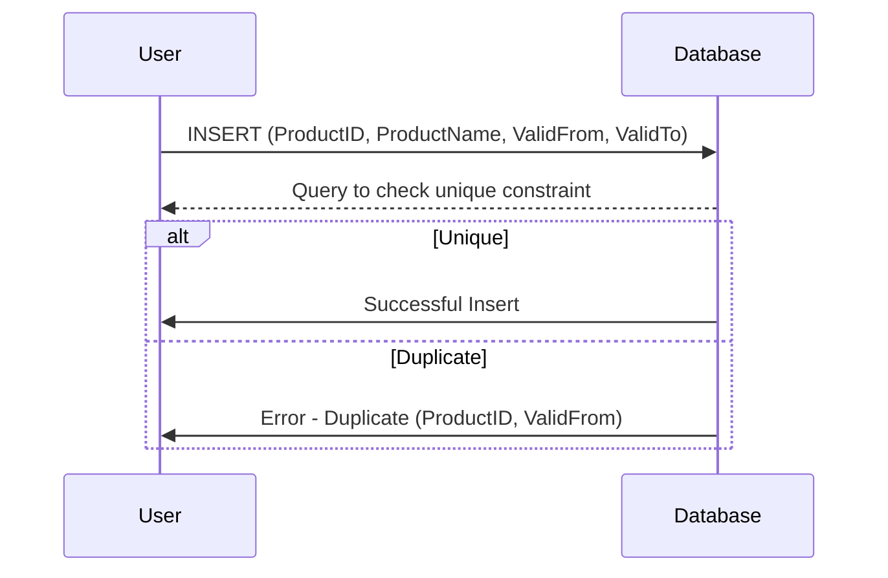

Temporal Key Constraints are a crucial aspect of data modeling, especially for systems dealing with time-varying information. These constraints ensure that key constraints, typically uniqueness and primary keys, take into account the temporal elements of the dataset—namely, attributes that denote time periods or timestamps.

## Description

Temporal Key Constraints involve defining keys that are unique not just by their traditional fields but also considering the temporal dimensions of the data. This pattern ensures that records can be uniquely identified even as their attributes might change over time, which is vital for historical archiving and auditing purposes. A common application is in managing slowly changing dimensions (SCDs) where maintaining a history of changes is essential.

## Architectural Approach

1. **Define Temporal Attributes**: Include time-specific columns such as `ValidFrom` and `ValidTo` to reflect the period during which a particular record version is valid.

2. **Composite Keys**: Use composite keys that include both the unique identifier (e.g., `ProductID`) and the temporal attributes (i.e., `ValidFrom`, `ValidTo`). This combination ensures that each record is unique across the specified time span.

3. **Constraint Enforcement**: Implement constraints within the database to enforce these keys. This usually involves the creation of unique indexes or constraints that span multiple columns.

4. **Handling Overlaps**: Implement logic to prevent temporal overlaps for the same entities, ensuring that no two records for the same entity have overlapping valid periods.

## Example Code

Here is an example SQL script that enforces temporal key constraints using a composite primary key approach:

```sql
CREATE TABLE ProductHistory (
    ProductID INT,
    ProductName VARCHAR(255),
    ValidFrom DATE,
    ValidTo DATE,
    PRIMARY KEY (ProductID, ValidFrom)
);

-- Additional check to ensure ValidFrom is always less than ValidTo
ALTER TABLE ProductHistory
ADD CONSTRAINT chk_valid_dates CHECK (ValidFrom < ValidTo);
```

This setup defines `ProductID` and `ValidFrom` as the composite key ensuring that within each validity period, the records are unique.

## Diagrams

Below is a simplified Mermaid UML Sequence Diagram showing the enforcement of a temporal constraint upon record insertion.



## Related Patterns

- **Slowly Changing Dimension (SCD) Type 2**: This pattern also involves tracking the temporal validity of data for historical record keeping.
- **Temporal Table**: Similar to temporal key constraints, temporal tables manage changes over time while automatically maintaining a history of row changes.

## Additional Resources

- [Temporal Tables in SQL Server](https://docs.microsoft.com/en-us/sql/relational-databases/tables/temporal-tables)
- [Design and Implementation of Temporal Databases](https://www.amazon.com/Design-Implementation-Temporal-Databases)
- [Temporal Data & the Relational Model](https://www.amazon.com/Temporal-Data-Relational-Model/dp/1558608559)

## Summary

Temporal Key Constraints are essential in situations where maintaining a record of historical data while ensuring data integrity is crucial. By incorporating time attributes into key constraints, it becomes possible to enforce uniqueness and prevent overlaps across time intervals, thus enhancing the reliability of data in temporal databases. This approach is especially useful in systems requiring precise audits of historical data changes and in business intelligence applications where historical data trends are analyzed.
