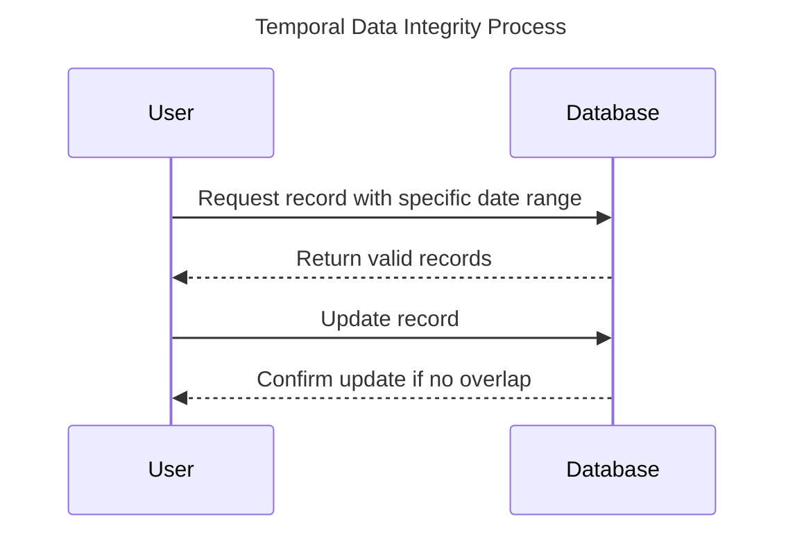

Temporal data integrity through normalization is a design pattern that focuses on ensuring data integrity by systematically organizing temporal data within databases. This pattern addresses specific challenges associated with handling current, historical, and future data, ensuring consistent and reliable access to time-sensitive information.

## Detailed Explanation

### Design Pattern Overview

The pattern of temporal data integrity through normalization involves structuring temporal data using normalization principles to eliminate redundancy, minimize update anomalies, and maintain consistency. This typically involves:

1. **Temporal Normal Forms**: Expanding traditional normalization normal forms to accommodate temporal dimensions.
2. **Temporal Granularity**: Managing temporal granularity effectively, ensuring uniformity.
3. **Separation of Concerns**: Keeping valid time and transaction time separate to account for different aspects of temporality.

### Architectural Approaches

To achieve temporal data normalization, several architectural approaches can be adopted:

1. **Bitemporal Data Models**: Employing models that include both valid-time and transaction-time dimensions, allowing for comprehensive time-based queries and historical data management.

2. **Reference Tables for Temporal Data**: Using additional tables or columns to track the time-related details without cluttering the main data schema.

3. **Time-Stamped Records**: Implementing time stamps for each transaction and ensuring proper indexes for efficient retrieval of temporal records.

4. **Versioned Entities**: Creating entity versions to handle changes effectively, enabling rollback and audit functionalities.

### Best Practices

1. **Use of Surrogate Keys**: Maintain surrogate keys separate from natural keys to accommodate time-related changes.

2. **Consistent Time Zone Support**: Ensure all date-time columns have consistent time zone settings to avoid discrepancies.

3. **Efficient Indexing**: Apply appropriate indexing strategies to optimize query performance for time-based operations.

4. **Temporal Consistency Checks**: Implement checks and constraints to prevent temporal anomalies such as overlapping periods.

### Example Code

Here's a simplified example to illustrate how temporal normalization might be implemented in a SQL database:

```sql
CREATE TABLE ProductHistory (
    ProductID INT,
    ProductName VARCHAR(255),
    ValidFrom DATETIME,
    ValidTo DATETIME,
    CONSTRAINT PK_ProductHistory PRIMARY KEY (ProductID, ValidFrom)
);

-- Insert product periods ensuring non-overlapping timelines
INSERT INTO ProductHistory (ProductID, ProductName, ValidFrom, ValidTo)
VALUES 
(1, 'Product A', '2023-01-01', '2023-06-30'),
(1, 'Product A', '2023-07-01', '2023-12-31');
```

### Diagrams

#### Mermaid UML Sequence Diagram



## Related Patterns

- **Slowly Changing Dimensions (SCD)**: A methodology for managing changes over time in data warehousing.
- **Event Sourcing**: A design pattern for capturing all changes to an application state as a sequence of events.
- **State Logging**: A technique for capturing and storing state changes for auditing purposes.

## Additional Resources

To further explore the topic, consider the following resources:

- [Temporal Data & The Relational Model](https://www.amazon.com/Temporal-Data-Relational-Representation-Management/dp/1558608559) - Insights into temporal data management.
- [Slowly Changing Dimensions](https://www.kimballgroup.com/category/design-tip/) - Kimball Group documentation and insights into handling changes over time.

## Summary

Temporal data integrity through normalization is a crucial design pattern that ensures data consistency and integrity in systems dealing with time-variant data. By utilizing solid architectural approaches and adhering to best practices, developers can effectively manage and query temporal data in relational databases while preventing anomalies and ensuring data reliability.
