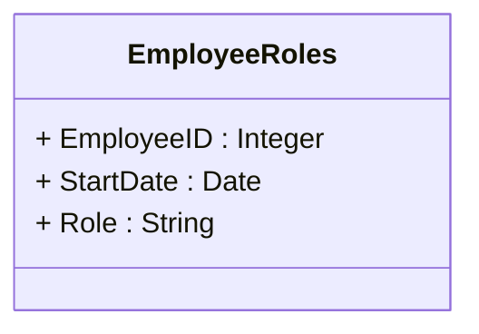

## Introduction

Temporal Boyce-Codd Normal Form (BCNFt) is an advanced normalization technique specifically designed for temporal databases. It builds upon the principles of Boyce-Codd Normal Form (BCNF) by incorporating the time dimension into the normalization process. BCNFt is crucial for maintaining the integrity and consistency of temporal data models.

## Importance of Temporal Normalization

Temporal data, which involves information changing over time, requires special attention during the normalization process. Traditional normalization forms such as 1NF, 2NF, and 3NF do not sufficiently address the complexities that arise with the time-sensitive nature of data. Temporal normalization ensures that temporal dependencies and constraints are accurately captured and managed.

## Temporal Boyce-Codd Normal Form (BCNFt) Explained

BCNFt strengthens the temporal Third Normal Form (3NFt) by ensuring that every temporal determinant is a candidate key. This prevents anomalies related to updates, deletes, and inserts in a temporal context. Here’s how BCNFt is applied:

- **Candidate Key Enforcement**: Every temporal determinant in a relation must be a candidate key. This reduces redundancies and enhances data consistency.
- **Separation of Concerns**: Attributes determined by temporal keys are stored in their respective tables where those keys act as primary identifiers.
- **Temporal Integrity**: Ensures that dependencies are logical over time, avoiding partial dependencies on non-candidate time attributes.

## Example

Imagine a database system tracking employee roles over time. Consider an original non-normalized temporal table:

| EmployeeID | Role       | StartDate  | EndDate    |
|------------|------------|------------|------------|
| 101        | Developer  | 2023-01-01 | 2023-06-30 |
| 101        | Manager    | 2023-07-01 | 2024-01-01 |

In this case, EmployeeID and StartDate act as a temporal determinant. In BCNFt, we ensure all non-trivial dependencies are supported by candidate keys.

**Reorganized Table (Normalized to BCNFt):**

- **EmployeeRoles Table**

| EmployeeID | StartDate  | Role     |
|------------|------------|----------|
| 101        | 2023-01-01 | Developer|
| 101        | 2023-07-01 | Manager  |

By making `(EmployeeID, StartDate)` a candidate key, all role data can be uniquely identified and managed appropriately without redundancy.

## Diagrams

To illustrate temporal normalization transition into BCNFt, consider the UML Class Diagram:

## Related Design Patterns

- **Temporal First Normal Form (1NFt)**: Focuses on eliminating duplicate times by ensuring each row has unique time attributes.
- **Temporal Second Normal Form (2NFt)**: Removes partial dependencies in temporal tables.
- **Temporal Third Normal Form (3NFt)**: Eliminates transitive dependencies in temporal contexts.

## Additional Resources

For more insight into temporal data modeling and normalization:

- [Temporal Data & The Relational Model](https://example.com)
- [Advanced Database Systems by Ceri and Pelagatti](https://example.com)
- [Temporal Database Systems: Chapter on Normalization](https://example.com)

## Summary

Temporal Boyce-Codd Normal Form (BCNFt) offers a robust framework for organizing temporal data within relational databases. It advances temporal normalization by enforcing candidate key integrity across time-determined attributes. Implementing BCNFt can optimize database design, reduce redundancy, and enhance data consistency over time, making it indispensable for systems managing historical and time-variant data.
