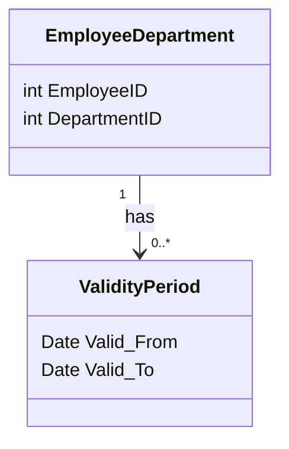

---

linkTitle: "Temporal Functional Dependencies"
title: "Temporal Functional Dependencies"
category: "Temporal Normalization"
series: "Data Modeling Design Patterns"
description: "Identifying and enforcing functional dependencies that include temporal dimensions."
categories:
- Data Modeling
- Database Design
- Temporal Databases
tags:
- temporal normalization
- data modeling
- temporal databases
- functional dependencies
- temporal data
date: 2024-07-07
type: docs

canonical: "https://softwarepatternslexicon.com/103/10/5"
license: "© 2024 Tokenizer Inc. CC BY-NC-SA 4.0"
---


## Introduction

In the ever-evolving landscape of data modeling, particularly in systems where temporal data plays a significant role, there's a need to not only consider functional dependencies but also to include temporal dimensions within these dependencies. This design pattern introduces Temporal Functional Dependencies (TFDs), which incorporate time-oriented aspects into traditional dependency paradigms to better manage and normalize temporal data within databases.

## Description

Temporal Functional Dependencies integrate the concept of time into functional dependencies, allowing databases to accurately model historical, current, and future data scenarios. It focuses on ensuring that data sets comply with dependency rules over specific time intervals.

### Key Concepts
- **Temporal Dimension**: A time aspect (e.g., valid time, transaction time) integral to the structure and semantics of the database.
- **Functional Dependency**: A relationship where one set of attributes uniquely determines another set.
- **Temporal Functional Dependency**: An extension of functional dependency that includes a temporal component, denoting that a certain attribute set is dependent on another set over a specified time period.

### Use Case Example

Consider an **employee's department**, which is functionally dependent on their **employee ID** and the **valid time**. Here, the valid time signifies the period during which the employee is associated with a particular department. This ensures that the history of department changes over time can be reconciled correctly without losing information about previous associations.

## Architectural Approaches

### Modeling the Temporal Dimension

1. **Add Temporal Attributes**:
   - Introduce time attributes such as `Valid_From` and `Valid_To` to model temporal aspects of records within tables.
   
2. **Temporal Tables**:
   - Use temporal tables provided by modern relational databases, which inherently facilitate storing state changes along with timestamps.

3. **Database Triggers and Constraints**:
   - Implement triggers or checks to maintain temporal integrity, ensuring that updates and deletes respect the defined temporal intervals.

## Example Code

### SQL Example

Using SQL, suppose we have a table storing employee departments:

```sql
CREATE TABLE EmployeeDepartments (
  EmployeeID INT,
  DepartmentID INT,
  Valid_From DATE,
  Valid_To DATE,
  PRIMARY KEY (EmployeeID, Valid_From)
);
```

### Enforcing Temporal Functional Dependencies

Ensure no overlapping validity for a single employee:

```sql
CREATE TRIGGER Check_Overlapping_Departments
BEFORE INSERT OR UPDATE ON EmployeeDepartments
FOR EACH ROW
BEGIN
  IF EXISTS (SELECT 1 FROM EmployeeDepartments
             WHERE EmployeeID = NEW.EmployeeID
               AND NEW.Valid_From < Valid_To
               AND NEW.Valid_To > Valid_From) THEN
    SIGNAL SQLSTATE '45000' SET MESSAGE_TEXT = 'Overlapping valid time periods not allowed';
  END IF;
END;
```

## Diagrams



## Related Patterns

- **Slowly Changing Dimension**: Manages and tracks changes in dimensions over time in data warehouse environments.
- **Bi-Temporal Tables**: Extends temporal tables to manage both transaction time and valid time.

## Additional Resources

- *Implementing a Temporal Data Model* by Snodgrass, T.
- *Temporal Database Management* by Bohlen, M.H.

## Summary

Temporal Functional Dependencies provide a robust framework for handling the challenges associated with managing and normalizing temporal data. By integrating time with traditional dependency rules, organizations can maintain high data fidelity over time, ensuring accurate historical tracking and more insightful business analytics. This pattern encourages careful consideration and design of temporal aspects for data management systems, particularly in industries where historical analysis is critical.
