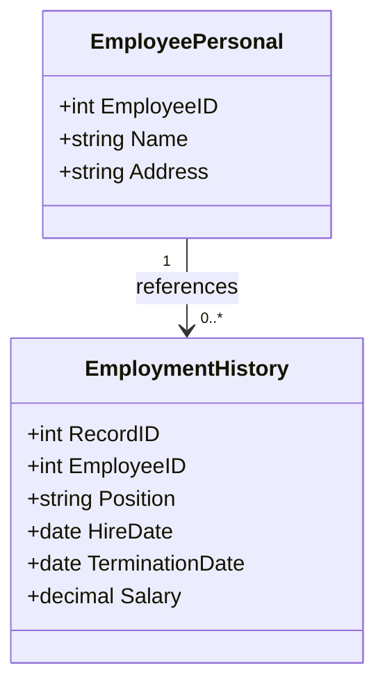

Temporal decomposition is a design pattern used in data modeling to improve database design and reduce redundancy specifically in temporal tables. This approach helps maintain integrity and manage temporal relationships between data entities by decomposing complex temporal tables into smaller, more manageable tables.

## Description

Temporal data is often complex, due to the need to track changes over time. Maintaining such data in large, monolithic tables can lead to redundancy and potential data anomalies. Temporal decomposition seeks to address this by splitting larger temporal tables into smaller, more specialized tables while preserving the temporal relationships.

### Benefits of Temporal Decomposition:

- **Redundancy Elimination**: By splitting tables, we eliminate unnecessary data duplication, which helps in optimizing storage and improving query performance.
- **Enhanced Data Integrity**: Smaller tables ensure that each piece of data is stored only once, reducing the risk of inconsistencies.
- **Improved Maintainability**: Managing smaller, more focused tables can ease the maintenance overhead and allow for easier schema evolution.

## Architectural Approach

When decomposing temporal tables, consider the following architectural steps:

1. **Identify Temporal Entities**: Recognize your primary entities (e.g., employees, orders) that incorporate temporal aspects.
2. **Analyze Temporal Attributes**: Determine which attributes within these entities change over time.
3. **Decompose into Base and Temporal Tables**: Separate static data (e.g., personal information) from temporal data (e.g., employment history) accordingly.
4. **Define Relationships**: Use foreign key relationships to relate these tables back to the main entity, preserving the semantic integrity.
5. **Manage Temporal Dimensions**: Ensure that each temporal table includes necessary columns for temporal tracking, like `start_date` and `end_date`.

## Example: Employee Data

Consider an example in an Employee Records database where you need to track both personal data and employment history.

### Tables Before Decomposition

- **Employee** (EmployeeID, Name, Address, Position, HireDate, TerminationDate, Salary)

### Tables After Decomposition

- **EmployeePersonal** (EmployeeID, Name, Address)
- **EmploymentHistory** (RecordID, EmployeeID, Position, HireDate, TerminationDate, Salary)

### Example SQL Statements

To demonstrate the creation of decomposed tables:

```sql
CREATE TABLE EmployeePersonal (
    EmployeeID INT PRIMARY KEY,
    Name VARCHAR(100),
    Address VARCHAR(200)
);

CREATE TABLE EmploymentHistory (
    RecordID INT PRIMARY KEY,
    EmployeeID INT,
    Position VARCHAR(100),
    HireDate DATE,
    TerminationDate DATE,
    Salary DECIMAL(10, 2),
    FOREIGN KEY (EmployeeID) REFERENCES EmployeePersonal(EmployeeID)
);
```

## Diagrams

Below is a Mermaid UML Class diagram illustrating the relationship between decomposed employee tables.



## Best Practices

- **Regular Monitoring**: Regularly review the temporal tables to ensure that the decomposition still meets business and performance needs.
- **Schema Versioning**: Implement schema versioning to track changes over time and facilitate rollback if needed.
- **Comprehensive Indexing**: Use indexing strategies to optimize query performance across decomposed tables.

## Related Patterns

- **Temporal Tables**: Focus on storing complete history for a given dataset, offering insight into historical data states.
- **Data Segmentation**: Breaks down datasets for improved performance, but not necessarily tied to temporal data.

## Additional Resources

- [Temporal Data Management Principles](https://www.temporaldatamanagement.com)
- [Kristin Rafaloff's Database Design Guidelines](https://developer.db-design.com/guidelines)

## Summary

Temporal decomposition is crucial in managing temporal data efficiently, ensuring reduced redundancy, improved integrity, and maintainability. By applying this pattern, organizations can streamline their temporal data management processes, enhancing data quality and operational efficiency.
