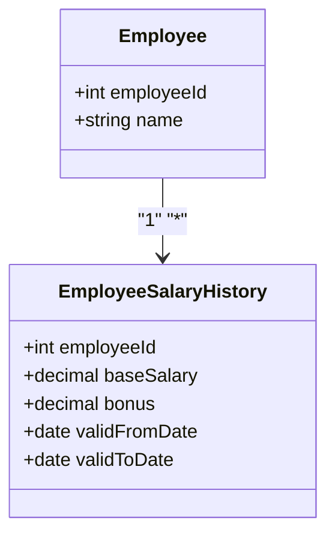

## Temporal Attribute Grouping

### Description
Temporal Attribute Grouping is a data modeling design pattern that involves grouping temporal attributes—that is, attributes that are dependent on time and often change together—into a single table. This pattern is used to maintain the relationships and co-dependencies among these attributes, ensuring that changes in one attribute are consistently reflected in others. It supports maintaining historical data and can enhance the system's ability to process and query time-dependent information efficiently.

### Architectural Approaches
1. **Temporal Tables**: Utilize temporal tables to track changes over time. These tables inherently store data states at different points in time, which is suitable for retaining a historical record.
2. **Audit Logs**: Implement audit logging to track changes to the grouped temporal attributes for auditing purposes while maintaining a coherent change history.
3. **Change Data Capture**: Use change data capture (CDC) methods to detect changes in temporal attributes and propagate these changes in an event-driven architecture.
4. **Effective-Through Dates**: Use column pairs representing 'effective' and 'through' dates to define the timeframe during which a record is valid, facilitating the management of historical data.

### Paradigms and Best Practices
- **Atomicity**: Ensure changes to grouped attributes are atomic, using transactional operations to prevent partial updates.
- **Encapsulation**: Abstract the complexity of temporal data manipulation behind APIs or services to prevent direct manipulation of tables.
- **Consistency**: Leverage database constraints to maintain data integrity across related time-dependent attributes.
- **Scalability**: Optimize indexes and queries to handle large volumes of historical data efficiently.

### Example Code

Consider a table storing `Employee` salary history, where salary properties like `baseSalary`, `bonus`, and `validFromDate`/`validToDate` are temporally linked:

```sql
CREATE TABLE EmployeeSalaryHistory (
    employeeId INT NOT NULL,
    baseSalary DECIMAL(10, 2) NOT NULL,
    bonus DECIMAL(10, 2),
    validFromDate DATE NOT NULL,
    validToDate DATE,
    PRIMARY KEY (employeeId, validFromDate),
    FOREIGN KEY (employeeId) REFERENCES Employee(employeeId)
);
```

In this example, all salary-related attributes are co-located, with effective date ranges used to encapsulate changes over time.

### Diagrams

#### UML Class Diagram



### Related Patterns with Descriptions
- **Snapshot Pattern**: Captures snapshots of entity states at given times, useful for analysis and rollback.
- **Event Sourcing**: Records all changes as a sequence of events, enabling the reconstruction of past states with automatic temporal attribute grouping.
- **Bitemporal History**: Manages two timelines of data, combining respective valid times and transaction times for comprehensive historical accuracy.

### Additional Resources
- [Temporal Design Patterns](https://martinfowler.com)
- [Effective Date Handling Best Practices](https://docs.oracle.com/en/database/oracle/oracle-database/19/adfns/temporal-data.html)
- [Change Data Capture Techniques](https://cloud.google.com/architecture/real-time-batch-integrated-dataflows)

### Summary
Temporal Attribute Grouping is a potent design pattern for efficiently managing time-dependent data. By consolidating temporally-dependent attributes, organizations can better maintain data integrity, reduce redundancy, and enhance historical analysis capability. Integrating this pattern with appropriate architectural methods and technology ensures reliable, scalable handling of temporal data.

This design pattern supports key operation needs like audit trails, consistent reporting, and historical data analysis, crucial for the temporal aspect of modern applications.
