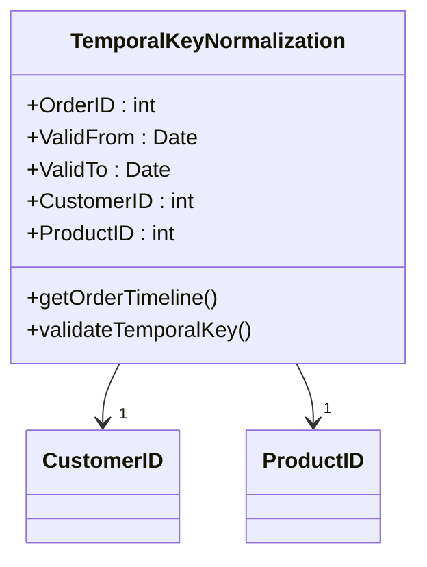

## Introduction

In modern data-driven applications, handling time-varying data efficiently is crucial. Temporal Key Normalization is a design pattern focusing on using temporal keys to ensure that each temporal record is uniquely identifiable. This is particularly important in systems where the historical state of data is as crucial as its current state, such as in financial, healthcare, and IoT applications.

## Description

The Temporal Key Normalization pattern dictates the structure of temporal keys, which typically involve combining entity identifiers with temporal attributes. This approach helps keep track of records across different time periods, thus enabling accurate data versioning and historical queries. A temporal key generally includes:

- **Entity ID**: Unique identifier for the data entity (such as customer ID, transaction ID).
- **Time Dimension**: Can be 'valid time', which refers to the period during which a fact is true in the real world, or 'transaction time', indicating when the data was stored in the database.

The combination of these two elements forms a composite key, ensuring uniqueness and facilitating precise querying of historical data states. 

## Architectural Approaches

When implementing Temporal Key Normalization, different architectural guidelines and database strategies may be adopted:

1. **Bitemporal Storage**: Store both valid time and transaction time, allowing for complex queries and historical audit trails.
2. **Temporal Databases**: Utilize databases with native support for temporal data (e.g., Oracle, PostgreSQL with temporal extensions).
3. **Time Series Databases**: Use specialized time series databases that inherently manage temporal data efficiently.

## Best Practices

- **Data Consistency**: Ensure that temporal keys consistently observe the same format and rules across all records.
- **Efficient Indexing**: Implement composite indexing on temporal keys to improve query performance.
- **Redundancy Minimization**: Normalize temporal data to avoid redundancy, ensuring scalability and maintainability.
- **Version Control**: Manage data modifications using versioning, allowing rollback and audit of incorrect data changes.

## Example Code

Below is a simplified SQL example demonstrating how to create a table with a composite key for temporal data:

```sql
CREATE TABLE Orders (
    OrderID INT,
    ValidFrom DATE,
    ValidTo DATE,
    CustomerID INT,
    ProductID INT,
    Quantity INT,
    PRIMARY KEY (OrderID, ValidFrom)
);
```

In this example, `OrderID` and `ValidFrom` together form the composite key, ensuring each record is uniquely identified by its time period of validity.

## Diagrams

Here is a Mermaid UML diagram to describe the Temporal Key Normalization pattern visually:



## Related Patterns

- **Indexing Strategies for Time-Based Data**: Complementary pattern to enhance query performance on temporal datasets.
- **Event Sourcing**: Captures all changes to an application state as a sequence of events, effectively handling temporal data.

## Additional Resources

- [Temporal Data & the Relational Model](https://example.com/temporal-data-relational-model) - In-depth book on modeling temporal data using relational databases.
- [Database Management Systems: Temporal Extensions](https://example.com/dbms-temporal-extensions) - An article about temporal extensions in traditional DBMS.

## Summary

Temporal Key Normalization is a crucial pattern in data modeling that ensures data integrity and enables efficient manipulation of temporal datasets. By leveraging composite keys of entity IDs and time dimensions, organizations can maintain accurate, query-able historical data, contributing markedly to operational insight and decision-making.
