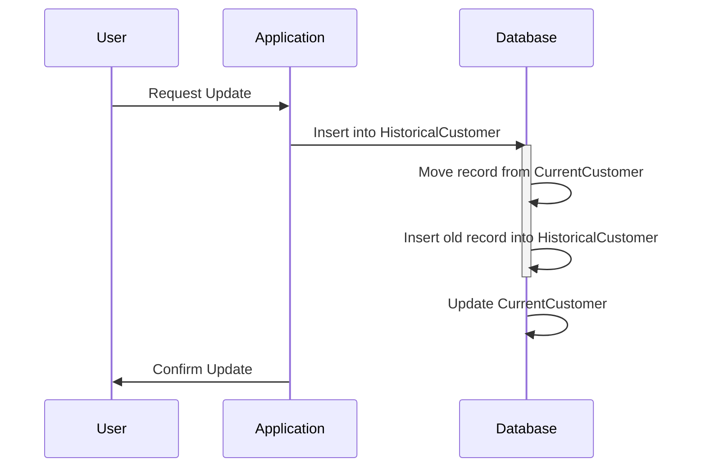

## Temporal Splitting

### Description

Temporal Splitting is a data modeling design pattern aimed at managing time-variant data by dividing a temporal relation into separate logical units. This segmentation typically involves creating distinct databases or tables for current and historical records, minimizing anomalies, and streamlining queries to cost-effectively handle different types of temporal data. It ensures that databases can adapt to the changing realities represented by temporal data, improving accuracy and efficiency.

### Architectural Approach

1. **Identify Temporal Attributes**: Determine which attributes within the data model vary over time. Commonly, these are attributes related to status, value, or condition.

2. **Segment the Data**: Divide your primary dataset into current and historical datasets. This can result in multiple structures such as:
   - **Current Table**: Contains only the latest valid data.
   - **Historical Table**: Stores outdated or previous versions of the data.

3. **Manage Update Operations**: Implement mechanisms to move records from current to historical tables when they change.

4. **Query Optimization**: Direct time-sensitive queries to the appropriate structure (e.g., historical queries to historical tables), which optimizes performance and reduces unnecessary complexity.

### Example Code

Let's illustrate how Temporal Splitting can be applied using a simple example with SQL database tables:

#### Original Data Table
```sql
CREATE TABLE Customer (
    CustomerID INT PRIMARY KEY,
    Name VARCHAR(100),
    Status VARCHAR(50),
    ValidFrom DATE,
    ValidTo DATE
);
```

#### Splitting Into Current and Historical
```sql
CREATE TABLE CurrentCustomer (
    CustomerID INT PRIMARY KEY,
    Name VARCHAR(100),
    Status VARCHAR(50),
    LastModified DATE
);

CREATE TABLE HistoricalCustomer (
    CustomerID INT,
    Name VARCHAR(100),
    Status VARCHAR(50),
    ValidFrom DATE,
    ValidTo DATE,
    PRIMARY KEY (CustomerID, ValidFrom)
);
```

### Diagrams

#### Mermaid UML Sequence Diagram for Temporal Splitting


### Related Patterns

- **Temporal Tables**: Utilize built-in database support for auditing changes and understanding states over time for record versions.
  
- **Event Sourcing**: Store all changes to an application state as a sequence of events, which provides a complete audit trail.

### Best Practices

- Plan and design indexing strategies carefully to maintain performance and speed with historical record query processing.
- Regularly archive or purge extremely old historical records to manage data volume.
- Implement metadata strategies for tracking the rationale and method of data versioning.
  
### Additional Resources

- **Book**: "Temporal Data & the Relational Model" by C.J. Date, Hugh Darwen, and Nikos Lorentzos
- **Article**: [Temporal Patterns for Managing Historical Data](https://example-article-link.com)

### Summary

Temporal Splitting is an essential design pattern for managing temporal data effectively. It enhances database performance by eliminating anomalies and minimizing data redundancy, facilitating easy access and management of both current and historical datasets. By incorporating best practices and related patterns, organizations can obtain precise control over their time-sensitive data, providing valuable insights and more efficient operations.
