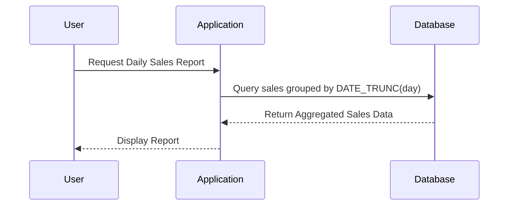

## Time-Based Grouping

Time-Based Grouping is a powerful design pattern used in data modeling, especially when handling temporal data. This pattern involves aggregating records by grouping them into defined time intervals like hours, days, weeks, months, or years. It is widely used in various domains such as finance, retail, healthcare, and IoT to summarize data over a specified period, resulting in simplified analysis and reporting.


## Architectural Approach

Implementing a Time-Based Grouping pattern typically involves the following steps:

1. **Data Collection**:
   Collect raw data streams with associated timestamps. This can involve multiple sources such as transactional databases, event logs, or sensor feeds.

2. **Time Series Partitioning**:
   Partition data based on temporal attributes. Ensure the timestamp attribute is properly indexed for efficient querying and aggregation.

3. **Define Time Intervals**:
   Decide on the granularity of the aggregation (e.g., hourly, daily, monthly). The choice depends on the business requirements and the volume of data.

4. **Aggregation Logic**:
   Use aggregation functions to summarize grouped data. For example, calculate sums, averages, counts, etc.

5. **Storage/Presentation**:
   Store the aggregated results in a suitable database or display them in dashboards or reports for analysis.


## Best Practices

- **Time Zone Handling**:
  Always normalize timestamps by converting them to a consistent UTC format to prevent discrepancies due to time zone differences.

- **Indexing**:
  Use appropriate indexes on the timestamp column to speed up the query performance when extracting time series data.

- **Window Functions**:
  In SQL-based systems, consider using window functions for more complex time-based calculations and analysis.

- **Batch vs. Real-Time**:
  Decide whether aggregations should be performed in batches (ETL jobs) or in real-time (stream processing) based on the nature of data and user requirements.


## Example Code

Here's how Time-Based Grouping could be implemented using SQL:

```sql
SELECT
  DATE_TRUNC('day', sale_date) AS sale_day,
  SUM(amount) AS total_sales
FROM
  transactions
GROUP BY
  sale_day
ORDER BY
  sale_day;
```

For a stream processing scenario using Apache Kafka Streams:

```java
KStream<String, Transaction> transactions = builder.stream("transactions");

KTable<Windowed<String>, Double> salesAggregated = transactions
    .groupBy((key, value) -> value.getSaleDate().truncatedTo(ChronoUnit.DAYS).toString())
    .windowedBy(TimeWindows.ofSizeWithNoGrace(Duration.ofDays(1)))
    .aggregate(
        () -> 0.0,
        (aggKey, newValue, aggValue) -> aggValue + newValue.getAmount(),
        Materialized.with(Serdes.String(), Serdes.Double()));
```

## Diagrams

### Sequence Diagram



## Related Patterns

- **Sliding Window**: Complementary to Time-Based Grouping, allows dynamic analysis over moving intervals rather than fixed periods.
  
- **Event Sourcing**: Records events rather than state, making it easier to apply time-based grouping for historical data reconstruction.

- **CQRS (Command Query Responsibility Segregation)**: Utilizes separate models for update and read operations, often organising data for faster retrieval in time-based formats.


## Additional Resources

- **Books**: 
  - "Designing Data-Intensive Applications" by Martin Kleppmann
  - "Building Event-Driven Microservices" by Adam Bellemare
  
- **Articles**:
  - "Time Series Databases and their key design considerations"
  - "Kafka Streams: Patterns and Use Cases"

- **Tools and Frameworks**:
  - Apache Kafka, Apache Flink
  - Time-series databases like InfluxDB, TimescaleDB

## Summary

Time-Based Grouping allows businesses to leverage temporal data by simplifying complex data sets into easily digestible time-based summaries. The pattern's flexibility enables scalable analytics across various domains, providing insights that drive decision-making and operational efficiency. Implementers must consider time zones, indexing, data process timing, and potential challenges such as handling late data.
