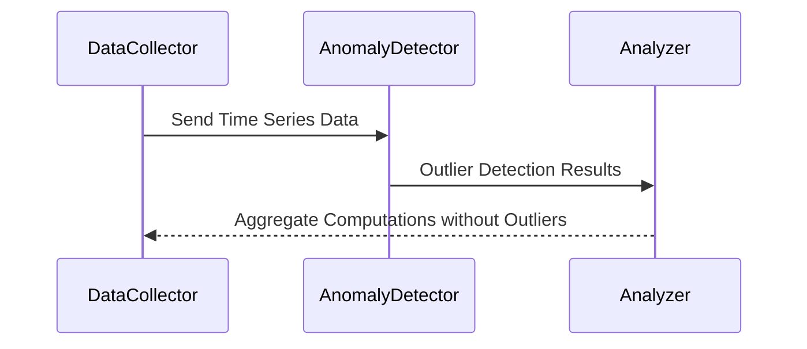

### Temporal Outlier Detection

**Description**: Temporal Outlier Detection focuses on identifying and handling outliers within time series data to improve the accuracy and reliability of aggregate computations. The approach often involves utilizing statistical techniques and machine learning algorithms to detect unexpected data points that deviate substantially from other observations in the dataset.

**Example**: One prevalent scenario for Temporal Outlier Detection is in network monitoring, where it is crucial to exclude anomalous traffic spikes when calculating metrics such as average bandwidth usage over time. These outliers may originate from atypical activities like DDoS attacks, maintenance tasks, or network misconfigurations, and can skew the results if not appropriately managed.

### Architectural Approaches

1. **Statistical Methods**: Utilize IQR (Interquartile Range), z-score, or modified z-score techniques to identify outliers. These methods can be effective for data with well-defined statistical distributions.

2. **Machine Learning Algorithms**: Implement algorithms tailored for anomaly detection in time series, such as Isolation Forest, One-Class SVM, or LSTM-based models. These are beneficial for capturing complex patterns and relationships in the data, particularly when the outliers do not follow a typical distribution.

3. **Rolling Averages and Smoothing Techniques**: Apply moving averages or exponential smoothing to dampen the effect of outliers. This can provide a more consistent and reliable aggregate for further analysis.

### Best Practices

- **Historical Analysis**: Examine historical data to identify common patterns or seasons to better calibrate outlier detection thresholds.
- **Adaptive Thresholds**: Employ dynamic thresholds that adjust based on varying conditions and patterns within the data rather than static limits.
- **Data Visualization**: Use data visualization techniques to represent time series data graphically, aiding in the easy identification of outlier points.
- **Continuous Monitoring**: Consistently monitor and update models to account for shifts in data characteristics or emergence of new patterns.

### Example Code

Here is an example of detecting temporal outliers using Python and the Scikit-learn library:

```python
from sklearn.ensemble import IsolationForest
import numpy as np

data = np.array([100, 102, 104, 3000, 107, 109, 105, 3000, 115, 113]).reshape(-1, 1)

model = IsolationForest(contamination=0.1)  # Assume 10% contamination
outliers = model.fit_predict(data)

outlier_positions = np.where(outliers == -1)

print("Outliers detected:", data[outlier_positions].flatten())
```

### Diagrams



This sequence diagram illustrates the data flow in a system implementing temporal outlier detection, where a `DataCollector` sends data to an `AnomalyDetector`, which then filters the data and passes only clean data to an `Analyzer` for aggregation.

### Related Patterns

- **Real-Time Stream Processing**: Ideal for cases where live, in-flight data monitoring can preemptively flag potential outliers.
- **Batch Processing**: Useful for historic or offline data analysis, permitting more nuanced outlier analysis algorithms.
- **Data Cleansing**: Pre-processing to refine raw time series data, deleting corrupted or irrelevant information before anomaly detection.

### Additional Resources

- [Scikit-learn Documentation on Anomaly Detection](https://scikit-learn.org/stable/modules/outlier_detection.html)
- [Time Series Analysis and Its Applications (Book)](https://www.springer.com/gp/book/9783319524511)

### Summary

Temporal Outlier Detection is an essential technique for ensuring the integrity and accuracy of time-based analytical operations. By efficiently identifying and managing anomalous data points, organizations can derive more reliable insights from their data, thereby facilitating better decision-making and operational efficiency. Employing a combination of statistical methods and machine learning models as part of a comprehensive data strategy can significantly enhance an organization's ability to handle complex temporal data.
