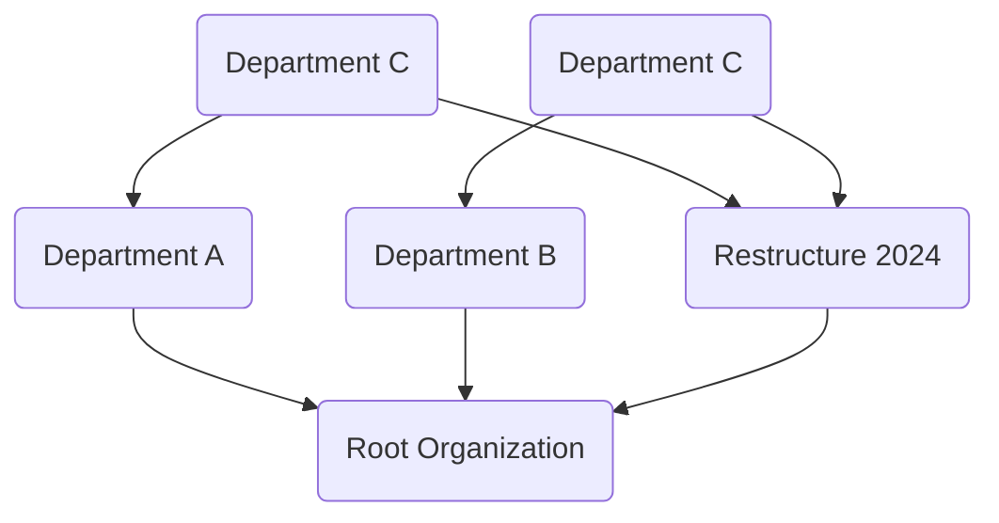

Handling Changing Hierarchies is a design pattern that addresses the challenge of aggregating data over time when hierarchies or groupings change. This scenario is commonly encountered during organizational restructuring, product categorization revisions, or changes in reporting structures.

## Detailed Explanation

In many organizations, the structuring hierarchy (such as departments, project teams, or product segments) changes over time. These changes can be due to mergers, acquisitions, strategic shifts, or operational adjustments. Traditional data models may struggle to accurately reflect historical data in light of these changes because they are typically designed with static hierarchies. The Handling Changing Hierarchies pattern provides a structured approach to maintaining data integrity and accuracy despite these changes.

### Architectural Approach

The key to managing changing hierarchies involves incorporating temporal attributes and transitioning strategies into the data model. This can be achieved through:

- **Temporal Tables**: Use temporal tables that store historical changes in hierarchies. This allows queries to adaptively reflect different hierarchies at different time frames.
  
- **Parent-Child Relationships**: Ensure hierarchical relationships between data entries, maintaining stable identifiers for each node despite changes.

- **Versioned Hierarchies**: Create versioned hierarchy structures, where each version captures a different configuration of the hierarchical structure.

### Paradigms and Techniques

- **Slowly Changing Dimensions (SCD)**: Adopt SCD strategies, particularly Type 2, to track historical changes in dimension data. This would involve maintaining both current and historical versions of hierarchy data.

- **Graph-Based Models**: Utilize graph databases to represent dynamically shifting hierarchies more naturally, allowing complex queries over changing structures.

### Best Practices

- **Accurate Timestamps**: Maintain accurate timestamps for each hierarchy change to ensure precise historical reconstructions.

- **Automate Change Detection**: Implement automatic methods to detect and incorporate hierarchy changes into the data warehouse.

- **Modular Query Design**: Develop modular query designs capable of incorporating dynamic hierarchical paths based on time.

## Example Code

Here's a simple example in SQL using a temporal table approach:

```sql
CREATE TABLE DepartmentHierarchy (
    DepartmentID INT,
    ParentDepartmentID INT,
    ValidFrom DATETIME,
    ValidTo DATETIME,
    PRIMARY KEY (DepartmentID, ValidFrom)
);

-- Inserting a department relationship valid from a particular date
INSERT INTO DepartmentHierarchy (DepartmentID, ParentDepartmentID, ValidFrom, ValidTo)
VALUES (1, 0, '2023-01-01', '2023-12-31');

-- Changing the parent department and capturing hierarchy change
INSERT INTO DepartmentHierarchy (DepartmentID, ParentDepartmentID, ValidFrom, ValidTo)
VALUES (1, 2, '2024-01-01', NULL);

-- Querying the hierarchy as of a specific point in time
SELECT *
FROM DepartmentHierarchy
WHERE ValidFrom <= '2023-06-01' AND (ValidTo IS NULL OR ValidTo > '2023-06-01');
```

## Diagrams



## Related Patterns

- **Event Sourcing**: Maintain a log of changes and construct hierarchical states at different times through event replay.
  
- **Command Query Responsibility Segregation (CQRS)**: Separate hierarchical change commands from queries to more flexibly update and read hierarchy configurations.

## Additional Resources

- [Temporal Data Tables — Microsoft SQL Server](https://docs.microsoft.com/en-us/sql/relational-databases/tables/temporal-tables)
- [Graph Databases — Neo4j](https://neo4j.com/developer/graph-database/)

## Summary

Handling Changing Hierarchies is an essential pattern for ensuring data models remain accurate and meaningful over time despite changes in hierarchical structures. By leveraging temporal tables, versioning, and graph database models, organizations can adapt their data aggregation strategies to remain consistent with historical and current structures. This enables more robust reporting and decision-making, reflecting the true state of the organization over time.
