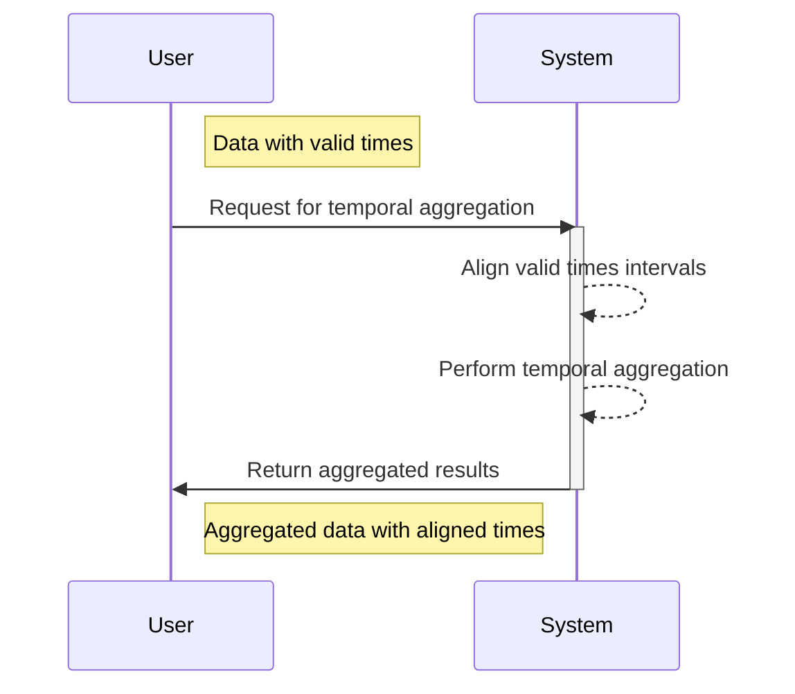

## Overview of Temporal Aggregation with Valid-Time Alignment

Temporal Aggregation with Valid-Time Alignment is a data modeling pattern that focuses on aligning valid-time data before performing aggregations. This ensures that data derived from time-sensitive computations are accurate and meaningful. It is particularly useful in scenarios where the validity of the data changes over time, such as inventory levels, financial transactions, or sensor readings.

### Design Pattern Explanation

In cases where data are associated with a specific valid time—meaning the period during which the data accurately describes reality—it becomes crucial to consider temporal aspects during aggregation. Failing to align valid times can lead to misleading outcomes, which do not properly account for the temporal dimension of the data.

#### Key Principles

1. **Valid Time Understanding**: Comprehend the concept of valid time in datasets to handle time-sensitive information effectively.
2. **Time Alignment**: Align the data based on their valid times before aggregation to ensure that aggregations are performed over correct time intervals.
3. **Robust Aggregation**: Implement aggregation functions that respect valid-time intervals, possibly requiring interval merging or intersection operations.

### Example Use Case

Consider a logistics company tracking inventory levels across multiple warehouses. Each stock record in their database has a valid from and valid until timestamp, marking the duration for which the inventory level holds true.

The company wants to aggregate inventory levels to find the average stock level per week. However, straightforward aggregation can lead to errors if time overlaps are not aligned. By using valid-time alignment, the company can precisely calculate the stock level only during the intervals that are overlapping across records.

```sql
WITH AlignedIntervals AS (
  SELECT
    ProductID,
    GREATEST(warehouse_start_time, inventory_start_time) AS valid_from,
    LEAST(warehouse_end_time, inventory_end_time) AS valid_until,
    StockLevel
  FROM
    InventoryRecords
  WHERE
    warehouse_start_time < inventory_end_time
    AND warehouse_end_time > inventory_start_time
)
SELECT
  ProductID,
  DATE_TRUNC('week', valid_from) AS week_start,
  AVG(StockLevel) AS average_stock_level
FROM
  AlignedIntervals
GROUP BY
  ProductID, week_start;
```

### Diagram: Temporal Alignment and Aggregation

The following Mermaid diagram visualizes the process of aligning valid times before aggregation:



### Related Patterns and Best Practices

- **Time-Based Partitioning**: Divide data based on time intervals to improve performance and manageability.
- **Temporal Validity Constraints**: Implement constraints to maintain consistency in valid-time data entries.
- **Snapshot Isolation**: Use snapshotting techniques to handle temporal updates accurately.

### Additional Resources

- "Managing Time in Relational Databases" by Tom Johnston and Randall Weiss
- [Wikipedia: Bitemporal Modeling](https://en.wikipedia.org/wiki/Bitemporal_model)

### Summary

Temporal Aggregation with Valid-Time Alignment ensures that data analysis respects the time-dependent nature of the information, enabling accurate aggregations over time. By aligning valid times and designing aggregation operations that take these alignments into account, organizations can obtain insights that truly reflect the underlying temporal processes. This pattern is essential in fields where the correctness of temporal data is a critical aspect of decision-making.
