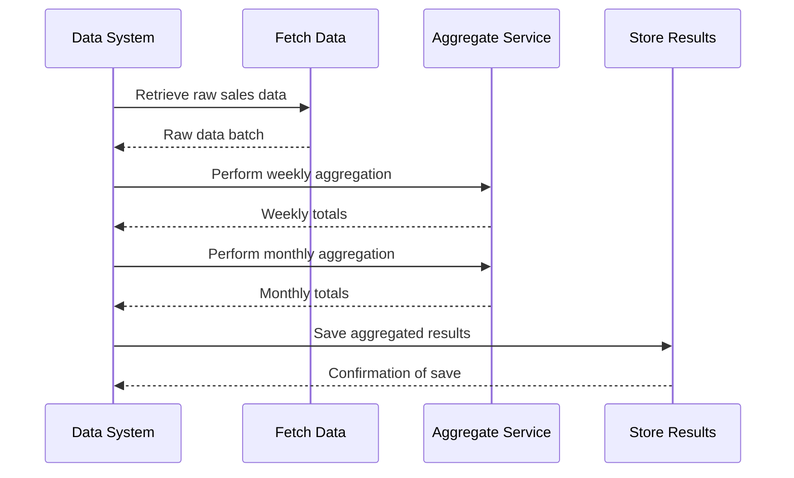

## Multi-Granularity Aggregation

In the realm of data processing and analysis, the **Multi-Granularity Aggregation** pattern addresses the need to aggregate data at multiple time granularities simultaneously. This pattern is particularly useful in scenarios where insights derived from different temporal scales can drive better decision-making.

### Description

Multi-Granularity Aggregation involves computing aggregated metrics over various time intervals concurrently. This allows for more flexible data exploration and comparative analysis. For example, comparing weekly and monthly sales totals can reveal trends not visible when looking at daily data alone. Businesses can correct seasonal variation, operational metrics, forecasting, and more with this approach.

### Architectural Approach

Achieving multi-granularity aggregation can be implemented using multiple architectural approaches, depending on the specifics of the data environment and system requirements:

1. **Batch Processing**: Using big data frameworks like Apache Spark or Flink to periodically compute aggregates at different granularities. This is suitable for non-real-time aggregated data needs.

2. **Lambda Architecture**: Utilizing both real-time data processing and batch processing pipelines. Streaming frameworks like Apache Kafka Streams or Apache Flink handle real-time computations, while batch layers can aggregate historical data over larger timeframes.

3. **Materialized Views**: Employing databases or warehouses that support materialized views, which precompute and store the result set of a query for faster access. This can efficiently provide aggregate results by leveraging precomputed datasets.

4. **Event-Driven Architecture**: Building microservices that process events via a message broker (like Kafka) and maintain updated aggregates for different time intervals in a NoSQL or SQL database.

### Example Code

Below is a Scala example demonstrating a simplified batch processing approach using Apache Spark:

```scala
import org.apache.spark.sql.SparkSession

val spark = SparkSession.builder
  .appName("Multi-Granularity Aggregation")
  .getOrCreate()

// Sample sales data
val salesData = Seq(
  ("2024-07-01", 100),
  ("2024-07-08", 200),
  ("2024-07-07", 150),
  ("2024-08-01", 250)
).toDF("date", "sales")

// Convert to DataSet with Date Format
import org.apache.spark.sql.functions._
val salesDs = salesData.withColumn("date", to_date(col("date"), "yyyy-MM-dd"))

// Weekly Aggregation
val weeklyAggregation = salesDs
  .groupBy(weekofyear(col("date")).alias("week"))
  .agg(sum(col("sales")).alias("total_sales_weekly"))

// Monthly Aggregation
val monthlyAggregation = salesDs
  .groupBy(month(col("date")).alias("month"))
  .agg(sum(col("sales")).alias("total_sales_monthly"))

weeklyAggregation.show()
monthlyAggregation.show()
```

### Diagram

Here's a UML sequence diagram depicting the orchestration of aggregation tasks:



### Related Patterns

- **Lambda Architecture**: A complementary pattern that segregates data processing into batch and real-time streams.
- **Materialized Views**: Often leveraged alongside multi-granularity aggregations for faster query execution.

### Additional Resources

- [Apache Spark Aggregations](https://spark.apache.org/docs/latest/sql-pyspark-sql.html)
- [Designing Lambda Architectures](https://lambda-architecture.readthedocs.io/en/latest/)
- [Materialized Views Best Practices](https://docs.oracle.com/en/database/oracle/oracle-database/19/sqlrf/CREATE-MATERIALIZED-VIEW.html)

### Summary

The **Multi-Granularity Aggregation** pattern is a strategic approach to generating insights at varied temporal intervals. This enhances data analysis capabilities by providing a multi-faceted view of time-series data, which can drive informed decision-making and trend analysis. Whether using big data platforms or traditional database solutions, this pattern facilitates robust temporal data modeling and aggregation strategies.
