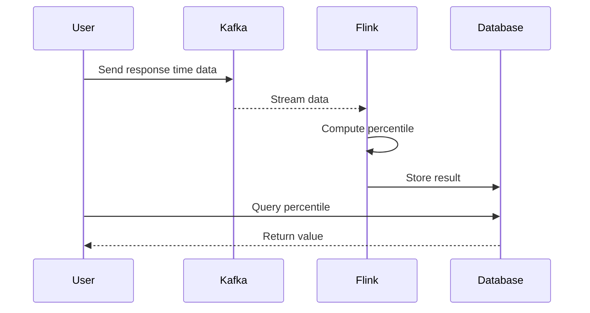

## Introduction

Temporal median and percentiles offer valuable insights by providing a summary statistic over a time period, often used in scenarios like performance analysis, load management, and trend detection. This pattern involves computing median or percentile values for datasets that evolve over time, with applications in numerous domains, particularly in performance monitoring and financial analytics.

## Architectural Approach

### Problem

Time-series data presents a unique challenge when deriving median and percentiles due to its continuous nature and often large size. Efficiently summing up these statistics over specified intervals requires careful consideration of storage, computation, and retrieval processes.

### Solution

To efficiently compute temporal medians and percentiles:
1. **Data Partitioning & Bucketing**: Divide data into fixed temporal bins (hourly, daily), facilitating easier computations within each bucket.
2. **Efficient Data Structures**: Utilize data structures like heaps or quantile sketches for dynamic percentile calculations as they allow for efficient insertion and extraction.
3. **Streaming & Distributed Computation**: Leverage streaming platforms like Apache Kafka and processing engines like Apache Flink for real-time computation; apply MapReduce in distributed environments.
4. **Incremental Aggregation**: Use incremental updates instead of recomputation from scratch, especially suitable for sliding window operations.

### Technologies & Tools

- **Apache Kafka**: For ingesting and delivering time-series data streams.
- **Apache Flink**: For real-time stream processing and aggregations.
- **Stream Processing Libraries**: Such as Apache Beam for building real-time data processing pipelines.
- **Cloud Storage and Databases**: Such as Google BigQuery or Amazon Redshift for storing pre-aggregated results for quick query access.

## Example Code

Below is an example using Apache Flink to calculate the 90th percentile of response times every hour:

```scala
val env = StreamExecutionEnvironment.getExecutionEnvironment
val dataStream = env.readTextFile("path_to_data_file")

case class ResponseTime(time: Long, value: Double)

val responseTimes = dataStream.map { line =>
  val columns = line.split(",")
  ResponseTime(columns(0).toLong, columns(1).toDouble)
}

// Create a windowed stream to compute percentile
responseTimes
  .assignTimestampsAndWatermarks(new BoundedOutOfOrdernessTimestampExtractor[ResponseTime](Time.seconds(10)) {
    override def extractTimestamp(element: ResponseTime): Long = element.time
  })
  .keyBy(_ => true)
  .timeWindow(Time.hours(1))
  .apply(new PercentileAggregateFunction(90))
  .print()

env.execute("Compute Temporal Percentile Example")

class PercentileAggregateFunction(percentile: Double) extends WindowFunction[ResponseTime, (Long, Double), Boolean, TimeWindow] {
  override def apply(key: Boolean, window: TimeWindow, input: Iterable[ResponseTime], out: Collector[(Long, Double)]): Unit = {
    val sortedValues = input.map(_.value).toSeq.sorted
    val index = (sortedValues.length * (percentile / 100)).toInt
    out.collect((window.getEnd, sortedValues(index)))
  }
}
```

## Diagrams

### Sequence Diagram

Here is a Mermaid sequence diagram illustrating the data pipeline for computing temporal percentiles:



## Related Patterns

- **Sliding Window Aggregation**: Temporal median and percentiles often incorporate sliding window mechanisms to provide continuous updates and views.
- **Session Windows**: Useful in contextual usage where temporal data is grouped by user activity or session.
- **Batch Processing**: Often complements streaming calculations for retrospective analyses.

## Additional Resources

- [Apache Flink Documentation](https://flink.apache.org/)
- [MapReduce for Parallel Process Computation](https://hadoop.apache.org/)
- [Introduction to Percentile Calculations](https://en.wikipedia.org/wiki/Percentile)

## Summary

Temporal median and percentile calculations are critical for real-time analytics and understanding data distribution over time. With the appropriate architecture, data structures, and technologies, these computations can be performed efficiently even across large data streams and datasets. Applying these methods allows businesses to maintain a real-time perspective on key metrics, thus enhancing operational intelligence and response capabilities.
