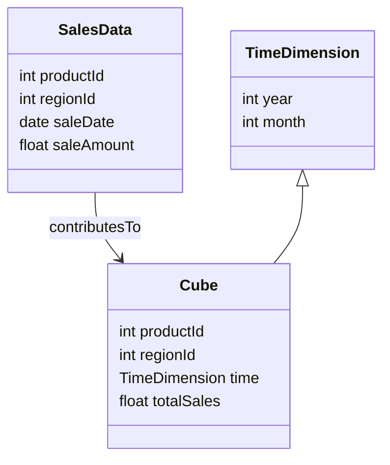

---

linkTitle: "Temporal Data Cubes"
title: "Temporal Data Cubes"
category: "Temporal Aggregation"
series: "Data Modeling Design Patterns"
description: "Design pattern for creating multidimensional cubes that include temporal dimensions for data aggregation and analysis."
categories:
- Data Modeling
- Temporal Aggregation
- Business Intelligence
tags:
- OLAP
- Data Cubes
- Temporal Data
- Aggregation
- Analytics
date: 2024-07-07
type: docs

canonical: "https://softwarepatternslexicon.com/103/11/16"
license: "© 2024 Tokenizer Inc. CC BY-NC-SA 4.0"
---

## Introduction

The Temporal Data Cubes design pattern is a powerful approach in data modeling, particularly useful for OLAP (Online Analytical Processing) systems. It introduces a time aspect to traditional data cubes, enabling temporal analyses such as trends over time, seasonal patterns, and temporal comparison tasks. These temporal data cubes extend traditional OLAP cubes by adding time as one of the key dimensions along with product, region, and other entities.

## Detailed Explanation

### Multidimensional Data Cubes

The essence of multidimensional data cubes lies in their ability to represent data across multiple orthogonal dimensions. For instance, a basic sales cube might have dimensions such as product, region, and time. Each cell in the cube contains aggregated data like total sales, average sale amount, etc.

### Temporal Dimensions

Temporal dimensions are integral for tracking changes over time. They can span various granularities, including:
- **Yearly, Monthly, Weekly**: Useful for observing long-term trends and seasonal behaviors.
- **Daily, Hourly**: Appropriate for shorter-term or real-time analysis, common in retail and finance sectors.

### Advantages of Temporal Data Cubes
1. **Comprehensive Analysis**: Facilitates a deep understanding of trends and patterns over time.
2. **Predictive Insights**: Helps generate predictive models by analyzing historical data trends.
3. **Flexible Granularity**: Supports analysis at different temporal resolutions depending on the business need.
4. **Enhanced Decision-Making**: Offers reliable and thorough insights for strategy and planning.

## Example Code

Below is a simplistic illustration using SQL to create a sales temporal data cube:

```sql
SELECT
    product_id,
    region_id,
    EXTRACT(YEAR FROM sale_date) AS year,
    EXTRACT(MONTH FROM sale_date) AS month,
    SUM(sale_amount) AS total_sales
FROM
    sales
GROUP BY
    CUBE(product_id, region_id, year, month);
```

This SQL query groups sales data into a cube format, aggregating the total sales per product, region, and month.

## Diagram

Here's a conceptual representation of how a temporal data cube might be structured using a Mermaid UML Class diagram:



## Related Patterns

- **Slowly Changing Dimensions (SCD)**: Closely related as it deals with tracking changes in dimension attributes over time.
- **Time Series Clustering**: Focuses on clustering similar time-series data for pattern analysis.
- **Event Sourcing**: Instead of storing current state, all past events are stored, providing a full timeline for data changes.

## Best Practices

1. **Temporal Granularity Selection**: Choose the right temporal granularity to balance performance and insight depth.
2. **Data Pruning Strategies**: Implement pruning techniques to manage storage costs and maintain performance.
3. **Reactive Analysis**: Utilize reactive streams to handle live data efficiently; consider frameworks like Apache Kafka for real-time data ingestion and transformation.

## Additional Resources

- [The Data Warehouse Toolkit: The Complete Guide to Dimensional Modeling by Ralph Kimball](https://www.kimballgroup.com/)
- [Data Warehousing and OLAP Technology: An Overview by Surajit Chaudhuri and Umeshwar Dayal](http://web.cse.iitk.ac.in/)

## Summary

Temporal Data Cubes serve as a versatile and robust pattern for businesses looking to extract complex, time-based insights from their datasets. By integrating temporal dimensions, organizations gain the power to forecast, identify trends, and make data-driven decisions. This pattern aligns with the modern goals of businesses to not just react to historical data but also to predict and prepare for future market behaviors.
