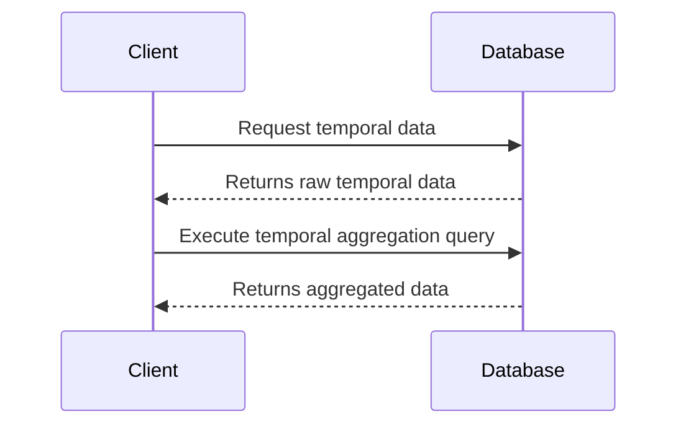

## Introduction

Temporal Aggregation Functions are essential for handling and processing time-related data. They enable efficient calculation of aggregates over specified time intervals, facilitating analysis of trends, patterns, and insights over time. This pattern is particularly useful in time-series databases and big data applications where temporal data is prevalent.

## Detailed Explanation

**Purpose and Use Cases**

Temporal Aggregation Functions are designed to work with temporal data, enabling operations like sums, averages, counts, minimums, and maximums over time intervals such as days, weeks, months, or years. They are vital in scenarios like:

- **Financial Data Analysis**: Calculating moving averages of stock prices or quarterly financial summaries.
- **IoT Data Processing**: Aggregating sensor readings to derive insights over significant time durations.
- **Health Informatics**: Summarizing patient vital signs or healthcare logistics over time.

**Advantages**

1. **Efficiency**: Optimized for temporal data, enabling faster and more resource-efficient calculations.
2. **Scalability**: Handles large datasets over extensive periods, making it suitable for big data applications.
3. **Accuracy**: Reduces the complexity and potential for errors in manual time-based calculations.

## Architectural Approach

To implement the Temporal Aggregation Functions pattern, follow these steps:

- **Select Appropriate Database**: Choose a database system or framework that supports temporal functions. For instance, SQL databases like PostgreSQL offer built-in temporal functions.
- **Data Preprocessing**: Arrange your data to be temporal-oriented, often involving time-stamped records.
- **Function Utilization**: Utilize functions specifically created for temporal operations. 

Example in SQL:
```sql
SELECT date_trunc('month', timestamp_column) AS month,
       SUM(value_column) AS total_value
FROM   temporal_data_table
GROUP BY month;
```

This SQL query calculates the total value per month, aggregating data based on time.

## Related Patterns

- **Time Series Storage**: Designs focused on the optimal storage of time-series data for retrieval and updates.
- **Event Sourcing**: Capturing state changes as a sequence of events, often applicable in temporal data scenarios.
- **Lambda Architecture**: Combines batch and real-time processing, useful in situations requiring immediate data analysis and longer temporal computations.

## Additional Resources

- Official PostgreSQL documentation on [Date/Time Functions](https://www.postgresql.org/docs/current/functions-datetime.html).
- Paper: "Processing Temporal Queries in SQL Databases".

## Diagrams

### UML Sequence Diagram for Temporal Aggregation Implementation



## Summary

Temporal Aggregation Functions are a powerful tool for processing and summarizing time-based data, enabling clarity and insights into trends over substantial periods. By leveraging prebuilt database functions, applications can deliver efficient and precise temporal analyses, crucial for sectors focused on temporal data significance.

Incorporating Temporal Aggregation Functions is a best practice in many data-rich and time-critical environments, offering both operational efficiency and analytical depth.

