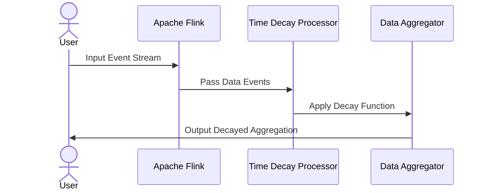

## Aggregation with Time Decay

### Overview

The Aggregation with Time Decay pattern introduces a method to process temporal data where recent data points are weighted more heavily than older ones. This pattern is particularly useful when recent data is believed to better reflect ongoing trends or behaviors. By applying decay factors, more relevant insights can be drawn from datasets with temporal characteristics.

### Architectural Approaches

- **Exponential Decay Functions**: Apply an exponential function to aggregate metrics, forward-weighting recent data exponentially over time.
- **Sliding Window Algorithm**: Use sliding time windows where the weight decreases as the data point slips further into the past.
- **Half-life Method**: Consider a half-life approach, where the weight of data halves at a specific interval. Useful for high-frequency data where decay can be precisely controlled.

### Best Practices

- **Choosing a Decay Rate**: Select a decay rate that reflects the natural dynamics of your data domain. Too aggressive a decay can miss important trends, whereas too lenient may resemble traditional aggregations.
- **Dynamic Tuning**: Continuously monitor the impact of decay on the aggregated outputs and adjust parameters to optimize insight accuracy.
- **Complement with Raw Aggregations**: Maintain a separate aggregation dataset without decay to provide a basis for comparison and trends validation.

### Example Code

#### Scala Implementation Using Apache Flink

A simple example showcasing a time decay implementation that can be processed in a stream processing application such as Apache Flink:

```scala
import org.apache.flink.streaming.api.scala._
import math.exp

case class Event(timestamp: Long, value: Double)

def aggregateWithDecay(events: DataStream[Event], decayRate: Double): DataStream[Double] = {
  val currentTime = System.currentTimeMillis()
  events
    .map(event => event.value * exp(-decayRate * (currentTime - event.timestamp)))
    .keyBy(_ => true)
    .sum(0) // aggregate to a single summation
}

object TimeDecayAggregationExample {
  def main(args: Array[String]): Unit = {
    val env = StreamExecutionEnvironment.getExecutionEnvironment
    val events: DataStream[Event] = env.fromElements(
      Event(System.currentTimeMillis() - 1000L, 5.0),
      Event(System.currentTimeMillis() - 2000L, 10.0),
      Event(System.currentTimeMillis() - 3000L, 20.0)
    )
    val decayRate = 0.001
    val result = aggregateWithDecay(events, decayRate)
    result.print()
    env.execute("Time Decay Aggregation Example")
  }
}
```

### Diagrams

#### Mermaid Sequence Diagram



### Related Patterns

- **Event Sourcing**: Stores event sequences which can utilize time decay to tune relevance.
- **Sliding Window**: Maintains a live dataset of specific time spans, often in conjunction with decay for weighted analysis.
- **Delta Lake Time Travel**: Allows access to historical data versions and can be adapted to decay-based analyses.

### Additional Resources

- [Flink Documentation](https://ci.apache.org/projects/flink/flink-docs-release-1.12/)
- "Streaming Systems": Book on event processing in Big Data architecture.
- [Lambda and Kappa Architectures](https://martinfowler.com/articles/lambda-kappa-architecture.html): Discuss how decay patterns fit within broader data streaming architectures.

### Summary

The Aggregation with Time Decay pattern is invaluable for applications requiring contemporary insights from time-series data. By wisely balancing current observations with the temporal drop-off of prior data, it enhances responsiveness and relevance within data analytics layers, particularly within real-time data processing environments.
