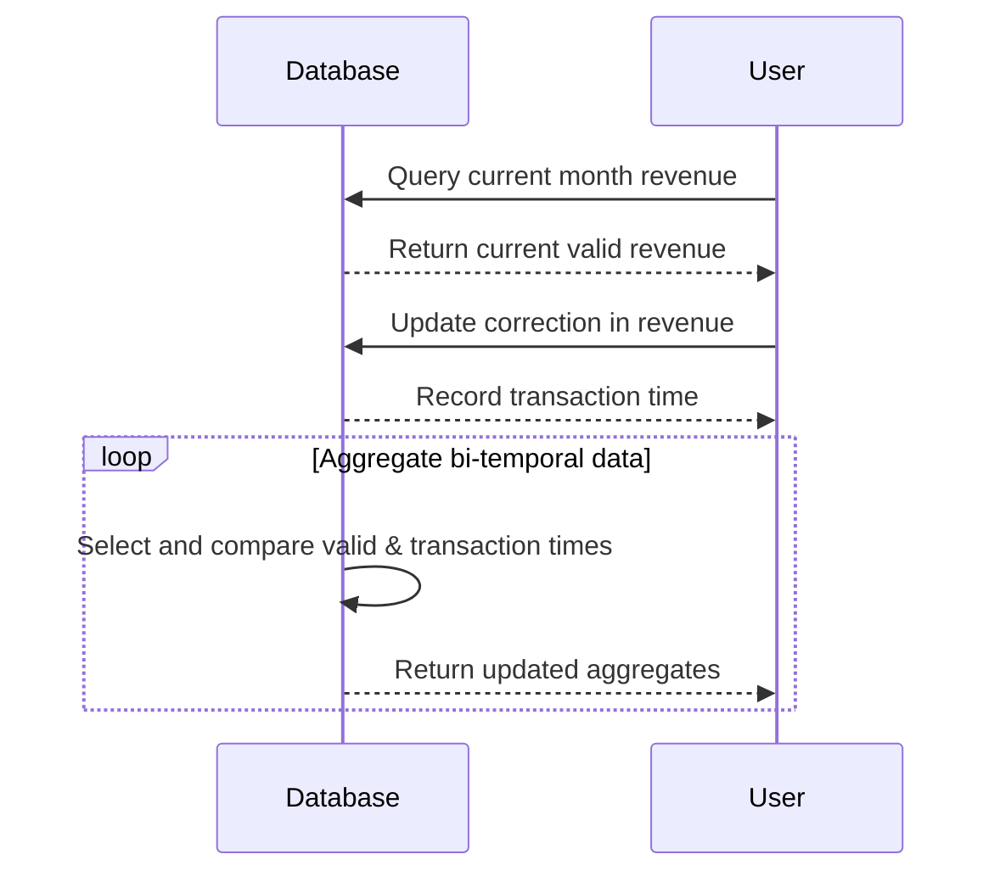

---

linkTitle: "Bi-Temporal Aggregation"
title: "Bi-Temporal Aggregation"
category: "Temporal Aggregation"
series: "Data Modeling Design Patterns"
description: "Aggregating data considering both valid time and transaction time, capturing how aggregates have changed over time."
categories:
- data-modeling
- temporal-aggregation
- design-patterns
tags:
- bi-temporal
- data-aggregation
- valid-time
- transaction-time
- data-modeling
date: 2024-07-07
type: docs

canonical: "https://softwarepatternslexicon.com/103/11/19"
license: "© 2024 Tokenizer Inc. CC BY-NC-SA 4.0"
---

## Introduction

Bi-Temporal Aggregation is a design pattern in data modeling that involves aggregating data while considering two temporal aspects: valid time and transaction time. This approach enables capturing and analyzing how aggregates have changed over time, particularly useful for temporal data correction and audit scenarios.

## Problem Statement

In environments where delayed data collection, corrections, and historical adjustments are common, traditional aggregation methods might fail to provide an accurate picture of the data's evolution. For example, calculating how reported monthly revenue totals change over time due to data corrections or updates poses a challenge to conventional data aggregation methods.

## Solution

Bi-Temporal Aggregation addresses this by using two independent time periods:

1. **Valid Time**: The actual time period during which a data fact is true in the real world.
2. **Transaction Time**: The time period during which a data fact is stored in the database, capturing when information became available.

This dual-temporality allows systems to manage and process both updates and historical data accurately, enabling re-aggregating past data with today's knowledge.

## Architectural Considerations

Bi-Temporal Aggregation involves carefully designing the data schema and implementing storage strategies that accommodate two layers of temporal information. The pattern generally requires:

- **Temporal Tables**: Using database tables that can store records with both valid time and transaction time.
- **Time-Based Indexing**: Implementing indices to efficiently query data by time dimensions.
- **Aggregation Logic**: Algorithms or functions that can reconstruct historical states and recalculate aggregates as needed.

## Example Implementation

Let's consider a scenario using SQL with a revenue table:

```sql
CREATE TABLE revenue (
  id INT AUTO_INCREMENT PRIMARY KEY,
  amount DECIMAL(10, 2),
  valid_time_start DATE,
  valid_time_end DATE,
  transaction_time_start TIMESTAMP DEFAULT CURRENT_TIMESTAMP,
  transaction_time_end TIMESTAMP DEFAULT '9999-12-31 23:59:59'
);

INSERT INTO revenue (amount, valid_time_start, valid_time_end)
VALUES (1000.00, '2023-01-01', '2023-01-31');

UPDATE revenue
SET transaction_time_end = CURRENT_TIMESTAMP
WHERE id = 1;

INSERT INTO revenue (amount, valid_time_start, valid_time_end)
VALUES (1100.00, '2023-01-01', '2023-01-31');
```

In this example, valid periods along with transaction time boundaries allow different states of data consistency to be reconstructed as needed.

## Diagram

Here is a conceptual sequence diagram showing the process of bi-temporal aggregation for updating revenue records:



## Related Patterns

- **Temporal Snapshot**: A pattern to capture views of data at specific points in time.
- **Multi-Version Concurrency Control**: Helps to manage concurrent access in a database, applicable in scenarios where multiple versions of data state exist.

## Best Practices

1. **Schema Design**: Ensure tables are designed to support and efficiently store temporal data observations.
2. **Data Integrity**: Implement checks to maintain data integrity across both time periods.
3. **Performance Optimization**: Use partitioning, indexing, and optimized queries to manage performance impact due to complex temporal queries.

## Additional Resources

- [Temporal Database Concepts in SQL](https://www.temporal-database-sql.com)
- [Designing for Temporal Data in Big Data Environments](https://www.big-data-temporal.com)

## Summary

Bi-Temporal Aggregation offers a robust design pattern for handling temporal data in complex environments where data changes over time. By accounting for both valid time and transaction time, this pattern ensures historical accuracy and full data traceability. Implementing this pattern requires careful planning of data structures and querying mechanisms but ultimately leads to enhanced temporal analysis capabilities.
