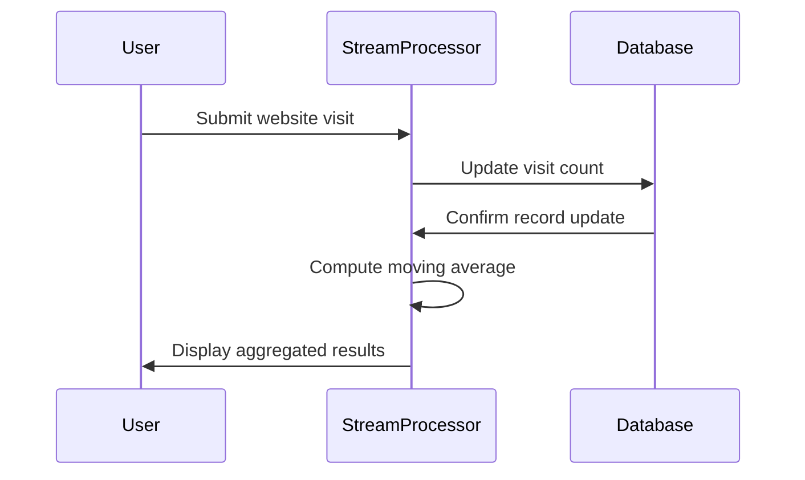

---

linkTitle: "Sliding Window Aggregation"
title: "Sliding Window Aggregation"
category: "Temporal Aggregation"
series: "Data Modeling Design Patterns"
description: "Computing aggregates over a moving time window to analyze trends within a dynamic period."
categories:
- Temporal Aggregation
- Data Modeling
- Streaming Processing
tags:
- Sliding Window
- Aggregation
- Streaming
- Data Processing
- Real-time Analytics
date: 2024-07-07
type: docs

canonical: "https://softwarepatternslexicon.com/103/11/2"
license: "© 2024 Tokenizer Inc. CC BY-NC-SA 4.0"
---

## Sliding Window Aggregation

### Description

Sliding Window Aggregation is a design pattern used in data processing and analytics to compute aggregates over a moving time frame. This dynamic approach is instrumental in analyzing data trends, capturing short-term variations while smoothing out short-term volatility for better trend visibility.

### Use Cases

A common use case of the Sliding Window Aggregation is in the area of web analytics, where it is often employed to compute the moving average of website visits over a 7-day period. This move provides insights into user engagement trends, distinguishing day-to-day volatilities from actual trends.

### Architectural Approaches

1. **Stream Processing Engines**: Software like Apache Flink or Apache Kafka Streams supports native sliding window operations that efficiently compute real-time aggregates.
   
2. **Batch Processing**: Tools like Apache Spark can be configured to simulate sliding window behavior for batch-processed datasets.

3. **DBMS with Temporal Functions**: Some SQL dialects offer built-in support for temporal window functions that implement similar behaviors directly within the query language.

### Best Practices

- **Choose Appropriate Window Size**: The width of the window determines responsiveness to data changes. A smaller window captures swift changes but is prone to noise, while a larger window smoothes out these variations.

- **Efficient State Management**: Keeping stateful operations (e.g., Flink or Kafka Streams) demands balanced memory use and computation needs, particularly when scaling.

- **Latency vs. Freshness Trade-offs**: Decide on how up-to-date data needs to be versus the allowed latency in processing data to maintain performance efficiency.

### Example Code

Here is an example using Apache Kafka Streams to demonstrate a sliding window aggregation:

```java
StreamsBuilder builder = new StreamsBuilder();

KGroupedStream<String, Long> visits = builder
    .stream("website_visits", Consumed.with(Serdes.String(), Serdes.Long()))
    .groupByKey();

TimeWindows timeWindows = TimeWindows.of(Duration.ofDays(7)) 
                                    .advanceBy(Duration.ofDays(1));

KTable<Windowed<String>, Long> dailyMovAvg = visits.windowedBy(timeWindows)
    .reduce(Long::sum);

dailyMovAvg.toStream().to("daily_moving_avg", Produced.with(WindowedSerdes.String(), Serdes.Long()));
```

### Diagrams

Below is a simple conceptual Mermaid sequence diagram illustrating the rolling aggregation:



### Related Patterns

- **Tumbling Window**: Unlike sliding, tumbling windows are non-overlapping and reset at regular intervals.
  
- **Event Time Processing**: Handles data according to the timestamp of the event occurrence rather than processing acknowledgement.

### Additional Resources

- [Apache Kafka Documentation on Windows](https://kafka.apache.org/documentation/streams/)
- [Apache Flink Documentation - Windows](https://nightlies.apache.org/flink/flink-docs-release-1.13/docs/dev/datastream/operators/windows/)
- "Stream Processing with Apache Flink" by Fabian Hueske

### Summary

The Sliding Window Aggregation pattern is essential in applications requiring real-time analytics and trend analysis. By choosing the appropriate tools and configuration for state management and window sizing, you can use this pattern to efficiently measure and interpret data trends across various timescales.
