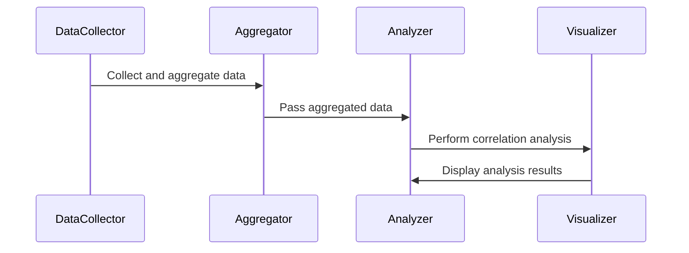

### Temporal Correlation Analysis

#### Introduction

Temporal Correlation Analysis is a data modeling design pattern focused on identifying relationships between datasets that evolve over time. This pattern leverages the natural temporal nature of datasets to reveal dependencies and correlations that may not be apparent in static data. A common use case includes analyzing energy consumption in response to varying weather conditions over specific time intervals. 

#### Design Pattern Explanation

The core idea of Temporal Correlation Analysis is to systematically aggregate, analyze, and model time-series data to extract meaningful insights. The analysis involves:

1. **Temporal Data Collection**: Gathering time-stamped data across different sources. 

2. **Aggregation**: Collecting datasets over specific time windows (e.g., hourly, daily, annually) to present a streamlined view. This helps in reducing the complexity of raw data and enhances pattern visibility.

3. **Correlation Analysis**: Using statistical techniques such as Pearson correlation, Spearman rank correlation, or machine learning algorithms to determine the strength and direction of a relationship between different datasets.

4. **Visualization**: Leveraging tools like time-series graphs, heatmaps, and dashboards to illustrate the correlations for easier interpretation and decision-making.

#### Architectural Approaches

- **Lambda Architecture**: Combines batch and stream processing to synthesize large datasets while allowing for real-time data handling and analysis.

- **Event-Driven Architecture**: Utilizes event sourcing coupled with event streams to process and correlate data in near real-time.

- **Microservices**: Decompose the analysis into services tailored for data collection, aggregation, processing, and visualization to improve scalability and manageability.

#### Best Practices

1. **Data Normalization**: Ensure data from differing sources adhere to consistent formats and scales to enable meaningful comparisons.

2. **Choose Appropriate Granularity**: Correlate datasets at the most impactful temporal granularity - too fine may introduce noise, too broad may conceal important patterns.

3. **Automated Data Pipeline**: Incorporate ETL processes that periodically gather, clean, and transform data for downstream analysis, ensuring data freshness and accuracy.

4. **Data Privacy and Security**: Safeguard sensitive temporal data via encryption and access control as time-related datasets can inadvertently reveal user behaviors.

#### Example Code

Here’s a simplified example in Python using pandas to demonstrate correlating two time-series datasets:

```python
import pandas as pd

weather_data = {'Date': ['2024-07-01', '2024-07-02', '2024-07-03'],
                'Temperature': [30, 28, 31]}
energy_data = {'Date': ['2024-07-01', '2024-07-02', '2024-07-03'],
               'EnergyConsumption': [200, 180, 210]}

df_weather = pd.DataFrame(weather_data)
df_energy = pd.DataFrame(energy_data)

df_merged = pd.merge(df_weather, df_energy, on='Date')

correlation = df_merged['Temperature'].corr(df_merged['EnergyConsumption'])
print(f'Correlation: {correlation}')
```

#### Diagrams

Below is a simple Mermaid sequence diagram showcasing data flow in a temporal correlation analysis:



#### Related Patterns

- **Time-Series Analysis**: Focuses on identifying trends, seasonal patterns, and anomalies in time-series data.

- **Event Sourcing**: Maintains a sequence of events for system processes, used in real-time temporal data analysis.

#### Additional Resources

- "Time Series Analysis and Its Applications: With R Examples" by Shumway and Stoffer.
- "Practical Time Series Analysis" on Coursera.
- Academic papers on Temporal Correlation in meteorological and consumption studies.

#### Summary

Temporal Correlation Analysis stands as a crucial design pattern in contemporary data modeling, enabling the prediction, visualization, and strategic alignment of diverse time-bound datasets. Its principles are as relevant for enterprises leveraging IoT sensors for city infrastructure as they are for financial markets predicting economic shifts. Implementing it effectively requires an agile data architecture and a keen insight into temporal data dynamics.

This pattern empowers organizations to not only discern hidden insights within their temporal data but also to build strategies predicated on data-driven decision-making influenced by analyzed correlations.
