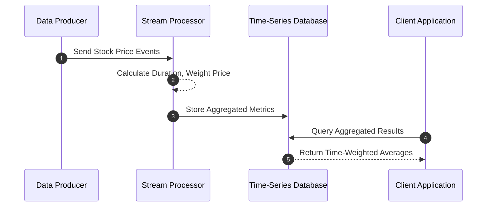

## Description

Time-Weighted Aggregation is a design pattern used to aggregate data values by considering the amount of time each value is effective. This approach is particularly useful for situations where observations or measurements are valid only for specific time durations, and the aggregation aims to reflect these durations precisely.

A typical example is computing the average stock price over a period, considering not just the price values but how long each price was maintained. Traditional averages may lead to misleading results when prices fluctuate within a significant range over time, whereas time-weighted aggregation provides a more representative calculation by factoring the time dimension into the aggregation.

## Applicability

Use this pattern when:

- You have data points associated with time intervals.
- The periods over which data points are valid vary significantly.
- It is essential to account for the duration of validity to provide meaningful aggregated results.

## Architectural Approaches

Time-weighted aggregation often relies on:

1. **Time-Series Databases**: Databases like InfluxDB or TimescaleDB provide native support for time-based operations.
2. **Windowing Techniques**: Applicability of sliding, tumbling, or session windows to group temporal data segments appropriately.
3. **Batch and Stream Processing**: Implementations through Apache Flink or Apache Kafka Streams, where events are continuously processed, and aggregations are incrementally updated.

## Best Practices

- **Accurate Timestamps**: Ensure time validity of data points is accurately captured.
- **Appropriate Windows**: Choose suitable window sizes and types based on data characteristics and aggregation needs.
- **Performance Optimization**: Ensure queries are optimized for performance, especially over large datasets.

## Example Code

Below is an example in Scala, showcasing how to implement a simple time-weighted average calculation for stock prices using a functional approach:

```scala
case class StockPrice(price: Double, startTime: Long, endTime: Long)

def timeWeightedAverage(prices: List[StockPrice]): Double = {
  val weightedPrices = prices.map { sp => 
    val duration = sp.endTime - sp.startTime
    sp.price * duration
  }
  val totalDuration = prices.map(sp => sp.endTime - sp.startTime).sum

  if (totalDuration == 0) 0.0 else weightedPrices.sum / totalDuration
}

val prices = List(
  StockPrice(100.0, 1609459200000L, 1609466400000L),
  StockPrice(102.0, 1609466400000L, 1609470000000L),
  StockPrice(98.0, 1609470000000L, 1609473600000L)
)

val average = timeWeightedAverage(prices)
println(s"Time-weighted average stock price: $$average")
```

## Diagrams

Here’s a basic sequence diagram showing how time-weighted aggregation could be handled in a typical stream processing system:



## Related Patterns

- **Sliding Window**: Used for processing continuously arriving data efficiently.
- **Event Sourcing**: Maintains a complete state history, which can be useful for temporal analyses.
- **Complex Event Processing (CEP)**: Provides more complex patterns recognition over time-series data.

## Additional Resources

- [Time-Series Database Concepts](https://timescaledb.com/)
- [Temporal Query Handling](https://www.postgresql.org/docs/current/functions-aggregate.html#FUNCTIONS-ORDEREDSET-TABLES)
- [Flink Stream Processing](https://flink.apache.org/)

## Summary

Time-Weighted Aggregation is a powerful pattern for scenarios where the duration a data point remains valid significantly influences the desired results. This technique ensures that time variability is accounted for in the calculation, providing insights that more closely represent the underlying data phenomena compared to simple aggregation methods. The adoption of this pattern requires meticulous design elements such as precise timestamp management and computational efficiency over potentially vast datasets.
