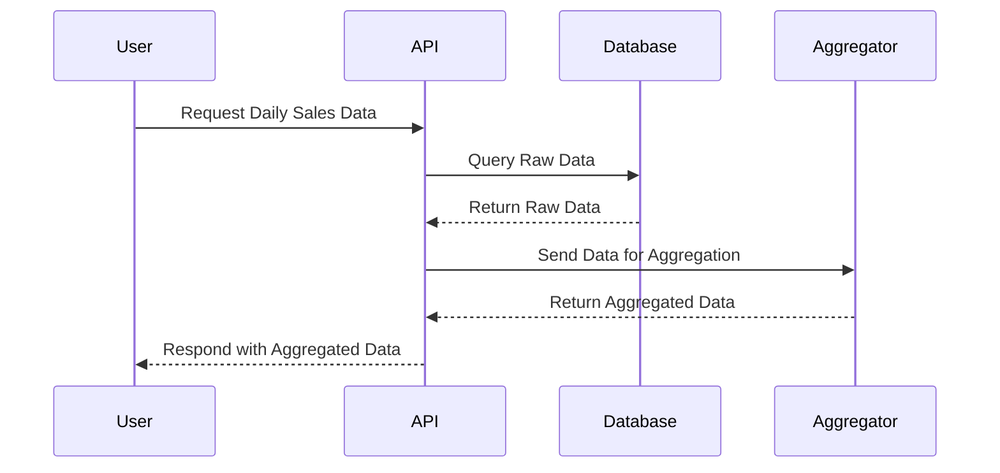

## Temporal Aggregation with Hierarchical Time Units

In the realm of cloud computing and data modeling, efficiently handling and summarizing time-based data is crucial. The "Temporal Aggregation with Hierarchical Time Units" pattern is an invaluable tool for organizing data in a way that supports both granular and coarse-grained time-based analyses.

### Description

This pattern involves aggregating data points across hierarchical time units such as days, weeks, months, and years. Such hierarchies are particularly common in time series data and are essential for generating meaningful insights at different temporal granularity levels. For instance, sales data can be aggregated daily, summed into weekly totals, and these weekly totals can further roll up into monthly datasets.

### Architectural Approach

Temporal aggregation can be efficiently handled using a layer-based architecture where each layer corresponds to a different time unit:

1. **Data Ingestion Layer**: Collect raw time series data, possibly using a streaming data platform like Apache Kafka.
   
2. **Transformation Layer**: Use tools like Apache Flink to process and transform data into required formats.
   
3. **Aggregation Layer**: Apply time-based aggregation logic to generate summaries for different hierarchical units like days, weeks, and months.
   
4. **Storage Layer**: Store pre-aggregated data in a database, e.g., a time-series database like InfluxDB or a partitioned table in a data warehouse like Snowflake.

5. **Query Layer**: Enable fast queries on aggregated data using SQL or a NOSQL syntax.

### Best Practices

- **Start with Detailed Granularity**: Collect data points at the finest granularity possible to ensure flexibility in aggregation.
  
- **Use Indexing**: Implement efficient time-based indexing to speed up retrieval and aggregation operations.
  
- **Leverage Cloud Services**: Employ cloud-based data pipeline services such as AWS Glue or Google Cloud Dataflow for easy scaling.
  
- **Pre-compute Key Aggregations**: Pre-compute commonly used aggregates to optimize query performance for end-users.

### Example Code

Here's how you might implement a basic temporal aggregation using Apache Flink and Java:

```java
import org.apache.flink.streaming.api.environment.StreamExecutionEnvironment;
import org.apache.flink.table.api.Table;
import org.apache.flink.table.api.bridge.java.StreamTableEnvironment;

public class TemporalAggregationExample {
    public static void main(String[] args) throws Exception {
        StreamExecutionEnvironment env = StreamExecutionEnvironment.getExecutionEnvironment();
        StreamTableEnvironment tableEnv = StreamTableEnvironment.create(env);

        String query = "SELECT window_start, window_end, SUM(sales) as weekly_sales " +
                       "FROM TABLE(TUMBLE(TABLE sales, DESCRIPTOR(sales_time), INTERVAL '7' DAY)) " +
                       "GROUP BY window_start, window_end";

        Table result = tableEnv.sqlQuery(query);
        result.execute().print();
    }
}
```

### Diagrams

#### UML Sequence Diagram



### Related Patterns

- **Event Sourcing**: Capturing changes to an application state as a sequence of events.
- **Lambda Architecture**: Processing massive datasets with a combination of batch and real-time streams.
- **CQRS**: Separating the read and write portions of a system to optimize performance.

### Additional Resources

- [Apache Flink Documentation](https://ci.apache.org/projects/flink/flink-docs-stable/)
- [Kafka Streams Overview](https://kafka.apache.org/documentation/streams/)
- Comprehensive guide to [Time Series Data Management](https://aws.amazon.com/big-data/datalakes-and-analytics/time-series/)

### Summary

The "Temporal Aggregation with Hierarchical Time Units" pattern provides a structured approach for handling time-dependent data efficiently. It leverages both batch and streaming technologies to build scalable and performant data processing pipelines. Employing this design pattern can significantly improve the capability to deliver timely and accurate insights across varied business domains.
