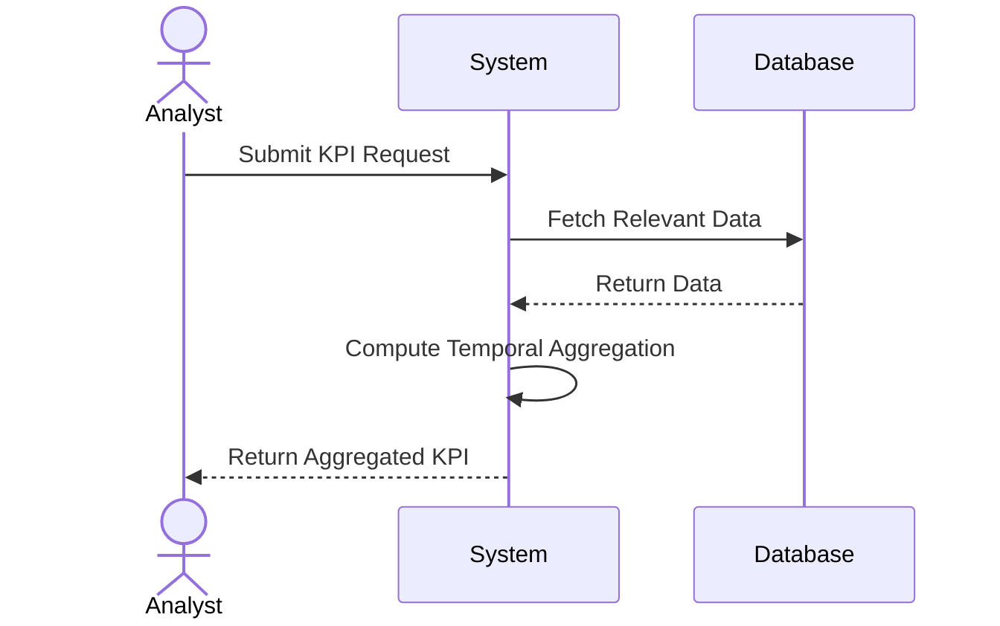

In today's data-driven world, organizations strive to improve their decision-making processes by deriving actionable insights from key performance indicators (KPIs). One crucial aspect of understanding KPIs is the inclusion of temporal dimensions, which allows stakeholders to analyze data trends over specified time frames. This approach effectively supports strategic planning, enhances business decisions, and provides a foundation for forecasting.

## Design Pattern Components

### Application

1. **Temporal Aggregation**: Capture trends by aggregating KPI data across different time frames, such as daily, weekly, monthly, or quarterly. This approach provides a more comprehensive understanding of performance over time.
 
2. **Rolling Averages**: Include rolling averages to smooth out short-term fluctuations and highlight long-term trends, facilitating better prediction and planning.

3. **Time Series Analysis**: Employ advanced statistical methods, such as time series analysis, to detect seasonality and cyclical patterns, enabling proactive decision-making.

4. **Automated Update and Snapshotting**: Ensure KPIs are periodically updated and historical snapshots are kept for comparative analysis.

### Example Implementation

For instance, in Big Tech Co., the team seeks to measure customer satisfaction effectively. They define a KPI as the average satisfaction score over the past quarter. By using time series analysis, they identify seasonal dips and peaks at specific times, such as holidays or during product launches. This helps refine their marketing strategies and customer interaction protocols.

```sql
SELECT 
    date_trunc('quarter', feedback_date) as quarter,
    AVG(score) as avg_score
FROM 
    customer_feedback
GROUP BY 
    date_trunc('quarter', feedback_date)
ORDER BY 
    quarter;
```

### Diagram

Below is a simplified UML sequence diagram for calculating temporal KPIs using a rolling average:



## Best Practices

- **Data Quality**: Ensure that the underlying data is clean, consistent, and accurate to maintain the integrity of the KPI calculation.

- **Contextual Understanding**: Recognize the context around temporal trends, because external factors can influence KPIs temporarily.

- **Visualization**: Use time series dashboards and visualization tools to make temporal data easily interpretable, aiding rapid insights derivation.

## Related Patterns

- **Time-Based Data Partitioning**: Efficiently manage large datasets through logical partitioning by time, optimizing queries for temporal datasets.
  
- **Snapshot Pattern**: Establish points-in-time captures of the data to preserve historical trends and comparatives over temporal changes.

## Additional Resources

- "Time Series Analysis and Its Applications" by Robert H. Shumway and David S. Stoffer for an in-depth statistical approach.
- "Designing Data-Intensive Applications" by Martin Kleppmann for understanding data modeling and processing architectures.

## Summary

Inclusion of Temporal Dimensions in KPIs is a fundamental data modeling pattern that empowers organizations to analyze historical behaviors, identify trends, and enable strategic improvements. By applying temporal aggregation and analysis, organizations enhance their ability to plan, predict, and refine operations with greater accuracy and insight. This design pattern constitutes the bridge between raw data and insightful decision-making.
