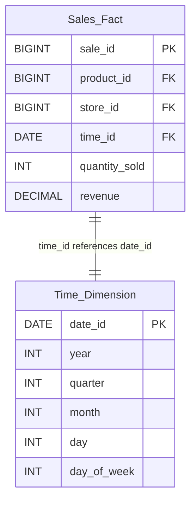

## Description

Temporal Fact Tables are a design pattern used in data warehousing that incorporate time as a fundamental aspect of data modeling. By embedding temporal data directly into fact tables, organizations can perform various time-based analyses efficiently. This approach facilitates historical trend analysis, periodic performance evaluation (such as monthly sales or annual growth), and supports temporal queries in OLAP systems.

## Architectural Approaches

1. **Dimensional Modeling with Time Dimensions**: This involves associating temporal attributes with fact tables using time dimensions (e.g., Date, Time, Month). Each entry in the fact table links to a time dimension, making it easy to aggregate data over specific time periods.

2. **Temporal Partitioning**: Time-based partitioning of fact tables can improve query performance by ensuring that queries scan only the relevant portions of data for a given time window (e.g., fetching the last quarters' data).

3. **Historical Fact Tables**: Maintain historical versions of records by capturing effective dates along with the reported measures. This enables "as-of" queries that help analyze data as it was at specific points in time.

4. **Slowly Changing Dimensions Type 2 (SCD Type 2)**: To capture the changing attributes over time while maintaining a complete history, SCD Type 2 is useful. It involves adding fields to handle the validity of records (start and end dates).

## Best Practices

- **Standardize Temporal Granularity**: Choose a standard temporal granularity (e.g., daily, weekly) across all temporal fact tables for easier integration and analysis.
  
- **Use Surrogate Keys**: Utilize surrogate keys for joining fact and dimension tables to ensure consistency and performance.

- **Regularly Archive Historical Data**: Archive older data into historical tables to maintain performance and manage storage effectively.

- **Optimize Indexes and Partitions**: Ensure that indexes and partition strategies align with common temporal query patterns to enhance retrieval performance.

## Example Code

Here's a SQL example representing a basic temporal fact table schema:

```sql
CREATE TABLE sales_fact (
    sale_id BIGINT PRIMARY KEY,
    product_id BIGINT,
    store_id BIGINT,
    time_id DATE,
    quantity_sold INT,
    revenue DECIMAL(15, 2),
    FOREIGN KEY (time_id) REFERENCES time_dimension (date_id),
    FOREIGN KEY (product_id) REFERENCES product_dimension (product_id),
    FOREIGN KEY (store_id) REFERENCES store_dimension (store_id)
);

CREATE TABLE time_dimension (
    date_id DATE PRIMARY KEY,
    year INT,
    quarter INT,
    month INT,
    day INT,
    day_of_week INT
);
```

## Diagram

Below is a conceptual diagram showing the relationship between a temporal fact table and its time dimension:



## Related Patterns

- **Event Sourcing**: Capture every state change as an event with timestamps to reconstruct states.

- **Snapshot Pattern**: Create snapshots of aggregated data at regular intervals to speed up analytics for particular timeframes.

- **SCD Type 2 Pattern**: Manage and preserve historical changes in dimension attributes using effective dates.

## Additional Resources

- *The Data Warehouse Toolkit* by Ralph Kimball: A comprehensive resource for dimensional modeling and temporal data treatment.
- [Temporal Data & Time Library Management](https://web.mit.edu/xpt/libdata/data/AnalyticDesignPatternGuide.pdf) - A technical guide for integrating temporal data within analytics systems.

## Summary

Temporal Fact Tables enable efficient time-based data aggregation and analysis by incorporating temporal data into the design of data warehouses. By carefully choosing granularity, employing SCD techniques, and optimizing partitioning, businesses can harness the full potential of time-oriented analytics. This pattern is essential for planning, forecasting, and providing valuable insights into historical and future trends.
