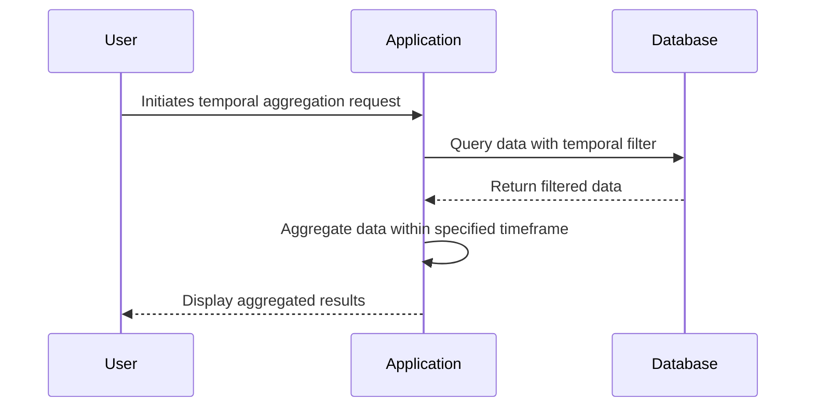

## Introduction

The "Aggregation with Temporal Filters" pattern is an advanced data modeling technique that seamlessly incorporates time-based constraints into data aggregation operations. This approach is invaluable in scenarios where only data from specific time frames is relevant to the business logic, such as excluding non-business hours from a sales report. By integrating temporal constraints, this design pattern ensures that the aggregated results reflect meaningful and contextually relevant insights.

## Detailed Explanation

### Design Pattern Overview

This pattern allows applications to apply temporal filters during aggregation processes, effectively narrowing the data set to those records that fall within user-defined time parameters. The goal is to enhance the accuracy and relevance of aggregated data outcomes.

### Architectural Approach

1. **Temporal Constraints Definition**: Define the specific time windows that are relevant for the aggregation. These constraints must be flexible enough to accommodate various time-related requirements, such as business hours, weekends, or fiscal periods.

2. **Data Extraction**: Leverage database queries or stream processing frameworks to isolate the desired data range based on the defined temporal constraints. This step often involves filtering data within a specified window using SQL's `WHERE` clause or stream processors like Apache Flink.

3. **Aggregation Execution**: Perform the aggregation operation on the filtered dataset. Modern cloud-based databases and big data frameworks provide optimized aggregation functions that can handle large volumes of time-filtered data efficiently.

4. **Integration**: Once the aggregation is complete, the results should be seamlessly integrated back into the application or data pipeline, often accompanied by dashboards or report generation tools that visualize the temporal patterns.

### Best Practices

- **Indexing and Partitioning**: Implement time-based indexing and data partitioning to optimize query performance and reduce latency.
- **Granularity**: Carefully choose the granularity of the temporal filters to balance between performance and precision.
- **Time Zone Handling**: Accurately manage time zones, especially for globally distributed systems, to avoid inconsistencies in data reporting.
- **Caching**: Utilize caching strategies to store frequent temporal query results for faster retrieval.

## Example Code

Here's a simplified example using SQL to filter and aggregate sales data within business hours (8 AM to 6 PM):

```sql
SELECT
    DATE(sale_time) as sale_date,
    SUM(amount) as total_sales
FROM
    sales
WHERE
    EXTRACT(HOUR FROM sale_time) BETWEEN 8 AND 18
GROUP BY
    sale_date
ORDER BY
    sale_date;
```

### Stream Processing Example

Using Apache Flink, you can apply temporal filtering in a real-time data stream:

```scala
val salesStream: DataStream[Sale] = ...
val businessHoursStream = salesStream
    .filter(sale => {
        val hour = sale.time.getHour
        hour >= 8 && hour < 18
    })
    .keyBy(_.date)
    .sum("amount")
```

## Diagram



## Related Patterns

- **Event Sourcing**: Maintaining all changes as an immutable sequence of events can help with reconstructing temporal aggregations.
- **Temporal Sharding**: Sharding data by time intervals can improve performance by reducing the data set size.

## Additional Resources

- [Temporal Data & the Relational Model](https://example.com/temporal-data)
- [Effective Data Analysis Techniques with Apache Flink](https://flink.apache.org/)

## Summary

The Aggregation with Temporal Filters pattern is essential in scenarios demanding precision and relevance concerning times or intervals in data aggregation tasks. When correctly implemented, it optimizes the accuracy of business insights by ensuring that only temporally pertinent data is considered, enhancing decision-making in time-sensitive environments. By using advanced filtering techniques in conjunction with cloud-based infrastructure, organizations can achieve robust analytics that aligns closely with real-world time constraints.
