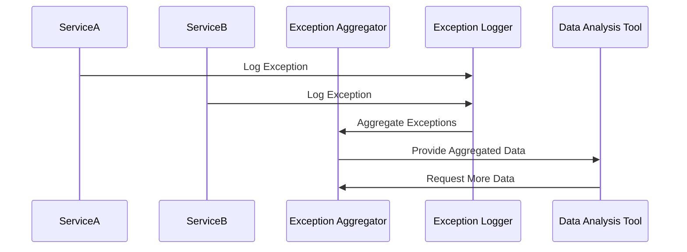

## Overview

In complex systems, exceptions and anomalies are inevitable. The Temporal Exception Aggregation pattern is designed to facilitate the tracking and analysis of exceptions over specific time intervals. By understanding these exceptions temporally, system architects and developers can derive insights into patterns and trends that might indicate underlying issues or opportunities for improvement.

## Intent

The primary goal of the Temporal Exception Aggregation pattern is to capture, aggregate, and analyze exceptions occurring in a system over defined time periods. This pattern helps in identifying spikes or trends of failures that could suggest systemic problems, thus aiding in proactive monitoring and diagnostics.

## Applicability

- When looking to continually monitor system health by aggregating failed transactions or error logs.
- In scenarios requiring the identification of failure trends over time to enhance system reliability.
- When aggregating data for reporting purposes that concern exceptions over daily, weekly, or monthly intervals.

## Architectural Approaches

### Centralized Logging System

Deploy a centralized logging system where all exceptions from various services are sent to a dedicated logging and analysis system, such as ELK Stack (Elasticsearch, Logstash, and Kibana) or Splunk. This enables the aggregation and visualization of errors to identify temporal patterns.

### Data Pipeline with Aggregation Layer

Implement a data pipeline using tools like Apache Kafka for streaming exception data, transforming it using Apache Flink, and storing aggregates in a persistent data store like Apache Cassandra. This pipeline can be configured to calculate exception counts within specific time windows.

### Microservices Architecture

In a microservices environment, consider creating a dedicated Exception Aggregator service responsible for collecting exceptions from all microservice components and aggregating them accordingly.

## Example Code

Here's a simple example using Apache Kafka Streams in Java to aggregate exceptions over time:

```java
import org.apache.kafka.streams.*;
import org.apache.kafka.streams.kstream.*;

import java.util.Properties;

public class ExceptionAggregator {

    public static void main(String[] args) {
        Properties props = new Properties();
        props.put(StreamsConfig.APPLICATION_ID_CONFIG, "exception-aggregator");
        props.put(StreamsConfig.BOOTSTRAP_SERVERS_CONFIG, "localhost:9092");

        StreamsBuilder builder = new StreamsBuilder();
        KStream<String, String> exceptions = builder.stream("exceptions-topic");

        KTable<Windowed<String>, Long> aggregatedExceptions = exceptions
                .groupBy((key, value) -> "exceptionCount")
                .windowedBy(TimeWindows.of(Duration.ofDays(1)))
                .count();

        aggregatedExceptions.toStream().to("exception-aggregates-topic", Produced.with(WindowedSerdes.timeWindowedSerdeFrom(String.class), Serdes.Long()));

        KafkaStreams streams = new KafkaStreams(builder.build(), props);
        streams.start();
    }
}
```

## UML Sequence Diagram



## Related Patterns

- **Centralized Logging**: For collecting logs and exceptions in one place.
- **Event Sourcing**: When capturing state changes as events, which can include exception events.
- **Circuit Breaker**: Used for handling faults gracefully and potentially preventing exceptions.

## Additional Resources

- *Building Real-Time Analytics using Apache Kafka Streams and Apache Flink* (online resource).
- *Effective Monitoring and Alerting* by Slawek Ligus, which discusses various approaches to monitoring exceptions.

## Summary

The Temporal Exception Aggregation pattern provides a robust mechanism for detecting, analyzing, and responding to patterns of exceptions over time. By aggregating exceptions, organizations can gain valuable insights into the health and stability of their systems, ensuring timely actions can be taken to resolve systemic issues. This pattern is especially relevant in systems utilizing distributed architectures or complex integrations across multiple services.
