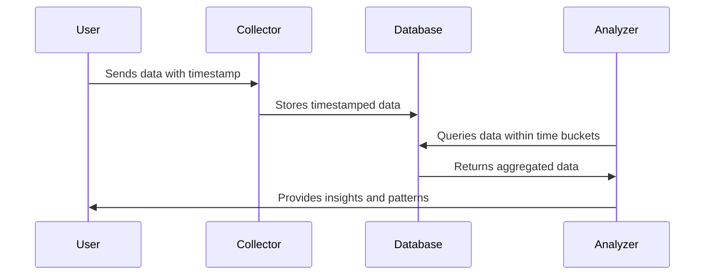

## Overview 

Temporal Bucketing is a design pattern focused on dividing time into specific intervals or "buckets" and aggregating data within these defined periods. This approach is particularly useful for analyzing temporal patterns in datasets where time-based trends and peaks are critical.

## Use Cases

Temporal Bucketing is widely used in scenarios where it is essential to understand patterns over time. Some common use cases include:

- **Energy Consumption Analysis**: Aggregating energy usage data into hourly buckets helps identify peak usage times and optimize resource distribution.
- **Web Traffic Monitoring**: Summarizing server requests in minute or second intervals to identify trends, peak usage periods, and potential bottlenecks.
- **Financial Market Analysis**: Analyzing stock price movements in daily, hourly, or minute intervals to detect patterns or anomalies.

## Architecture and Implementation

1. **Time Division**: Decide the appropriate bucket size (e.g., seconds, minutes, hours) based on the use case and data granularity requirements.
   
2. **Data Collection and Storage**: Collect data streams that include timestamps. Store this data in a time-series database that can efficiently handle temporal queries.

3. **Aggregation Logic**: Implement logic to aggregate data within each time bucket, which can include operations such as summing values, calculating averages, or detecting maximums or minimums.
   
4. **Visualization and Analysis**: Use tools to visualize the aggregated data, enabling pattern analysis and informed decision-making.

### Example Code: Temporal Bucketing with Java

```java
import java.time.Instant;
import java.time.Duration;
import java.util.*;

public class TemporalBucketing {

    private static Map<Long, List<Double>> bucketData(List<Instant> timestamps, List<Double> values, Duration bucketSize) {
        Map<Long, List<Double>> buckets = new HashMap<>();
        
        for (int i = 0; i < timestamps.size(); i++) {
            long bucket = timestamps.get(i).getEpochSecond() / bucketSize.getSeconds();
            buckets.putIfAbsent(bucket, new ArrayList<>());
            buckets.get(bucket).add(values.get(i));
        }
        
        return buckets;
    }

    private static Map<Long, Double> aggregateBuckets(Map<Long, List<Double>> buckets) {
        Map<Long, Double> aggregatedBuckets = new HashMap<>();
        
        for (Map.Entry<Long, List<Double>> entry : buckets.entrySet()) {
            double sum = entry.getValue().stream().mapToDouble(Double::doubleValue).sum();
            aggregatedBuckets.put(entry.getKey(), sum);
        }
        
        return aggregatedBuckets;
    }

    public static void main(String[] args) {
        List<Instant> timestamps = Arrays.asList(Instant.now(), Instant.now().plusSeconds(3600));
        List<Double> values = Arrays.asList(100.0, 200.0);

        Duration bucketSize = Duration.ofHours(1);
        Map<Long, List<Double>> buckets = bucketData(timestamps, values, bucketSize);
        Map<Long, Double> aggregated = aggregateBuckets(buckets);

        System.out.println("Aggregated Data: " + aggregated);
    }
}
```

### Diagram: Temporal Bucketing Process



## Best Practices

- **Choose the Right Bucket Size**: The bucket size should balance the need for granularity and the overhead of aggregation. Larger buckets reduce noise but may smooth out critical details.
- **Leverage Time-Series Databases**: Utilize time-series databases optimized for read and write operations on temporal data such as InfluxDB or TimescaleDB.
- **Data Compression and Optimization**: Apply data compression techniques to manage storage requirements efficiently.

## Related Patterns

- **Time Windowing**: Focuses on maintaining a rolling analysis window over incoming data streams.
- **Sliding Window Aggregation**: Extends the concept of fixed time buckets to sliding intervals for more dynamic data analysis.
- **Event Sourcing**: Retains all application state changes as an immutable series of events in sequence order, useful for reconstructing data states.

## Additional Resources

- *Time-Series Data Management and Processing Using Open-Source Tools* by Arun Kejariwal and Mehdi Amirsaghian.
- *Designing Data-Intensive Applications* by Martin Kleppmann.
- *Time Series Databases* Blog by Datadog.

## Summary

Temporal Bucketing is an essential design pattern for applications requiring time-based data insights. By effectively segmenting and aggregating data into discrete temporal units, organizations can identify trends, optimize operations, and make informed decisions based on historical patterns. This approach is crucial for industries ranging from utilities to finance and the web, where time series data analytics provide a competitive advantage.
