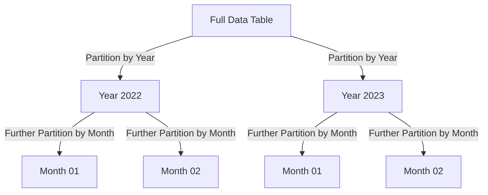

## Overview

Temporal Data Partitioning for Aggregation is a design pattern that involves segmenting large datasets into smaller, manageable partitions based on time periods. This strategy is particularly effective in optimizing the performance of aggregation queries, such as sum totals, averages, or counts, that often need to process vast amounts of data over specific time intervals.

### Context

In big data applications, datasets can grow exponentially, rendering simple query operations inefficient and resource-intensive. When working with temporal data—data that inherently deals with time-based attributes such as timestamps—queries often focus on recent or specific time periods.

### Problem

As the dataset grows, performing aggregation operations over the entire dataset becomes inefficient. Full table scans can become a significant bottleneck, impacting performance and increasing cost.

### Solution

Partition the data using temporal attributes. For example, sales transactions can be partitioned by year, month, week, or day depending on the granularity required for analysis. By dividing the dataset into smaller partitions, queries can selectively access only the relevant partitions and avoid scanning through unnecessary data.

### Example Code

Here is a SQL example illustrating temporal data partitioning:

```sql
CREATE TABLE sales (
    id SERIAL PRIMARY KEY,
    amount DECIMAL(10, 2),
    transaction_date TIMESTAMP
) PARTITION BY RANGE (EXTRACT(YEAR FROM transaction_date));

CREATE TABLE sales_2022 PARTITION OF sales 
FOR VALUES FROM (2022) TO (2023);

CREATE TABLE sales_2023 PARTITION OF sales 
FOR VALUES FROM (2023) TO (2024);
```

### Diagram

Below is a diagram illustrating Temporal Data Partitioning:



### Best Practices

1. **Choose Appropriate Partitions**: Select a partitioning strategy that aligns with your query patterns. Monthly or weekly partitions are common for time-series data.
2. **Indexing**: Ensure indices are used appropriately on temporal columns for quicker lookups.
3. **Maintain Partitioned Data**: Develop scripts to automate the creation and archiving of partitions as new data arrives.

### Related Patterns

- **Sharding Pattern**: Distribute data across multiple databases or servers.
- **Indexing Strategies**: Enhance query performance by indexing frequently accessed fields.
- **Cache Pattern**: Use caching mechanisms to reduce database load.

### Additional Resources

- [Temporal Data Capacity Planning](https://example.com)
- [Advanced Partition Management Techniques](https://example.com)

## Summary

Temporal Data Partitioning for Aggregation efficiently organizes data by leveraging time-based segmentation to optimize read performance during aggregation queries. This pattern reduces query response time by accessing a targeted subset of data, thus enhancing database performance and cost efficiency in big data applications.
