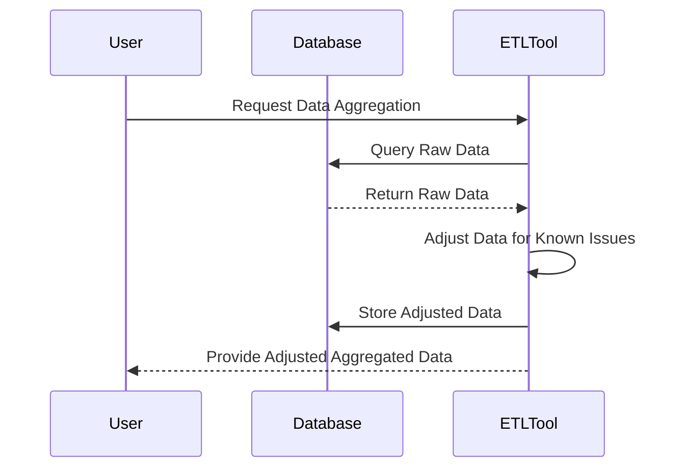

## Introduction

The Adjusted Temporal Aggregation pattern is a strategy used in data modeling and processing to adjust aggregated data over time. This pattern is crucial in situations where raw data records may be incomplete or skewed due to identifiable issues, such as system downtime, data import issues, or external factors that impact the data quality or relevance.

## Detailed Explanation

Temporal data aggregation is a common requirement in any data processing system, be it for generating reports, dashboards, or predictive analysis. Aggregating data over a period like days, weeks, or months involves summarizing raw data into meaningful, digestible metrics. However, this process may encounter scenarios where the data for certain periods is incomplete or known to be inaccurate.

### When to Use Adjusted Temporal Aggregation

The Adjusted Temporal Aggregation pattern becomes necessary when:

- There are known periods with missing or partial data due to system outages, leading to underestimated sales totals, lower web traffic counts, etc.
- External events like holidays, promotions, or market disruptions need to be factored into historical data analysis.
- There is a need to ensure continuity and comparability in time series data across different periods.

### Implementation Strategy

The implementation involves several steps:

1. **Identify Issues or External Factors**: Pinpoint known data issues or factors. For instance, identify dates when sales data is missing due to a system update.

2. **Adjustment Methodology**: Define a methodology to adjust the data. This could be imputing missing values based on historical averages, using machine learning models to predict missing data, or explicitly accounting for known events.

3. **Aggregate with Adjustments**: Perform temporal data aggregation by integrating the adjustments. Use SQL queries, scripts, or ETL (Extract, Transform, Load) tools to consistently apply these adjustments.

4. **Review and Iterate**: Periodically review the adjustment logic to incorporate new insights or evolving business needs.

## Example Code

Here's a simple SQL example where sales data is adjusted based on identified issues for aggregation:

```sql
WITH corrected_sales AS (
    SELECT
        date,
        CASE 
            WHEN date IN ('2024-05-01', '2024-05-02') THEN sales * 1.2
            ELSE sales
        END AS adjusted_sales
    FROM daily_sales
)
SELECT
    DATE_TRUNC('month', date) AS month,
    SUM(adjusted_sales) AS total_sales
FROM corrected_sales
GROUP BY month;
```

## Diagrams

**UML Sequence Diagram**



## Related Patterns

- **Missing Data Pattern**: Techniques for handling missing data in datasets, including removing, replacing, or imputing data points.
- **Event Sourcing**: Capturing all changes to an application state as a sequence of events, which can assist in replaying or adjusting historical data.

## Additional Resources

- [Temporal Data Processing on AWS](https://aws.amazon.com/big-data/datalakes-and-analytics/)
- [Temporal Aggregation Techniques in SQL](https://dev.mysql.com/doc/refman/8.0/en/date-and-time-functions.html)
- [Introduction to Time Series Analysis](https://otexts.com/fpp3/)

## Summary

The Adjusted Temporal Aggregation pattern is pivotal when data integrity is of utmost importance, yet external events might skew data interpretation. Applying it allows for more accurate historical analyses and predictions by ensuring that known irregularities or imbalances in the data are accounted for properly. When implemented properly, this pattern ensures that business decisions are based on the most reliable data available, fostering more accurate insights and projections.
