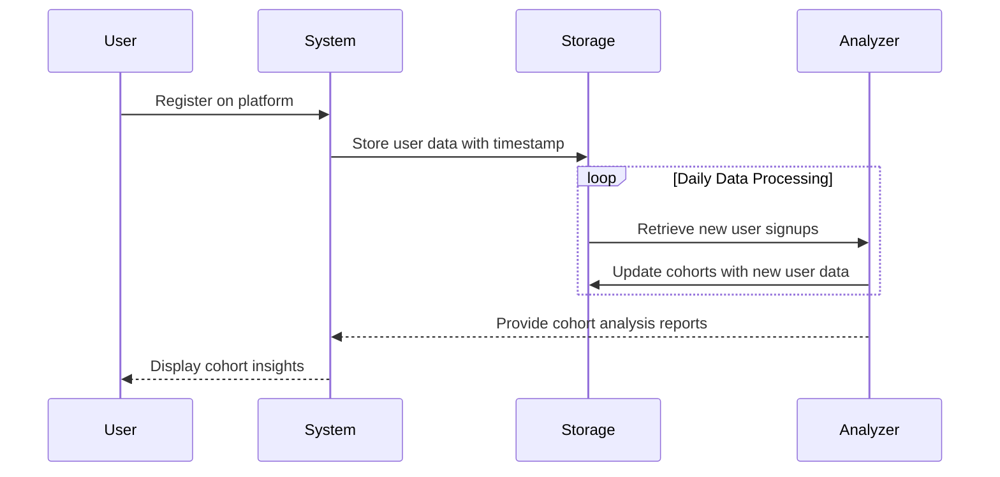

## Overview
Temporal Cohort Analysis is an essential design pattern in data modeling that helps organizations understand how groups of entities (cohorts) exhibit behaviors over time. By grouping entities based on the time they share a particular characteristic, such as the date of registration or purchase, businesses and analysts can identify patterns and trends that may otherwise go unnoticed.

## Architectural Approach

### Cohort Definition
A cohort is typically defined by filtering a dataset on certain time-based criteria. For instance, cohorts could consist of users registering in the same month or products launched during the same quarter.

### Data Aggregation
Once cohorts are defined, various aggregations and analyses can be performed, such as cumulative metrics, per cohort, including:
- Retention Rates
- Average Purchase Frequency
- Revenue per Cohort
- Engagement Metrics

### Infrastructure Setup
Cloud platforms and big data solutions provide scalable means to store and process time-series data required for cohort analysis:
- **Apache Kafka and Apache Flink** for event stream processing and real-time data feeds.
- **AWS Redshift or Google BigQuery** for large-scale data warehousing.
- **Snowflake** or **Databricks** can efficiently handle dynamic querying and complex analytical computations.

## Best Practices

1. **Granular Time Alignment**: Align cohort metrics on a consistent granularity level (daily, weekly, monthly) to ensure consistency in temporal comparisons.
2. **Retrospective Cohort Updates**: Continuously update cohort attributes and metrics as fresh data arrives to maintain relevance.
3. **Data Quality and Cleansing**: Maintain high-quality datasets by regular validation and error-checking processes to ensure analysis accuracy.
4. **Visualization Tools**: Use data visualization platforms like Tableau or Power BI to illustrate cohort analyses effectively.

## Example Code

The following is a Python example using Pandas for a simple temporal cohort analysis:

```python
import pandas as pd

data = {
    'user_id': [1, 2, 3, 4, 5],
    'signup_date': ['2023-01-12', '2023-01-12', '2023-02-15', '2023-03-20', '2023-03-20'],
    'purchase_date': ['2023-01-14', '2023-02-16', '2023-02-20', '2023-04-10', '2023-05-15'],
    'amount': [50, 20, 30, 100, 150]
}

df = pd.DataFrame(data)
df['signup_month'] = pd.to_datetime(df['signup_date']).dt.to_period('M')
df['purchase_month'] = pd.to_datetime(df['purchase_date']).dt.to_period('M')

cohort_data = df.groupby(['signup_month', 'purchase_month']).size().unstack(fill_value=0)
print(cohort_data)
```

This example computes the number of users who signed up in each month and made purchases in each subsequent month.

## Diagrams

### UML Sequence Diagram

Below is a sequence diagram that showcases the temporal cohort analysis process:



## Related Patterns

- **Time-series Analysis**: Focuses on statistical techniques for analyzing time-ordered data.
- **Event Sourcing**: Captures state changes as a sequence of events to support data auditing and reconstruction from history.
- **Real-time Processing**: Emphasizes immediate data insights by processing streams as events arrive.

## Additional Resources

- [Building a Cohort Analysis Pipeline with Apache Kafka and Flink](https://example.com/kafka-flink-cohort)
- [Temporal Cohort Visualizations using Tableau](https://example.com/tableau-cohort)
- [Cohort Analysis in Retail: How Time Impacts Metrics](https://example.com/retail-cohort)

## Summary

Temporal Cohort Analysis is a powerful design pattern that provides valuable insights into how groups of users or entities behave over time. By leveraging modern cloud and open-source technologies, businesses can perform sophisticated data analysis to drive decision-making, optimize operations, and enhance user experiences. Adopting best practices and using suitable tools will ensure the accuracy and usefulness of cohort insights.
