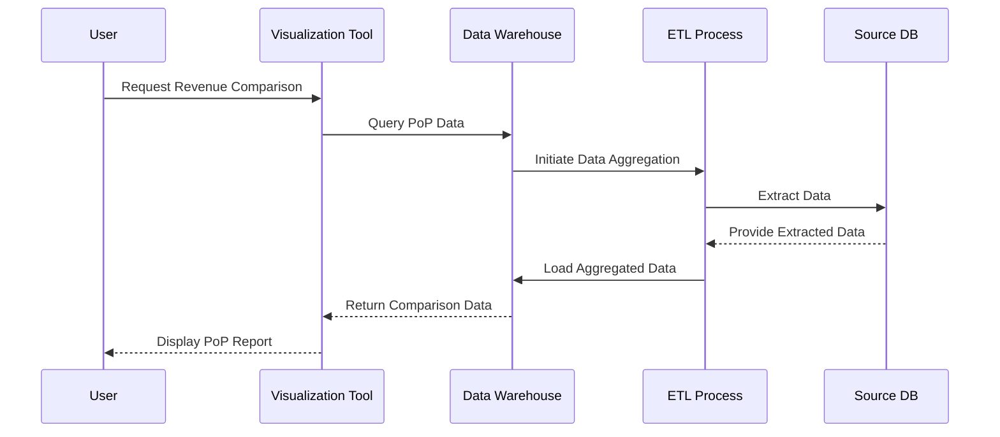

## Overview

The Period-over-Period (PoP) Comparison design pattern is used in data modeling and analysis to compare aggregate metrics over different time periods. This is commonly applied in business intelligence to identify trends and changes in key performance indicators (KPIs) such as revenues, user engagement, or operational costs. 

## Architectural Approaches

**Data Warehousing**: Centralize data from different sources and ensure it is structured for querying and analysis. Time-dimensional models, such as star or snowflake schemas, often support this requirement.

**ETL Pipelines**: Use Extract, Transform, Load (ETL) processes to prepare data, ensuring time dimension consistency. Aggregations are calculated before being loaded into a data warehouse or analytical data store.

**Temporal Databases**: Utilize databases with built-in support for time series data, which can efficiently partition and index time-related data, providing swift aggregate calculations for period comparisons.

## Best Practices

- **Time Normalization**: Ensure data time stamps are consistent in format and time zone. This reduces errors in data aggregation.
- **Version Control**: Maintain versioning in datasets to allow retrospective analysis after data corrections or load errors.
- **Incremental Data Loads**: Implement incremental rather than full reloads for updating data, which enhances performance and reduces system load.
- **Pre-computed Aggregations**: Periodically compute and store common aggregations for quick access.
- **Visualization Tools**: Integrate data with visualization tools (e.g., Tableau, Power BI) to make trend analysis intuitive and accessible.

## Example Code

Here’s an example using SQL to compare quarterly revenue. This SQL snippet compares the current year's quarterly revenue to the previous year's.

```sql
SELECT
    current_year.quarter,
    current_year.revenue AS current_revenue,
    previous_year.revenue AS previous_revenue,
    ((current_year.revenue - previous_year.revenue) / previous_year.revenue) * 100 AS percent_change
FROM
    (SELECT quarter, SUM(revenue) AS revenue FROM sales WHERE year = EXTRACT(YEAR FROM CURRENT_DATE) GROUP BY quarter) AS current_year
JOIN
    (SELECT quarter, SUM(revenue) AS revenue FROM sales WHERE year = EXTRACT(YEAR FROM CURRENT_DATE) - 1 GROUP BY quarter) AS previous_year
ON
    current_year.quarter = previous_year.quarter;
```

## Diagram

Here is a simple diagram using Mermaid to depict the data flow in Period-over-Period comparison:



## Related Patterns

- **Time Series Database**: Optimized for handling and analyzing temporal data across various time scales.
- **Lambda Architecture**: Balances latency, throughput, and fault-tolerance by combining batch and real-time data processing models.
  
## Additional Resources

- [Comparative Data Analysis] Performance and growth metrics, particularly useful for financial and sales domains.
- [Time Series Insights & Analysis] Publishing patterns.

## Summary

A Period-over-Period Comparison is critical for any organization that seeks insights from data trends over successive time periods. Leveraging the right architectural strategy and implementing best practices can facilitate an efficient and meaningful temporal analysis, enhancing decision-making processes.
